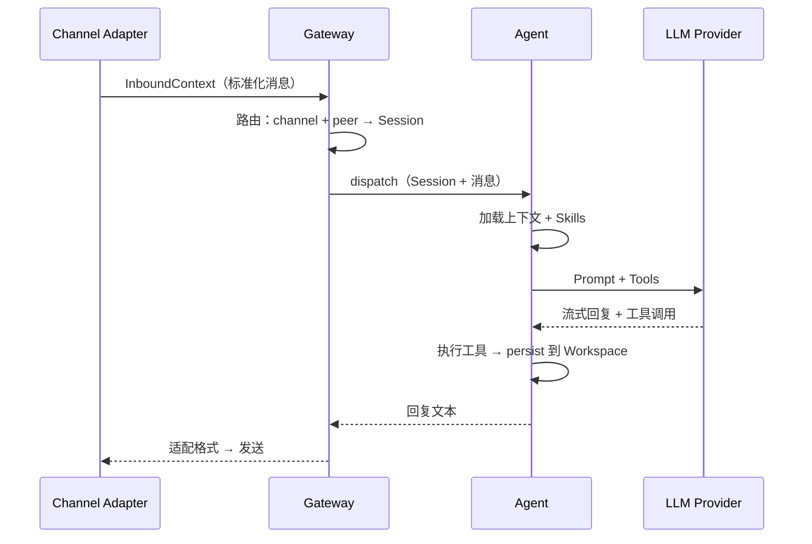
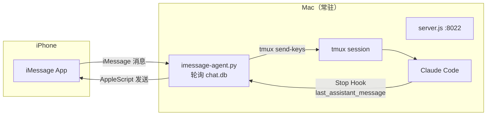
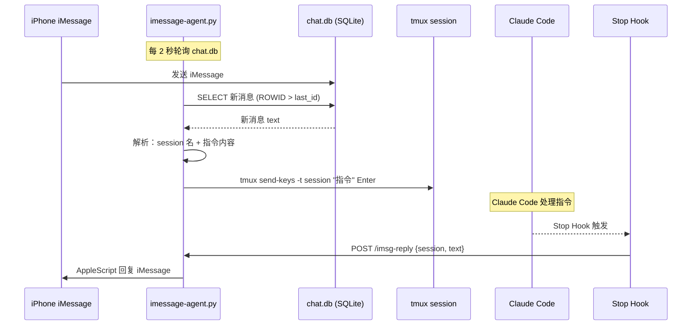
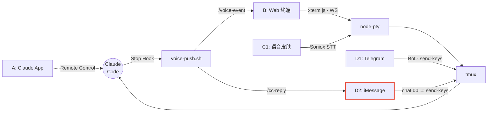

# iMessage 整合方案详解

> 研究日期：2026-03-07
> 对应架构方式：D2（iMessage 文字入口）
> 前置研究：OpenClaw 多渠道架构原理

---

## 一、OpenClaw 多渠道架构原理

### 1.1 项目背景

[OpenClaw](https://github.com/openclaw/openclaw) 是 2025 年 11 月由 Peter Steinberger 发布的开源个人 AI 助手，截至 2026 年 3 月已超过 117K GitHub stars。它的核心卖点是**一个 AI 代理，跑在你已经用的所有消息平台上**——WhatsApp、Telegram、Slack、Discord、Signal、iMessage、IRC、Teams 等 20+ 渠道。

### 1.2 三层架构

OpenClaw 采用清晰的三层设计：

```
┌──────────────────────────────────────────────────────┐
│                  Gateway（网关层）                      │
│  单进程 WebSocket · ws://127.0.0.1:18789              │
│  职责：Session 管理、消息路由、权限、配置热加载           │
├──────────────────────────────────────────────────────┤
│                  Agent（代理层）                        │
│  职责：加载上下文 → 组装 Prompt → 调用 LLM → 工具执行    │
│  → 流式回复 → 写入 Workspace（持久化记忆）              │
├──────────────────────────────────────────────────────┤
│               Channel Adapters（渠道适配层）             │
│  每个平台一个 Adapter：Telegram(grammY)、               │
│  WhatsApp(Baileys)、Discord、Slack、Signal、           │
│  BlueBubbles(iMessage)、IRC、WebChat …                │
│  职责：平台协议 → 标准化 InboundContext → Gateway       │
└──────────────────────────────────────────────────────┘
```

### 1.3 消息流转（核心循环）



**关键设计模式：**

| 模式 | 说明 |
|------|------|
| **Adapter 归一化** | 每个 Channel Adapter 将平台特有的消息格式转为统一的 `InboundContext`（包含 sender、text、attachments、channel_id），Gateway 不关心消息来自哪个平台 |
| **Session 隔离** | per-channel-peer 模式——同一用户在 WhatsApp 和 Telegram 有独立 Session，不会交叉污染上下文 |
| **配置热加载** | `~/.openclaw/openclaw.json` 是单一配置文件，Gateway 监听文件变更自动重载 |
| **多 Agent 路由** | 可配置不同渠道/用户路由到不同 Agent（如工作 Agent vs 生活 Agent） |

### 1.4 OpenClaw 的 iMessage 实现

OpenClaw 提供两种 iMessage 集成方式：

| 方式 | 技术 | 状态 |
|------|------|------|
| **BlueBubbles** (推荐) | BlueBubbles macOS Server + REST API + Webhook | 活跃维护 |
| **imsg** (Legacy) | [steipete/imsg](https://github.com/steipete/imsg) CLI + JSON-RPC over stdio + chat.db | 标记为 legacy |

**BlueBubbles 方式**：独立的 macOS Server 应用 → 提供 REST API → OpenClaw 通过 `@openclaw/bluebubbles` 插件对接，Webhook 推送新消息。

**imsg Legacy 方式**：Gateway 启动 `imsg rpc` 子进程，通过 stdin/stdout 的 JSON-RPC 通信。imsg 底层读取 `chat.db`（SQLite）获取消息，用 AppleScript 发送消息。

### 1.5 对我们项目的启示

我们的架构比 OpenClaw 简单得多——不需要通用 Gateway/多 Agent/Workspace 持久化。但 OpenClaw 的以下设计值得借鉴：

1. **Adapter 归一化**：消息入口（Web 终端、iMessage、Telegram）都转为统一格式，再路由到 tmux session
2. **Session 路由**：消息中携带 session 标识，精确投递到对应的 CC 实例
3. **安全白名单**：只响应已授权 sender 的消息

---

## 二、我们的 iMessage 整合方案

### 2.1 目标

通过 iMessage 发消息给 Mac，Mac 上的 agent 将消息转发到指定的 Claude Code tmux session，CC 回复后通过 iMessage 回传。

### 2.2 整体架构



### 2.3 信息流时序



---

## 三、技术实现详解

### 3.1 macOS 上读取/发送 iMessage 的三种方式

#### 方式 A：sqlite3 读 chat.db + AppleScript 发送（推荐）

| 维度 | 说明 |
|------|------|
| 读取 | `sqlite3 ~/Library/Messages/chat.db` 查询 `message` 表 |
| 发送 | `osascript -e 'tell application "Messages" to send "text" to buddy "phone" of (service 1 whose service type is iMessage)'` |
| 权限 | Terminal 需 Full Disk Access（读 chat.db）+ Automation（控制 Messages.app） |
| 优势 | 无第三方依赖、稳定、低延迟 |
| 劣势 | 轮询模式（非事件驱动）、chat.db schema 可能随 macOS 版本变化 |

**chat.db 核心表结构：**

```sql
-- 获取最新消息
SELECT
    m.ROWID,
    m.text,
    m.is_from_me,
    m.date,
    h.id AS sender
FROM message m
LEFT JOIN handle h ON m.handle_id = h.ROWID
WHERE m.ROWID > ?  -- 上次已读的最大 ROWID
ORDER BY m.ROWID ASC;
```

> `m.date` 是 Core Data 时间戳（自 2001-01-01 的纳秒数），转换：`datetime(m.date / 1000000000 + 978307200, 'unixepoch', 'localtime')`

#### 方式 B：imsg CLI（OpenClaw 生态）

| 维度 | 说明 |
|------|------|
| 安装 | `brew install steipete/tap/imsg` |
| 读取 | `imsg watch --json` 实时流式输出新消息（JSON 格式） |
| 发送 | `imsg send --handle "+86..." --text "回复内容"` |
| 优势 | JSON 输出、流式 watch、已验证 99.6% 送达率 |
| 劣势 | 第三方依赖、Legacy 状态（OpenClaw 推荐迁移到 BlueBubbles） |

#### 方式 C：iOS Shortcuts Automation

| 维度 | 说明 |
|------|------|
| 原理 | iPhone 端 Shortcuts「当收到消息时」自动化 → SSH 命令到 Mac |
| 优势 | 事件驱动、不需要 Mac 端轮询 |
| 劣势 | 必须 iPhone 解锁状态才触发、不可靠、延迟不可控 |

**推荐：方式 A**（sqlite3 + AppleScript），零依赖、最稳定。方式 B 作为备选。方式 C 不推荐作为主方案。

### 3.2 消息格式设计

用户通过 iMessage 发送的消息需要包含目标 session 信息。设计两种格式：

**显式指定 session：**
```
@abl-1430 帮我看一下 git status
```

**省略 session（使用默认/最近的）：**
```
帮我看一下 git status
```

解析规则：
1. 以 `@session-name` 开头 → 路由到指定 session
2. 无 `@` 前缀 → 路由到最近活跃的 session（`tmux list-sessions` 取第一个）
3. 特殊命令：`/list` 列出所有 session、`/status` 查看状态

### 3.3 核心组件：imessage-agent.py

```python
#!/usr/bin/env python3
"""iMessage Agent — 桥接 iMessage 与 Claude Code tmux sessions"""

import sqlite3
import subprocess
import json
import time
import os
import re
from pathlib import Path
from http.server import HTTPServer, BaseHTTPRequestHandler
import threading

# === 配置 ===
CHAT_DB = Path.home() / "Library/Messages/chat.db"
ALLOWED_SENDERS = {"+8613800138000", "your@icloud.com"}  # 白名单
POLL_INTERVAL = 2  # 秒
TMUX = "/opt/homebrew/bin/tmux"
REPLY_PORT = 8023  # 接收 Stop Hook 回调的端口

class IMsgAgent:
    def __init__(self):
        self.last_rowid = self._get_max_rowid()
        self.pending_replies = {}  # session -> sender

    def _get_max_rowid(self):
        """启动时跳过所有历史消息"""
        conn = sqlite3.connect(str(CHAT_DB))
        cursor = conn.execute("SELECT MAX(ROWID) FROM message")
        result = cursor.fetchone()[0] or 0
        conn.close()
        return result

    def poll_new_messages(self):
        """轮询 chat.db 获取新消息"""
        conn = sqlite3.connect(str(CHAT_DB))
        cursor = conn.execute("""
            SELECT m.ROWID, m.text, m.is_from_me, h.id AS sender
            FROM message m
            LEFT JOIN handle h ON m.handle_id = h.ROWID
            WHERE m.ROWID > ? AND m.is_from_me = 0 AND m.text IS NOT NULL
            ORDER BY m.ROWID ASC
        """, (self.last_rowid,))

        messages = cursor.fetchall()
        conn.close()

        for rowid, text, is_from_me, sender in messages:
            self.last_rowid = rowid
            if sender not in ALLOWED_SENDERS:
                print(f"[imsg] ignored sender: {sender}")
                continue
            self.handle_message(sender, text.strip())

    def handle_message(self, sender, text):
        """解析并路由消息"""
        # 特殊命令
        if text == "/list":
            sessions = self._list_sessions()
            self._send_imessage(sender, f"活跃 sessions:\n{sessions}")
            return
        if text == "/status":
            self._send_imessage(sender, f"Agent 运行中, 轮询间隔 {POLL_INTERVAL}s")
            return

        # 解析 @session 前缀
        match = re.match(r"^@([\w-]+)\s+(.+)$", text, re.DOTALL)
        if match:
            session, command = match.group(1), match.group(2)
        else:
            session = self._get_latest_session()
            command = text

        if not session:
            self._send_imessage(sender, "没有活跃的 tmux session")
            return

        # 记录 sender 以便回复
        self.pending_replies[session] = sender

        # 发送到 tmux
        print(f"[imsg] {sender} -> {session}: {command[:50]}...")
        subprocess.run(
            [TMUX, "send-keys", "-t", session, command, "Enter"],
            capture_output=True
        )

    def handle_cc_reply(self, session, text):
        """收到 CC 回复后通过 iMessage 回传"""
        sender = self.pending_replies.get(session)
        if not sender:
            print(f"[imsg] no pending sender for session {session}")
            return

        # 截断过长回复
        if len(text) > 1000:
            text = text[:1000] + "\n...(truncated)"

        reply = f"[{session}]\n{text}"
        self._send_imessage(sender, reply)

    def _send_imessage(self, recipient, text):
        """通过 AppleScript 发送 iMessage"""
        # 转义双引号和反斜杠
        escaped = text.replace("\\", "\\\\").replace('"', '\\"')
        script = f'''
            tell application "Messages"
                set targetService to 1st service whose service type = iMessage
                set targetBuddy to buddy "{recipient}" of targetService
                send "{escaped}" to targetBuddy
            end tell
        '''
        try:
            subprocess.run(
                ["osascript", "-e", script],
                capture_output=True, timeout=10
            )
            print(f"[imsg] sent reply to {recipient}")
        except Exception as e:
            print(f"[imsg] send error: {e}")

    def _list_sessions(self):
        try:
            result = subprocess.run(
                [TMUX, "list-sessions", "-F", "#{session_name}"],
                capture_output=True, text=True
            )
            return result.stdout.strip() or "无"
        except:
            return "tmux 未运行"

    def _get_latest_session(self):
        try:
            result = subprocess.run(
                [TMUX, "list-sessions", "-F", "#{session_name}"],
                capture_output=True, text=True
            )
            sessions = result.stdout.strip().split("\n")
            return sessions[0] if sessions[0] else None
        except:
            return None
```

### 3.4 CC 回复捕获：复用 Stop Hook

在现有 Stop Hook 基础上增加 iMessage 回传。Stop Hook 的 stdin 包含 `last_assistant_message`（已验证字段），提取后 POST 到 imessage-agent：

**voice-push.sh 中增加 iMessage 回调（追加到现有脚本末尾）：**

```bash
# --- iMessage reply (D2) ---
# 获取当前 tmux session 名
TMUX_SESSION=$(tmux display-message -p '#S' 2>/dev/null)
if [ -n "$TMUX_SESSION" ]; then
  # 提取前 500 字符作为摘要
  SUMMARY=$(echo "$INPUT" | python3 -c "
import sys, json
data = json.loads(sys.stdin.read())
msg = data.get('last_assistant_message', '')[:500]
print(json.dumps({'session': '$TMUX_SESSION', 'text': msg}))
" 2>/dev/null)

  if [ -n "$SUMMARY" ]; then
    curl -s -X POST "http://localhost:8023/cc-reply" \
      -H "Content-Type: application/json" -d "$SUMMARY" > /dev/null 2>&1 &
  fi
fi
```

### 3.5 imessage-agent 的 HTTP 回调服务

```python
class ReplyHandler(BaseHTTPRequestHandler):
    """接收 Stop Hook 的 CC 回复推送"""
    agent = None  # 由 main() 注入

    def do_POST(self):
        if self.path == "/cc-reply":
            length = int(self.headers.get("Content-Length", 0))
            body = json.loads(self.rfile.read(length))
            session = body.get("session", "")
            text = body.get("text", "")
            if session and text:
                self.agent.handle_cc_reply(session, text)
            self.send_response(200)
            self.end_headers()
            self.wfile.write(b'{"ok":true}')
        else:
            self.send_response(404)
            self.end_headers()

    def log_message(self, format, *args):
        pass  # 静默日志

def main():
    agent = IMsgAgent()

    # 启动 HTTP 回调服务（后台线程）
    ReplyHandler.agent = agent
    http_server = HTTPServer(("127.0.0.1", REPLY_PORT), ReplyHandler)
    threading.Thread(target=http_server.serve_forever, daemon=True).start()
    print(f"[imsg] reply listener on port {REPLY_PORT}")

    # 主循环：轮询新消息
    print(f"[imsg] polling chat.db every {POLL_INTERVAL}s, allowed: {ALLOWED_SENDERS}")
    while True:
        try:
            agent.poll_new_messages()
        except Exception as e:
            print(f"[imsg] poll error: {e}")
        time.sleep(POLL_INTERVAL)

if __name__ == "__main__":
    main()
```

---

## 四、权限与安全

### 4.1 macOS 权限配置

| 权限 | 用途 | 配置路径 |
|------|------|---------|
| **Full Disk Access** | 读取 `~/Library/Messages/chat.db` | 系统设置 > 隐私与安全性 > 完全磁盘访问权限 > 添加 Terminal/iTerm/Python |
| **Automation** | AppleScript 控制 Messages.app 发送消息 | 首次运行时弹窗授权，或在 系统设置 > 隐私与安全性 > 自动化 中手动添加 |

> **注意**：如果 imessage-agent.py 通过 `nohup` 或 LaunchAgent 后台运行，需要确保**启动该进程的 context** 拥有上述权限。macOS Sequoia+ 对非交互式进程的 TCC 权限更严格。建议首次在交互式终端中运行，授权后再转为后台。

### 4.2 安全白名单

**必须限制谁能通过 iMessage 触发 CC。** 代码中的 `ALLOWED_SENDERS` 白名单是第一道防线：

```python
ALLOWED_SENDERS = {"+8613800138000", "your@icloud.com"}
```

只有白名单中的手机号/Apple ID 发来的消息才会被处理，其余消息静默忽略。

### 4.3 危险指令过滤（可选）

```python
DANGEROUS_PATTERNS = [
    r"rm\s+-rf",
    r"sudo\s+",
    r"--dangerously",
    r"format\s+disk",
]

def is_safe(command):
    for pattern in DANGEROUS_PATTERNS:
        if re.search(pattern, command, re.IGNORECASE):
            return False
    return True
```

建议在 `handle_message()` 中调用 `is_safe()` 过滤，拒绝时回复原因。

---

## 五、部署与启停

### 5.1 手动启动

```bash
# 首次运行（交互式，用于授权弹窗）
cd ~/Documents/LIG_ALL/实时更新学习Claude/remote-claude-project
python3 imessage-agent.py
```

### 5.2 集成到 start-claude.sh（按需启停）

与 Web Terminal 相同的按需启停模式：有 CC session 时运行，无 session 时停止。

```bash
# 在 start-claude.sh 中添加
IMSG_AGENT_DIR=~/Documents/LIG_ALL/实时更新学习Claude/remote-claude-project

start_imsg_agent() {
  if ! lsof -i :8023 -sTCP:LISTEN &>/dev/null; then
    cd "$IMSG_AGENT_DIR" && nohup python3 imessage-agent.py &>/dev/null &
    echo "iMessage agent started on port 8023"
  fi
}

stop_imsg_agent_if_idle() {
  local remaining
  remaining=$(tmux list-sessions 2>/dev/null | wc -l | tr -d ' ')
  if [ "$remaining" -eq 0 ]; then
    pkill -f "imessage-agent.py" 2>/dev/null
    echo "iMessage agent stopped (no sessions)"
  fi
}
```

### 5.3 LaunchAgent（可选，开机自启）

```xml
<?xml version="1.0" encoding="UTF-8"?>
<!DOCTYPE plist PUBLIC "-//Apple//DTD PLIST 1.0//EN"
  "http://www.apple.com/DTDs/PropertyList-1.0.dtd">
<plist version="1.0">
<dict>
    <key>Label</key>
    <string>com.user.imessage-agent</string>
    <key>ProgramArguments</key>
    <array>
        <string>/opt/homebrew/bin/python3</string>
        <string>/Users/你的用户名/Documents/LIG_ALL/实时更新学习Claude/remote-claude-project/imessage-agent.py</string>
    </array>
    <key>KeepAlive</key>
    <true/>
    <key>StandardOutPath</key>
    <string>/tmp/imessage-agent.log</string>
    <key>StandardErrorPath</key>
    <string>/tmp/imessage-agent.log</string>
</dict>
</plist>
```

保存为 `~/Library/LaunchAgents/com.user.imessage-agent.plist`，然后：

```bash
launchctl load ~/Library/LaunchAgents/com.user.imessage-agent.plist
```

> **警告**：LaunchAgent 的 TCC 权限继承需要测试。macOS Tahoe (26) 对 LaunchAgent 的 Full Disk Access 授权方式有变化，imsg 项目也报告了相关 [issue](https://github.com/openclaw/openclaw/issues/5116)。

---

## 六、与现有架构的集成点

### 6.1 架构位置



D2（iMessage）与 D1（Telegram）共享相同的 tmux send-keys 注入模式和 Stop Hook 回复捕获机制。

### 6.2 与 Voice Mode (C1) 的关系

iMessage 入口默认**不启用语音模式**。如果用户通过 iMessage 发送 `/voice on`，agent 可以 `touch ~/.claude/voice-mode-{session}` 开启，但 iMessage 本身不播放语音——只回传文字摘要。

### 6.3 与 server.js 的关系

imessage-agent.py 是独立进程，不嵌入 server.js。两者通过 HTTP 松耦合：

| 组件 | 端口 | 职责 |
|------|------|------|
| server.js | 8022 | Web 终端 + 语音 TTS + 通知广播 |
| imessage-agent.py | 8023 | iMessage 轮询 + CC 回复转发 |

Stop Hook 同时 POST 到两个端口：8022（语音播报）和 8023（iMessage 回复）。

---

## 七、消息轮询 vs 事件驱动

### 7.1 对比

| 维度 | 轮询 chat.db | imsg watch | Shortcuts Automation |
|------|-------------|------------|---------------------|
| 触发方式 | 定时 SELECT | 流式输出 JSON | iPhone 自动化规则 |
| 延迟 | 0~2s（取决于轮询间隔）| <1s | 不可控（3-10s）|
| 可靠性 | 高（数据库是 ground truth）| 中（进程可能崩溃）| 低（需解锁、常被系统杀）|
| 资源占用 | 极低（2s 一次轻量 SELECT）| 低（长驻进程）| 无 Mac 端资源 |
| 第三方依赖 | 无 | imsg CLI | 无 |

### 7.2 推荐：chat.db 轮询

2 秒间隔的 SQLite 查询对系统几乎没有影响（chat.db 有索引，查询 <1ms）。相比事件驱动方案，轮询的优势是**极其简单、零依赖、不怕进程重启**——重启后从 `last_rowid` 继续即可，不丢消息。

### 7.3 优化：watchdog 文件监控（可选）

如果希望降低延迟到亚秒级，可以用 `watchdog` 库监听 chat.db 文件变化：

```python
from watchdog.observers import Observer
from watchdog.events import FileSystemEventHandler

class ChatDBHandler(FileSystemEventHandler):
    def on_modified(self, event):
        if event.src_path.endswith("chat.db"):
            agent.poll_new_messages()

observer = Observer()
observer.schedule(ChatDBHandler(), str(CHAT_DB.parent), recursive=False)
observer.start()
```

这样消息到达后几乎立即触发处理，而轮询循环作为 fallback 兜底。

---

## 八、局限性和风险

### 8.1 已知限制

| 限制 | 说明 | 缓解 |
|------|------|------|
| **仅文字** | iMessage 语音消息的音频附件难以通过 AppleScript 自动化提取 | 语音需求用 D1(Telegram) 或 C1(Web 终端) |
| **chat.db schema 变化** | Apple 可能在新 macOS 版本中修改数据库结构 | 版本检查 + 异常捕获 |
| **TCC 权限脆弱** | macOS 升级后 Full Disk Access 可能重置 | 首次启动脚本检测权限 |
| **AppleScript 送达率** | 极少数情况下 AppleScript 发送静默失败 | 检查 osascript 返回码 |
| **无快捷按钮** | iMessage 不像 Telegram 有 inline keyboard，无法做按钮式交互 | 用文字命令代替（`/list`、`/status`） |
| **单设备 iMessage** | 需要 Mac 上登录 iMessage（同一 Apple ID） | Mac 作为常驻设备已满足 |
| **长回复截断** | iMessage 单条消息长度有限（约 20,000 字符），CC 回复可能很长 | 截断 + 提示查看 Web 终端 |
| **LaunchAgent TCC** | macOS Tahoe 对后台进程的 Automation 权限有 [已知问题](https://github.com/openclaw/openclaw/issues/5116) | 交互式终端授权后再后台化 |

### 8.2 风险评估

| 风险 | 概率 | 影响 | 应对 |
|------|------|------|------|
| 非授权用户触发 CC | 低 | 高 | 白名单必须配置 |
| 危险命令通过 iMessage 执行 | 中 | 高 | 指令过滤 + CC 自身权限控制 |
| chat.db 被锁（Messages.app 写入时） | 极低 | 低 | sqlite3 WAL 模式支持并发读 |
| agent 进程崩溃 | 低 | 中 | KeepAlive LaunchAgent / 主循环 try-except |

---

## 九、实施路线

### Phase 1：最小可用（MVP, ~2-3h）

1. 写 `imessage-agent.py`——chat.db 轮询 + AppleScript 发送
2. 配置 `ALLOWED_SENDERS` 白名单
3. 手动运行测试：iMessage 发 "hello" → CC 收到 → CC 回复 → iMessage 收到
4. 在 Stop Hook 中添加 `/cc-reply` POST

### Phase 2：路由与控制（+1-2h）

5. `@session` 路由支持
6. `/list`、`/status` 控制命令
7. 危险指令过滤
8. 集成到 `start-claude.sh` 按需启停

### Phase 3：稳定性（+1h）

9. 回复截断与格式优化
10. 错误处理与日志
11. LaunchAgent 配置（可选）

### 总工时估计：4-6 小时

---

## 十、与 D1 (Telegram Bot) 的协同

iMessage (D2) 和 Telegram (D1) 不是互斥的，可以并存：

| 场景 | 推荐 |
|------|------|
| 快速文字指令（"git status"、"帮我找文件"） | iMessage — 零依赖、随手发 |
| 语音指令 | Telegram — Bot 原生支持语音消息 |
| 发送文件/图片给 CC | Telegram — Bot API 完善 |
| 查看 CC 长回复 | Web 终端 — 完整输出 |
| 不想装 Telegram 的场景 | iMessage — iPhone 自带 |

**最佳实践**：iMessage 用于日常快速指令（打开手机就能发），Telegram 用于需要语音/文件的复杂交互，Web 终端用于需要看完整输出的场景。三者共享同一套 tmux session 和 Stop Hook 机制。

---

*参考资料：*
- [OpenClaw 官方仓库](https://github.com/openclaw/openclaw)
- [OpenClaw 三层架构深度解析](https://eastondev.com/blog/en/posts/ai/20260205-openclaw-architecture-guide/)
- [OpenClaw 多渠道网关详解](https://medium.com/@ozbillwang/understanding-openclaw-a-comprehensive-guide-to-the-multi-channel-ai-gateway-ad8857cd1121)
- [OpenClaw BlueBubbles 渠道文档](https://docs.openclaw.ai/channels/bluebubbles)
- [OpenClaw iMessage (Legacy) 渠道文档](https://docs.openclaw.ai/channels/imessage)
- [steipete/imsg — iMessage CLI](https://github.com/steipete/imsg)
- [imsg-plus — 增强版 iMessage CLI](https://github.com/micahbrich/imsg-plus)
- [niftycode/imessage_reader — Python chat.db 读取](https://github.com/niftycode/imessage_reader)
- [macOS iMessage Chatbot 实践](https://www.mayer.cool/writings/creating-an-imessage-chatbot/)
- [AppleScript 发送 iMessage 教程](https://chrispennington.blog/blog/send-imessage-with-applescript/)
