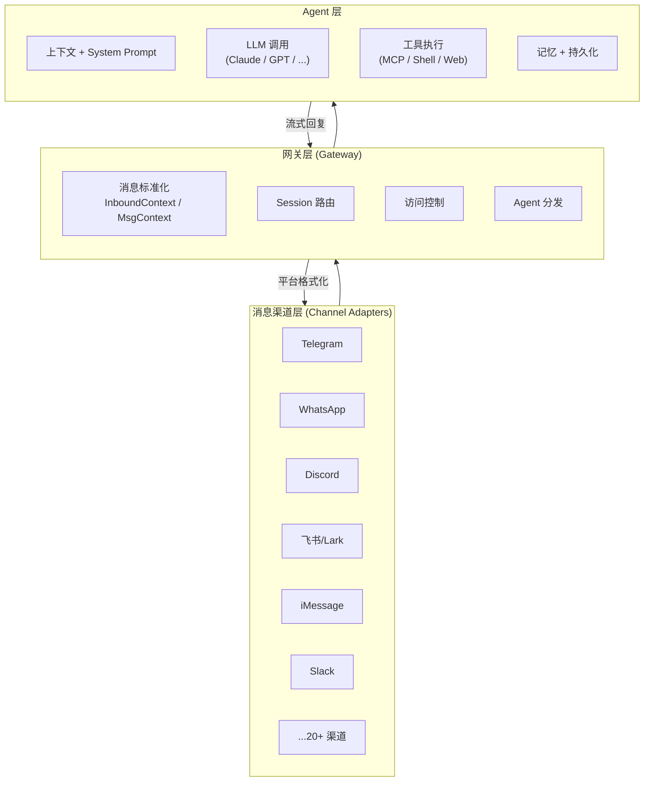
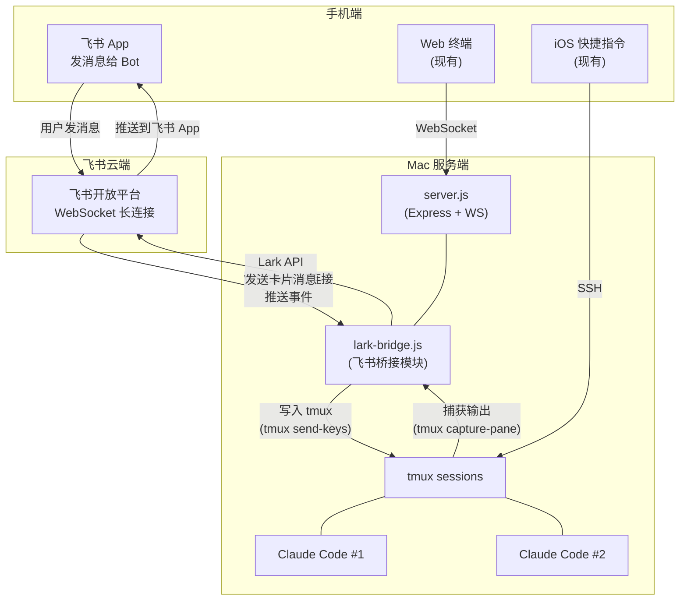
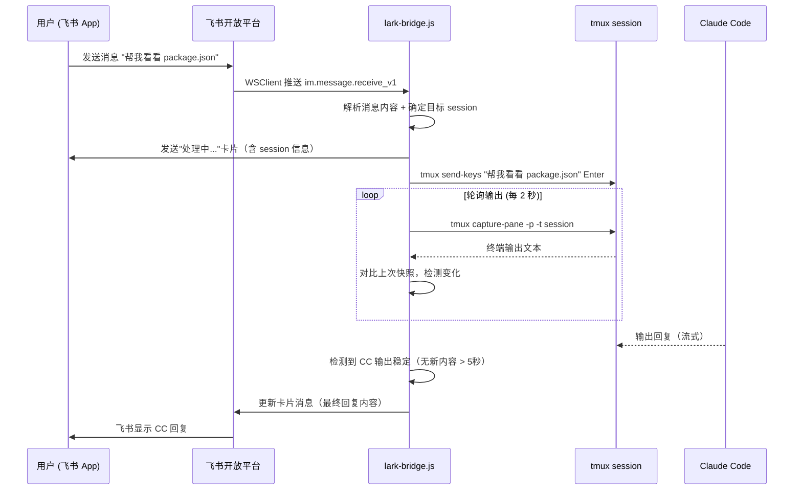
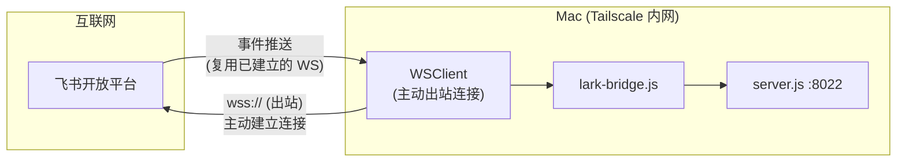

# 飞书（Lark）整合方案详解

> 目标：通过飞书 Bot 发送消息给 Claude Code session，CC 回复后通过飞书回传，实现移动端飞书 IM 操控 Claude Code 的完整闭环。

---

## 一、OpenClaw 多渠道架构原理

### 1.1 项目背景

[OpenClaw](https://github.com/openclaw/openclaw) 是由 Peter Steinberger 于 2025 年 11 月发布的开源多渠道 AI 网关框架（原名 Clawdbot，后更名为 Moltbot，最终定名 OpenClaw）。截至 2026 年 3 月，GitHub 已超 24.7 万 Stars。它将 WhatsApp、Telegram、Discord、Slack、iMessage、飞书等 20+ 消息平台统一接入一个 AI Agent 后端。

### 1.2 三层架构

OpenClaw 采用 **Hub-and-Spoke** 架构，核心分三层：



### 1.3 Channel Adapter 核心设计

每个消息平台有一个**专属适配器**，职责：

1. **入站标准化**：将平台特定的消息格式转换为统一的 `MsgContext` 结构

   ```
   MsgContext {
     sender: { id, name, platform }
     body: string              // 纯文本内容
     attachments: []            // 图片/文件/语音（已转码）
     channel: { id, type }     // 渠道标识
     metadata: { ... }         // 平台原始元数据
   }
   ```

2. **出站适配**：将 Agent 的统一回复格式转换回平台特定格式（文本、卡片、图片等）

3. **生命周期管理**：连接建立、心跳、重连、速率限制

### 1.4 消息处理流水线

```
收到消息 → Channel Adapter 标准化 → 去重 → 访问控制
→ Session 路由 → 上下文组装 → LLM 调用 → 工具执行
→ 回复流式输出 → Channel Adapter 格式化 → 发送回平台
```

关键设计原则：
- **渠道无关**：Gateway 和 Agent 层完全不感知具体平台
- **插件化**：内置渠道在 `src/{platform}/` 下，第三方通过 `openclaw.plugin.json` 注册
- **多 Agent 隔离**：不同渠道/联系人可路由到不同 Agent，各有独立 workspace 和记忆

### 1.5 对我们项目的启示

我们的项目与 OpenClaw 架构不同。OpenClaw 是完整的 AI Agent 运行时（自带 LLM 调用、工具沙箱、记忆管理），而我们是**直接操控 Claude Code CLI session**，通过 tmux 和 node-pty 桥接终端。我们不需要 OpenClaw 的 Agent 层，只借鉴它的**消息桥接模式**：

| 对比项 | OpenClaw | 我们的方案 |
|--------|----------|-----------|
| AI 后端 | 内置 LLM 调用 | Claude Code CLI（tmux session） |
| 消息处理 | 标准化 → Agent → 格式化 | 飞书消息 → 写入 tmux → 捕获输出 → 回传飞书 |
| 复杂度 | 完整框架，数万行代码 | 轻量模块，集成进现有 server.js |
| 适用场景 | 通用 AI 助手 | 专用 Claude Code 远程控制 |

---

## 二、飞书开放平台基础

### 2.1 自建应用 vs 商店应用

| 类型 | 适用场景 | 审核 | 推荐 |
|------|----------|------|------|
| **企业自建应用** | 内部使用，无需上架 | 企业管理员审核即可 | **推荐** |
| 商店应用 | 对外发布 | 飞书官方审核，周期长 | 不需要 |

我们选择**企业自建应用**，流程简单、权限灵活。

### 2.2 事件订阅方式：WebSocket 长连接 vs Webhook

| 方式 | 原理 | 需要公网 URL | 推荐 |
|------|------|-------------|------|
| **WebSocket 长连接** | SDK 主动连飞书平台，保持双向通道 | 不需要 | **强烈推荐** |
| Webhook 回调 | 飞书向你的 URL 发 POST 请求 | 需要（ngrok/反代） | 不推荐 |

**选择 WebSocket 长连接的理由：**
- 不需要公网 URL，Tailscale 内网环境直接可用
- 不需要 ngrok、Cloudflare Tunnel 等穿透方案
- `@larksuiteoapi/node-sdk` v1.24.0+ 原生支持
- 限制：每个应用最多 50 个连接，消息处理需 3 秒内响应（可异步处理后再回复）

---

## 三、整体架构设计

### 3.1 架构图



### 3.2 消息流（完整时序）



### 3.3 模块划分

```
server.js          ← 现有，新增 require('./lark-bridge')
lark-bridge.js     ← 新增，飞书桥接核心逻辑
lark-config.json   ← 新增，飞书应用配置（App ID/Secret、Session 映射）
```

集成方式：`lark-bridge.js` 作为独立模块，在 `server.js` 中 require 并传入 Express app 实例，不侵入现有终端逻辑。

---

## 四、飞书自建应用创建流程

### 4.1 创建应用

1. 访问 [飞书开放平台](https://open.feishu.cn/app)（国际版：open.larksuite.com/app）
2. 点击「创建企业自建应用」
3. 填写应用名称（如 "Claude Code Bot"）和描述
4. 创建后进入应用详情页

### 4.2 获取凭证

在「凭证与基础信息」页面获取：
- **App ID**（格式：`cli_xxx`）
- **App Secret**

将这两个值写入 `lark-config.json`（不入 git）。

### 4.3 启用机器人能力

1. 左侧菜单 → 「添加应用能力」
2. 选择「机器人」→ 点击添加

### 4.4 配置事件订阅

1. 左侧菜单 → 「事件与回调」
2. 订阅方式 → 选择「使用长连接接收事件」→ 保存
3. 点击「添加事件」→ 搜索 `im.message.receive_v1`（接收消息）→ 确认添加

### 4.5 权限配置

左侧菜单 → 「权限管理」，开通以下权限：

| 权限标识 | 说明 | 用途 |
|---------|------|------|
| `im:message` | 读取消息 | 接收用户消息 |
| `im:message:send_as_bot` | 以机器人身份发送消息 | 回复用户 |
| `im:message.p2p_msg` | 接收私聊消息 | 1:1 对话 |
| `im:message.group_at_msg` | 接收群 @Bot 消息 | 群内使用（可选） |
| `im:chat` | 获取群信息 | 群聊 session 路由（可选） |
| `im:resource` | 获取消息中的资源 | 接收图片/文件（可选） |

### 4.6 发布应用

1. 「版本管理与发布」→ 创建版本
2. 填写版本号和更新说明
3. 提交审核（企业内部应用，管理员审核即可）
4. 审核通过后，在飞书中搜索机器人名称即可使用

---

## 五、核心实现方案

### 5.1 依赖安装

```bash
npm install @larksuiteoapi/node-sdk
```

### 5.2 配置文件 lark-config.json

```json
{
  "appId": "cli_xxxxxxxxxxxxxxxx",
  "appSecret": "xxxxxxxxxxxxxxxxxxxxxxxxxxxxxxxx",
  "defaultSession": "claude-main",
  "allowedUserIds": ["ou_xxxxxxxxxxxx"],
  "sessionMapping": {
    "default": "claude-main",
    "project-a": "project-a",
    "project-b": "project-b"
  },
  "pollIntervalMs": 2000,
  "stableThresholdMs": 5000,
  "maxOutputLines": 80
}
```

字段说明：
- `allowedUserIds`：白名单，只有这些飞书用户的 Open ID 可以使用 Bot
- `sessionMapping`：消息中的关键字映射到 tmux session 名称
- `pollIntervalMs`：轮询 tmux 输出的间隔
- `stableThresholdMs`：输出稳定多久后认为 CC 回复结束

### 5.3 核心模块 lark-bridge.js 结构

```javascript
const Lark = require('@larksuiteoapi/node-sdk');
const { execSync } = require('child_process');
const fs = require('fs');

// --- 初始化 ---
const config = JSON.parse(fs.readFileSync('./lark-config.json', 'utf-8'));
const client = new Lark.Client({
  appId: config.appId,
  appSecret: config.appSecret,
});

// --- 状态管理 ---
// 每个 chat_id 维护：目标 session、上次输出快照、轮询定时器
const chatState = new Map();

// --- WebSocket 长连接 + 事件分发 ---
const wsClient = new Lark.WSClient({
  appId: config.appId,
  appSecret: config.appSecret,
  loggerLevel: Lark.LoggerLevel.info,
});

wsClient.start({
  eventDispatcher: new Lark.EventDispatcher({}).register({
    'im.message.receive_v1': async (data) => {
      // 1. 权限校验
      // 2. 解析消息内容
      // 3. 路由到目标 tmux session
      // 4. 发送"处理中"卡片
      // 5. 写入 tmux（send-keys）
      // 6. 启动轮询捕获输出
    },
  }),
});
```

### 5.4 关键函数设计

#### 5.4.1 消息解析

```javascript
function parseMessage(messageData) {
  const { message } = messageData;
  const msgType = message.message_type;

  if (msgType === 'text') {
    const content = JSON.parse(message.content);
    return { type: 'text', text: content.text };
  }

  if (msgType === 'image') {
    // 下载图片 → 保存到 /tmp → 返回路径
    return { type: 'image', path: '/tmp/lark-img-xxx.png' };
  }

  // 富文本、文件等类型按需扩展
  return { type: 'unsupported' };
}
```

#### 5.4.2 写入 tmux

```javascript
function sendToTmux(session, text) {
  const escaped = text.replace(/'/g, "'\\''");
  execSync(
    `/opt/homebrew/bin/tmux send-keys -t "${session}" '${escaped}' Enter`,
    { timeout: 5000 }
  );
}
```

#### 5.4.3 捕获 tmux 输出

```javascript
function captureTmuxOutput(session, lines = 80) {
  try {
    return execSync(
      `/opt/homebrew/bin/tmux capture-pane -t "${session}" -p -S -${lines}`,
      { encoding: 'utf-8', timeout: 5000 }
    );
  } catch {
    return '';
  }
}
```

#### 5.4.4 输出变化检测 + 稳定判断

```javascript
function startOutputPolling(chatId, session) {
  const state = chatState.get(chatId);
  let lastSnapshot = captureTmuxOutput(session);
  let lastChangeTime = Date.now();

  state.pollTimer = setInterval(async () => {
    const current = captureTmuxOutput(session);

    if (current !== lastSnapshot) {
      lastSnapshot = current;
      lastChangeTime = Date.now();
    }

    // 输出稳定超过阈值 → 认为回复完成
    if (Date.now() - lastChangeTime > config.stableThresholdMs) {
      clearInterval(state.pollTimer);
      const reply = extractCCReply(current);
      await sendLarkCard(chatId, reply);
    }
  }, config.pollIntervalMs);
}
```

#### 5.4.5 发送飞书卡片消息

```javascript
async function sendLarkCard(chatId, content) {
  const truncated = content.length > 4000
    ? content.slice(0, 4000) + '\n\n... (输出过长，已截断)'
    : content;

  await client.im.v1.message.create({
    params: { receive_id_type: 'chat_id' },
    data: {
      receive_id: chatId,
      msg_type: 'interactive',
      content: JSON.stringify({
        config: { wide_screen_mode: true },
        header: {
          template: 'blue',
          title: { tag: 'plain_text', content: 'Claude Code' },
        },
        elements: [
          {
            tag: 'markdown',
            content: truncated,
          },
          {
            tag: 'note',
            elements: [
              {
                tag: 'plain_text',
                content: `Session: ${chatState.get(chatId)?.session || 'unknown'} | ${new Date().toLocaleTimeString('zh-CN')}`,
              },
            ],
          },
        ],
      }),
    },
  });
}
```

---

## 六、Session 路由策略

### 6.1 单 Session 模式（默认）

所有飞书消息发送到 `lark-config.json` 中指定的 `defaultSession`。适合个人使用。

### 6.2 多 Session 模式

通过消息前缀指令切换目标 session：

| 用户输入 | 解析结果 |
|---------|---------|
| `帮我看看代码` | 发送到 defaultSession |
| `/session project-a` | 切换当前聊天的目标 session 为 project-a |
| `/sessions` | 列出所有可用 tmux sessions |
| `/status` | 显示当前绑定的 session 和状态 |

```javascript
function handleCommand(chatId, text) {
  if (text.startsWith('/session ')) {
    const target = text.slice(9).trim();
    // 验证 tmux session 存在
    try {
      execSync(`/opt/homebrew/bin/tmux has-session -t "${target}" 2>/dev/null`);
      chatState.get(chatId).session = target;
      return { handled: true, reply: `已切换到 session: ${target}` };
    } catch {
      return { handled: true, reply: `Session "${target}" 不存在` };
    }
  }

  if (text === '/sessions') {
    // 列出所有 tmux sessions
    const list = execSync(
      `/opt/homebrew/bin/tmux list-sessions -F '#\{session_name\}' 2>/dev/null`,
      { encoding: 'utf-8' }
    ).trim();
    return { handled: true, reply: `可用 sessions:\n${list}` };
  }

  if (text === '/status') {
    const session = chatState.get(chatId)?.session || config.defaultSession;
    return { handled: true, reply: `当前 session: ${session}` };
  }

  return { handled: false };
}
```

### 6.3 群聊场景（可选扩展）

在群中 @Bot 发消息：
- 群 chat_id 绑定一个固定 session（通过 `sessionMapping` 配置）
- 不同群可以操控不同的 CC session
- 多人可以在同一群中看到 CC 的回复

---

## 七、消息格式处理

### 7.1 入站（飞书 → CC）

| 飞书消息类型 | 处理方式 | 优先级 |
|-------------|---------|--------|
| **文本** | 直接 send-keys 到 tmux | P0 核心 |
| **富文本** | 提取纯文本部分 | P1 |
| **图片** | 下载到 /tmp，路径作为 CC 输入 | P2 |
| **文件** | 下载到 /tmp，路径作为 CC 输入 | P2 |
| **语音** | 飞书转文字 → 文本发送（需额外权限） | P3 |
| **表情/贴纸** | 忽略 | - |

### 7.2 出站（CC → 飞书）

| CC 输出内容 | 飞书消息格式 |
|-------------|-------------|
| 纯文本回复 | **消息卡片**（Markdown 格式） |
| 代码块 | 卡片中的 Markdown code block |
| 长输出（>4000字符） | 截断 + 提示"输出过长" |
| 工具调用过程 | 可选：中间卡片更新，显示进度 |

### 7.3 卡片消息设计

```
+------------------------------------------+
|  Claude Code                     [blue]   |
+------------------------------------------+
|                                          |
|  我查看了 package.json，发现以下依赖：      |
|                                          |
|  ```json                                 |
|  {                                       |
|    "express": "^4.18.2",                 |
|    "ws": "^8.14.2",                      |
|    "node-pty": "^1.0.0"                  |
|  }                                       |
|  ```                                     |
|                                          |
|  共 3 个 dependencies，                   |
|  0 个 devDependencies。                   |
|                                          |
+------------------------------------------+
|  Session: claude-main | 14:32:05         |
+------------------------------------------+
```

### 7.4 流式卡片更新（高级）

飞书支持通过 `PATCH im/v1/messages/{message_id}` 更新已发送的卡片内容，可以实现类似"打字中"的效果：

1. 用户发送消息后，立即创建一张"处理中..."卡片
2. 每隔几秒检测到新输出，调用 API 更新卡片内容
3. 输出稳定后，发送最终版本的卡片

这样用户不需要等待 CC 完全回复完毕就能看到中间进展。

---

## 八、安全与权限

### 8.1 访问控制

```javascript
function isAllowed(userId) {
  // 白名单模式：只有配置中的用户可以使用
  return config.allowedUserIds.includes(userId);
}
```

白名单中的 `userId` 是飞书的 Open ID（格式 `ou_xxx`），可在飞书开放平台的事件日志中查到。

### 8.2 敏感信息保护

- `lark-config.json` 加入 `.gitignore`，不入版本库
- App Secret 只存在于本机
- WebSocket 长连接由飞书 SDK 管理，使用 TLS 加密
- tmux session 只在 localhost 访问，飞书桥接模块运行在同一台 Mac

### 8.3 输入消毒

```javascript
function sanitizeInput(text) {
  // 防止 tmux 命令注入
  // 移除控制字符、限制长度
  return text
    .replace(/[\x00-\x08\x0b\x0c\x0e-\x1f]/g, '')
    .slice(0, 2000);
}
```

---

## 九、与现有 server.js 的集成

### 9.1 集成方式

在 `server.js` 末尾添加条件加载：

```javascript
// --- Lark Bot Integration (optional) ---
const larkConfigPath = path.join(__dirname, 'lark-config.json');
if (fs.existsSync(larkConfigPath)) {
  try {
    const larkBridge = require('./lark-bridge');
    larkBridge.init(app, wss);
    console.log('[lark] bridge module loaded');
  } catch (e) {
    console.error('[lark] failed to load bridge:', e.message);
  }
}
```

特点：
- **可选加载**：没有 `lark-config.json` 则不启动飞书功能，零侵入
- **共享 Express**：飞书相关的 REST API（如 `/api/lark/status`）挂在同一个 server 上
- **独立模块**：`lark-bridge.js` 不依赖 server.js 的 WebSocket 终端逻辑

### 9.2 新增 API 端点

| 端点 | 方法 | 用途 |
|------|------|------|
| `GET /api/lark/status` | GET | 查看飞书连接状态 |
| `POST /api/lark/send` | POST | 手动通过 API 发飞书消息（调试用） |

### 9.3 start-claude.sh 无需修改

飞书桥接模块随 `server.js` 启动，不需要额外的进程管理。`start-claude.sh` 启动 Web Terminal 时自动加载飞书功能。

---

## 十、网络拓扑

### 10.1 为什么不需要公网穿透



关键：WSClient 是**客户端主动向飞书平台发起** WebSocket 连接（出站），不需要飞书回调你的服务器。只要 Mac 能访问互联网即可，无需公网 IP、域名、反向代理或 ngrok。

### 10.2 与 Webhook 方案的对比

| 方面 | WebSocket 长连接 | Webhook 回调 |
|------|-----------------|-------------|
| 公网 URL | 不需要 | 需要（ngrok/Cloudflare Tunnel） |
| 额外成本 | 无 | ngrok 付费 / 域名费用 |
| 延迟 | 低（保持连接） | 每次 HTTP 建立连接 |
| 运维 | 简单 | 需维护穿透服务稳定性 |
| 限制 | 最多 50 连接 / 应用 | 3 秒内响应否则重试 |

---

## 十一、完整实施步骤

### Phase 1：基础连通（P0）

1. 飞书开放平台创建自建应用 + 配置权限和事件
2. 安装 `@larksuiteoapi/node-sdk`
3. 编写 `lark-bridge.js`，实现：
   - WSClient 连接
   - 接收文本消息
   - 写入默认 tmux session
   - 轮询输出 + 回复文本消息
4. 在 `server.js` 中条件加载
5. 测试端到端流程

### Phase 2：体验优化（P1）

1. 卡片消息替代纯文本
2. 流式卡片更新（处理中 → 最终回复）
3. Session 切换命令（`/session`、`/sessions`、`/status`）
4. CC 输出智能截取（去掉 ANSI 转义码、提取有效内容）

### Phase 3：高级功能（P2）

1. 图片/文件消息支持（下载到 /tmp → 路径传给 CC）
2. 群聊支持（@Bot 触发）
3. 语音消息（飞书转文字 → 文本输入）
4. Web 终端页面显示飞书连接状态

---

## 十二、已知限制与风险

| 问题 | 影响 | 缓解方案 |
|------|------|---------|
| CC 输出包含 ANSI 转义码 | 飞书显示乱码 | strip-ansi 清洗后再发送 |
| CC 交互式提示（y/n） | 飞书用户不知道需要确认 | 检测提示模式，发送带按钮的卡片 |
| 长时间任务（> 30 分钟） | 轮询消耗资源 | 设置超时上限，超时后通知用户 |
| 多人同时发消息到同一 session | 命令交叉 | 消息队列 + 锁 |
| 飞书 WebSocket 断线 | 暂时无法接收消息 | SDK 内置重连机制，添加断线告警 |
| tmux session 不存在 | 命令执行失败 | 提前检查 session 存在性，提示用户启动 |

---

## 十三、参考资源

- [OpenClaw 官方仓库](https://github.com/openclaw/openclaw)
- [OpenClaw 多渠道文档](https://docs.openclaw.ai/channels)
- [OpenClaw 飞书渠道配置](https://docs.openclaw.ai/channels/feishu)
- [OpenClaw 架构深度解析](https://ppaolo.substack.com/p/openclaw-system-architecture-overview)
- [OpenClaw 三层架构指南](https://eastondev.com/blog/en/posts/ai/20260205-openclaw-architecture-guide/)
- [飞书开放平台](https://open.feishu.cn/app)
- [飞书开发文档](https://open.feishu.cn/document?lang=zh-CN)
- [@larksuiteoapi/node-sdk (npm)](https://www.npmjs.com/package/@larksuiteoapi/node-sdk)
- [@larksuiteoapi/node-sdk (GitHub)](https://github.com/larksuite/node-sdk)
- [飞书消息卡片构建工具](https://open.feishu.cn/document/tools-and-resources/message-card-builder?lang=zh-CN)
- [飞书消息卡片介绍](https://open.feishu.cn/document/common-capabilities/message-card/introduction-of-message-cards)
- [OpenClaw Wikipedia](https://en.wikipedia.org/wiki/OpenClaw)
