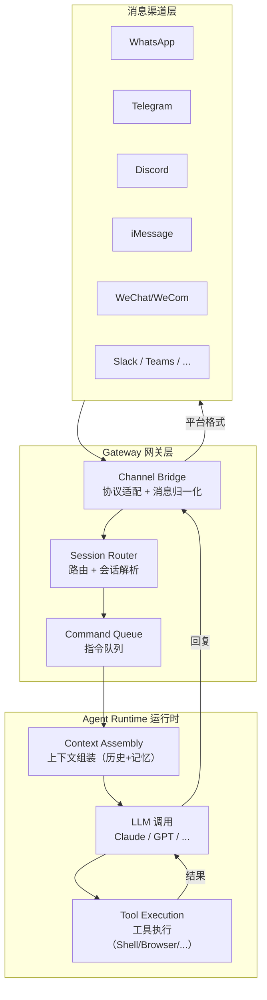
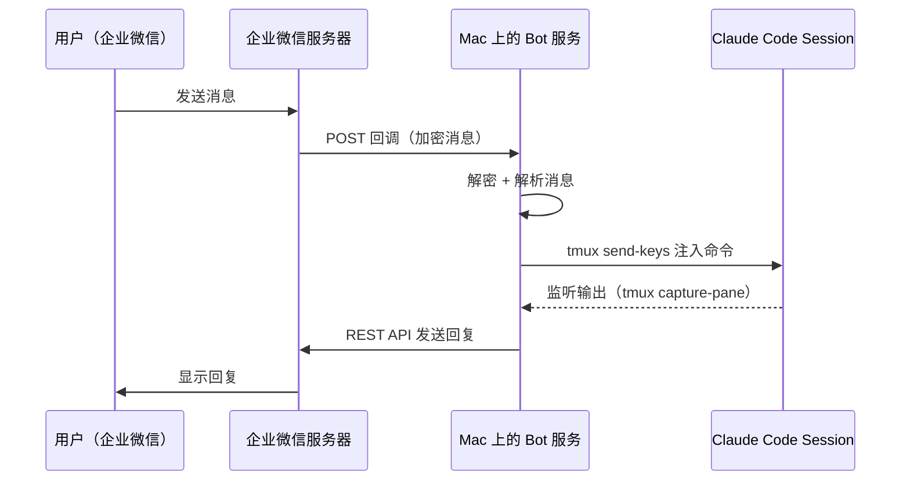
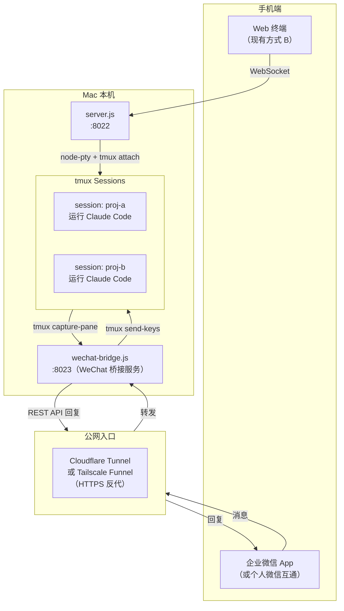
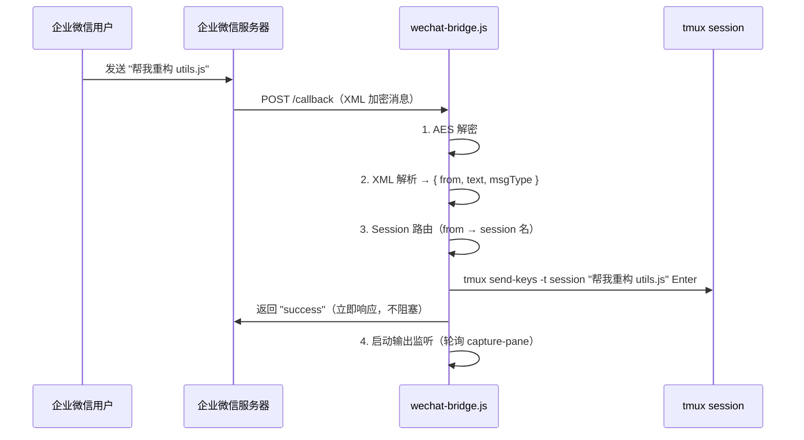
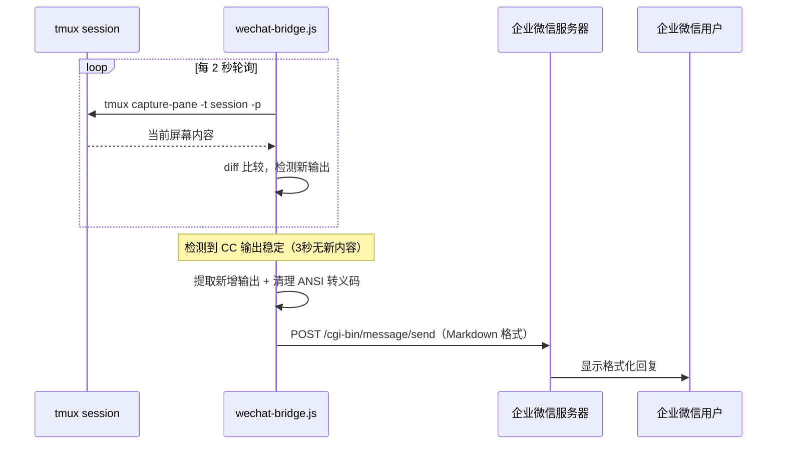
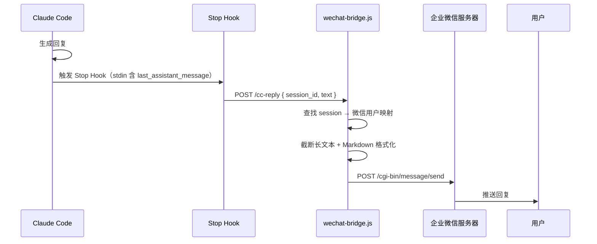
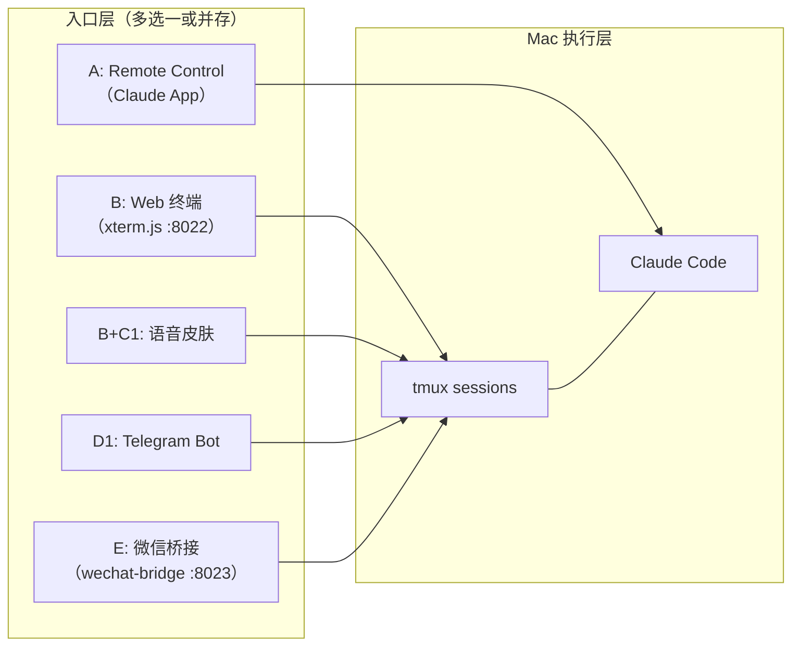

# 微信（WeChat）整合方案详解

> 目标：通过微信发消息给 Mac 上的 bot，bot 将消息转发到 Claude Code session，CC 回复后通过微信回传。本文档基于 OpenClaw 多渠道架构原理研究和现有项目架构，提出完整的微信接入方案。

---

## 一、OpenClaw 多渠道架构原理

### 1.1 项目背景

[OpenClaw](https://github.com/openclaw/openclaw)（前身 Clawdbot / Moltbot，2026年1月更名）是一个开源的自托管 AI Agent 框架，核心能力是将 LLM 变成跨消息平台的持久化智能助手。截至 2026年3月，GitHub 上已有 247k+ stars。

### 1.2 三层架构

OpenClaw 采用 **Gateway（网关）- Channel（渠道）- Agent Runtime（运行时）** 三层设计：



### 1.3 Channel Plugin 机制

每个消息渠道是一个独立的 **Channel Plugin**，必须实现三个核心接口：

| 接口 | 职责 |
|------|------|
| `listen()` | 监听平台消息，转换为 `InboundContext`（归一化消息载荷） |
| `send()` | 将 Agent 回复转换为平台格式并发送（含 `sendText`、`sendMedia` 等） |
| `health_check()` | 连接健康检测、掉线自动重连 |

每个 Plugin 包含一个 `openclaw.plugin.json` 清单文件，声明配置 schema，Gateway 在启动时动态加载。

### 1.4 消息生命周期

```
入站消息 → Channel Bridge（协议解析 + 归一化）
         → Session Resolution（sender → session 映射）
         → Command Queue（排队）
         → Agent Runtime（LLM + 工具调用）
         → 出站回复 → Channel Bridge（平台格式化）
         → 消息渠道（发回用户）
```

**关键设计思想**：Gateway 是唯一持有消息连接的进程——每个平台只有一个连接实例（一个 WhatsApp session、一个 Telegram bot 等），消息经过归一化后与具体平台解耦。

### 1.5 对我们项目的启示

OpenClaw 的架构为我们提供了明确的设计参考：

1. **消息归一化**：不管消息来自微信还是 Web 终端，统一为 `{ sender, text, attachments, session }` 格式
2. **Session 路由**：通过 sender 身份映射到具体的 CC tmux session
3. **健康监控**：Channel 需要心跳检测和掉线重连机制
4. **Plugin 隔离**：微信渠道作为独立模块，不影响现有 Web 终端功能

---

## 二、微信接入方案对比

### 2.1 三种方案总览

| 维度 | 个人微信（Wechaty/WeChatFerry） | 企业微信（自建应用） | 微信公众号 |
|------|------|------|------|
| **接入对象** | 个人微信号 | 企业微信组织成员 | 关注公众号的用户 |
| **协议方式** | Hook/iPad协议/Web协议 | 官方 REST API + 回调 | 官方 REST API + 回调 |
| **封号风险** | 中~高（非官方协议） | 无（官方 API） | 无（官方 API） |
| **消息类型** | 文字/语音/图片/文件 | 文字/图片/文件/Markdown | 文字/图片/语音（5秒内回复限制） |
| **部署要求** | 需登录态（扫码） | 需企业微信管理后台 | 需公众号后台 + 备案域名 |
| **双向通信** | 实时双向 | 实时双向 | 被动回复（5秒限制）或客服消息（48h限制） |
| **适合场景** | 个人使用、快速原型 | 团队协作、长期稳定 | 面向外部用户 |
| **月费** | 免费（Web）/ 付费（iPad协议~200元/月） | 免费 | 免费 |
| **稳定性** | 低~中（微信反爬） | 高 | 高 |

### 2.2 方案 A：个人微信（Wechaty + Puppet）

#### 原理

[Wechaty](https://wechaty.js.org/) 是最主流的微信机器人框架，采用四层架构：

```
上层接口层（Wechaty API）
    ↓
Puppet Service 服务层（gRPC 暴露统一接口）
    ↓
Puppet Abstract 抽象层（协议无关的抽象类）
    ↓
具体 Puppet 实现（Web / iPad / Windows Hook）
```

不同 Puppet 协议对比：

| Puppet | 协议 | 免费 | 稳定性 | 封号风险 | 备注 |
|--------|------|------|--------|---------|------|
| puppet-wechat4u | Web 协议 | 是 | 低 | 中 | 2017年后注册的号可能无法登录网页版 |
| puppet-padlocal | iPad 协议 | 否（付费） | 高 | 低 | gRPC 双向通信，不共享 IP |
| WeChatFerry | Windows Hook | 是 | 中 | 中 | 需要 Windows 环境运行 PC 微信 |
| GeweChat | Pad 协议 | 免费版可用 | 中 | 中 | 较新，社区活跃 |

**风险**：所有个人微信方案均为非官方协议，微信可能随时更新反爬策略导致失效或封号。

#### 优势
- 直接用自己的微信号，不需要额外注册
- 交互体验最自然（就像跟朋友聊天）
- 支持语音消息（可转文字后发给 CC）

#### 劣势
- 封号风险始终存在
- Web 协议不支持 2017 年后注册的部分账号
- iPad 协议需付费
- 登录态需要定期维护（扫码重新登录）

### 2.3 方案 B：企业微信自建应用（推荐）

#### 原理

在企业微信管理后台创建「自建应用」，配置消息回调 URL。当用户在企业微信中给应用发消息时，企业微信服务器会将消息 POST 到回调 URL；应用处理后通过 REST API 主动推送回复。



#### 关键 API

| 操作 | API | 说明 |
|------|-----|------|
| 接收消息 | `POST /callback` | 企业微信推送，需解密（AES） |
| 发送消息 | `POST /cgi-bin/message/send` | 主动推送，支持 text/image/markdown |
| 获取 Token | `GET /cgi-bin/gettoken` | 2h 过期，需定时刷新 |
| 上传媒体 | `POST /cgi-bin/media/upload` | 图片/文件上传 |

#### 优势
- **零封号风险**：完全使用官方 API
- **稳定可靠**：不依赖逆向协议，不会因微信更新失效
- **支持 Markdown**：回复可以格式化显示
- **企业微信可与个人微信互通**：通过"微信插件"功能，个人微信用户也能收到应用消息
- **已有成熟生态**：OpenClaw 已有 [WeCom channel plugin](https://github.com/sunnoy/openclaw-plugin-wecom)

#### 劣势
- 需要注册企业微信组织（免费，可用个人信息注册）
- 配置略复杂（需设置回调 URL、可信 IP）
- 回调 URL 需要公网可达（Tailscale 内网需搭桥）

### 2.4 方案 C：微信公众号

#### 原理

在公众号后台配置服务器 URL，用户发送的消息由微信服务器转发到该 URL。服务端需在 5 秒内回复，否则超时。

#### 优势
- 官方 API，零风险
- 任何微信用户关注即可使用

#### 劣势
- **5 秒回复限制**：CC 处理通常远超 5 秒，需要异步+客服消息接口（48h 限制）
- 需要备案域名
- 交互体验差（公众号对话而非聊天窗口）
- 不适合个人工具场景

### 2.5 方案选择建议

```
个人快速体验 → 方案 A（Wechaty + GeweChat/WeChatFerry）
长期稳定使用 → 方案 B（企业微信自建应用）★ 推荐
面向外部用户 → 方案 C（公众号）
```

**本文档后续以方案 B（企业微信）为主线展开，方案 A 作为备选补充。**

---

## 三、推荐方案：企业微信自建应用 + 现有 server.js 集成

### 3.1 完整架构



### 3.2 组件职责

| 组件 | 文件 | 职责 |
|------|------|------|
| Web 终端服务 | `server.js` (:8022) | 现有功能不变，管理 xterm.js + WebSocket 终端连接 |
| 微信桥接服务 | `wechat-bridge.js` (:8023) | 处理企业微信回调、管理 CC 交互、发送回复 |
| 公网入口 | Cloudflare Tunnel / Tailscale Funnel | 将内网服务暴露给企业微信服务器回调 |
| 启动脚本 | `start-claude.sh` | 增加微信桥接服务的启动/停止管理 |

### 3.3 为什么独立为 wechat-bridge.js 而不是合并到 server.js

1. **职责分离**：server.js 管终端连接（node-pty），wechat-bridge.js 管消息桥接（HTTP 收发），互不干扰
2. **独立生命周期**：微信服务可以单独重启而不影响正在运行的终端连接
3. **端口隔离**：Cloudflare Tunnel 只暴露 8023（微信回调），8022（终端）保持 Tailscale 内网
4. **符合 OpenClaw Channel Plugin 思想**：渠道适配器独立于核心网关

---

## 四、消息流详解

### 4.1 入站消息处理（用户 → CC）



### 4.2 出站消息处理（CC → 用户）



### 4.3 利用现有 Stop Hook（更优方案）

项目已有 Stop Hook 机制，CC 每次回复结束后触发。可以直接复用：

```json
{
  "hooks": {
    "Stop": [{
      "matcher": "",
      "hooks": [{
        "type": "command",
        "command": "curl -s -X POST http://localhost:8023/cc-reply -H 'Content-Type: application/json' -d \"$(cat /dev/stdin | jq -c '{session_id: .session_id, text: .last_assistant_message}')\""
      }]
    }]
  }
}
```

这样 CC 的每次完整回复都会自动推送到 wechat-bridge.js，无需轮询 capture-pane。**这比轮询方案更可靠**，是推荐的实现方式。



---

## 五、Session 路由策略

### 5.1 问题

用户可能有多个 CC session（proj-a、proj-b），微信消息如何知道发到哪个 session？

### 5.2 路由规则

```
1. 默认 session：用户绑定一个默认 session，消息自动发到这里
2. 指令切换：发送 "#session proj-b" 切换当前 session
3. 指令前缀：发送 "#proj-b 帮我修 bug" 指定 session
4. 查看列表：发送 "#ls" 列出所有可用 session
5. 状态查询：发送 "#status" 查看当前绑定的 session
```

### 5.3 数据结构

```javascript
// wechat-bridge.js 内部维护的路由表
const userSessionMap = new Map();
// key: 企业微信 userId
// value: { currentSession: 'proj-a', lastActiveAt: Date }

// 持久化到文件（重启不丢失）
const ROUTE_FILE = path.join(os.homedir(), '.claude', 'wechat-routes.json');
```

---

## 六、消息格式处理

### 6.1 支持的消息类型

| 消息类型 | 入站处理（用户 → CC） | 出站处理（CC → 用户） |
|---------|---------------------|---------------------|
| 文字 | 直接注入 tmux | Markdown 格式化后发送 |
| 语音 | 下载 → 调用语音识别 API → 文字注入 | 文字回复 + 可选 TTS 语音 |
| 图片 | 下载到 /tmp → 路径注入 CC（CC 可读图） | 截图以图片消息发送 |
| 文件 | 下载到 /tmp → 路径注入 CC | 文件路径通知（不主动发文件） |

### 6.2 出站文本处理

CC 的输出包含 ANSI 转义码和终端格式，需要清理：

```javascript
function cleanAnsi(text) {
  // 移除 ANSI 转义序列
  return text.replace(/\x1B\[[0-9;]*[a-zA-Z]/g, '')
             .replace(/\x1B\].*?\x07/g, '')  // OSC 序列
             .replace(/[\x00-\x08\x0E-\x1F]/g, '');  // 控制字符
}

function truncateForWeCom(text, maxLen = 2048) {
  if (text.length <= maxLen) return text;
  return text.slice(0, maxLen - 20) + '\n\n...(内容已截断)';
}
```

### 6.3 语音消息处理

企业微信的语音消息为 AMR 格式，处理流程：

```
收到语音 → 下载 AMR 文件 → 调用语音识别（可选方案）:
  a) 企业微信自带的语音转文字（部分语音消息自带 Recognition 字段）
  b) 本地 whisper.cpp 转文字（离线、免费、隐私）
  c) 腾讯云 ASR API
→ 文字结果注入 CC
```

推荐方案 b（本地 whisper.cpp），与项目「本地执行」原则一致。

---

## 七、wechat-bridge.js 核心设计

### 7.1 模块结构

```
wechat-bridge.js
├── 企业微信 API 封装
│   ├── 消息解密（AES-256-CBC）
│   ├── Token 管理（自动刷新）
│   └── 消息发送（text / markdown / image）
├── tmux 交互层
│   ├── send-keys 注入命令
│   ├── capture-pane 读取输出（备选方案）
│   └── list-sessions 列出可用会话
├── Session 路由
│   ├── 用户-Session 映射管理
│   ├── 指令解析（#session / #ls / #status）
│   └── 路由持久化
├── Stop Hook 接收端
│   ├── POST /cc-reply 接收 CC 回复
│   └── 回复格式化 + 推送
└── HTTP 服务
    ├── GET  /callback   企业微信 URL 验证
    ├── POST /callback   消息接收
    ├── POST /cc-reply   Stop Hook 回调
    └── GET  /health     健康检查
```

### 7.2 关键代码示例

#### 企业微信消息解密

```javascript
const crypto = require('crypto');
const xml2js = require('xml2js');

function decryptMsg(encodingAESKey, encryptedMsg) {
  const aesKey = Buffer.from(encodingAESKey + '=', 'base64');
  const iv = aesKey.slice(0, 16);
  const decipher = crypto.createDecipheriv('aes-256-cbc', aesKey, iv);
  decipher.setAutoPadding(false);
  let decrypted = Buffer.concat([decipher.update(encryptedMsg, 'base64'), decipher.final()]);
  // 去除 PKCS7 padding
  const pad = decrypted[decrypted.length - 1];
  decrypted = decrypted.slice(0, decrypted.length - pad);
  // 前 16 字节随机，4 字节消息长度，后面是消息内容 + corpId
  const msgLen = decrypted.readUInt32BE(16);
  const msg = decrypted.slice(20, 20 + msgLen).toString('utf-8');
  return msg;
}
```

#### 消息回调处理

```javascript
app.post('/callback', async (req, res) => {
  // 1. 立即返回 success（企业微信要求 5 秒内响应）
  res.send('success');

  // 2. 解密消息
  const xmlStr = decryptMsg(ENCODING_AES_KEY, req.body.xml.Encrypt[0]);
  const parsed = await xml2js.parseStringPromise(xmlStr);

  const msgType = parsed.xml.MsgType[0];
  const fromUser = parsed.xml.FromUserName[0];
  const content = parsed.xml.Content?.[0] || '';

  // 3. 检查是否为路由指令
  if (content.startsWith('#')) {
    await handleCommand(fromUser, content);
    return;
  }

  // 4. 查找目标 session
  const route = userSessionMap.get(fromUser);
  if (!route?.currentSession) {
    await sendTextToUser(fromUser, '未绑定 session，请发送 #ls 查看可用列表，#session <名称> 绑定');
    return;
  }

  // 5. 注入到 tmux
  const escaped = content.replace(/'/g, "'\\''");
  execSync(`/opt/homebrew/bin/tmux send-keys -t "${route.currentSession}" '${escaped}' Enter`);
});
```

#### Stop Hook 回复接收

```javascript
app.post('/cc-reply', (req, res) => {
  const { session_id, text } = req.body;
  if (!text) return res.json({ ok: false });

  // 查找绑定到该 session 的用户
  for (const [userId, route] of userSessionMap.entries()) {
    if (route.currentSession === session_id) {
      const cleaned = cleanAnsi(text);
      const truncated = truncateForWeCom(cleaned);
      sendMarkdownToUser(userId, truncated);
    }
  }
  res.json({ ok: true });
});
```

---

## 八、公网暴露方案

企业微信回调需要公网 HTTPS 地址。三种方案：

### 8.1 方案对比

| 方案 | 免费 | 稳定性 | 配置复杂度 | 推荐 |
|------|------|--------|-----------|------|
| Cloudflare Tunnel | 是 | 高 | 低 | 推荐 |
| Tailscale Funnel | 是 | 高 | 最低 | 备选（限速） |
| 自有域名 + 反代 | 需域名 | 高 | 中 | 已有域名时 |

### 8.2 Cloudflare Tunnel 配置（推荐）

```bash
# 安装 cloudflared
brew install cloudflared

# 登录（一次性）
cloudflared tunnel login

# 创建隧道
cloudflared tunnel create wechat-bot

# 配置路由（~/.cloudflared/config.yml）
# tunnel: <tunnel-id>
# credentials-file: /Users/xxx/.cloudflared/<tunnel-id>.json
# ingress:
#   - hostname: wechat-bot.yourdomain.com
#     service: http://localhost:8023
#   - service: http_status:404

# 启动隧道
cloudflared tunnel run wechat-bot
```

启动后，`https://wechat-bot.yourdomain.com/callback` 即可作为企业微信回调 URL。

### 8.3 Tailscale Funnel（更简单但有限制）

```bash
# 启用 Funnel（需要在 Tailscale 管理后台开启）
tailscale funnel 8023
# 自动获得 https://your-machine.tailnet-name.ts.net:8023
```

注意：Tailscale Funnel 有带宽限制，但对消息量不大的个人使用足够。

---

## 九、企业微信配置步骤

### 9.1 注册企业微信

1. 访问 [work.weixin.qq.com](https://work.weixin.qq.com/) 注册
2. 企业类型选「其他」，可以用个人信息注册
3. 记录 **企业 ID**（CorpID）

### 9.2 创建自建应用

1. 进入「应用管理」→「自建」→「创建应用」
2. 填写应用名称（如「Claude Assistant」）、上传 logo
3. 设置可见范围（选自己所在的部门）
4. 记录 **AgentId** 和 **Secret**

### 9.3 配置消息回调

1. 在应用详情页 → 「接收消息」→ 开启「接收消息模式」
2. 填写：
   - **URL**: `https://wechat-bot.yourdomain.com/callback`
   - **Token**: 自定义一个随机字符串
   - **EncodingAESKey**: 点「随机获取」
3. 企业微信会发送 GET 验证请求，确保你的服务已启动

### 9.4 配置可信 IP

1. 在应用详情页 → 「企业可信IP」
2. 添加你的公网 IP（Cloudflare Tunnel 出口 IP 或服务器公网 IP）

### 9.5 开启个人微信互通（可选）

1. 在「我的企业」→「微信插件」中开启
2. 企业成员可用个人微信接收应用消息
3. 这样就能在普通微信中与 Claude 对话

---

## 十、部署和运维

### 10.1 集成到 start-claude.sh

在现有启动脚本中增加微信桥接服务的管理：

```bash
# 在 start_web_terminal() 之后添加
start_wechat_bridge() {
  if ! lsof -i :8023 -sTCP:LISTEN -t >/dev/null 2>&1; then
    echo "[wechat] Starting wechat-bridge on :8023..."
    (cd "$PROJECT_DIR" && nohup node wechat-bridge.js </dev/null >/dev/null 2>&1 &) </dev/null >/dev/null 2>&1
    sleep 1
    echo "[wechat] Bridge started"
  fi
}

stop_wechat_bridge() {
  local pid=$(lsof -i :8023 -sTCP:LISTEN -t 2>/dev/null)
  if [ -n "$pid" ]; then
    kill "$pid"
    echo "[wechat] Bridge stopped"
  fi
}
```

### 10.2 Token 自动刷新

企业微信 access_token 有效期 2 小时，需定期刷新：

```javascript
let accessToken = '';
let tokenExpireAt = 0;

async function getAccessToken() {
  if (Date.now() < tokenExpireAt - 60000) return accessToken;
  const url = `https://qyapi.weixin.qq.com/cgi-bin/gettoken?corpid=${CORP_ID}&corpsecret=${SECRET}`;
  const resp = await fetch(url);
  const data = await resp.json();
  accessToken = data.access_token;
  tokenExpireAt = Date.now() + data.expires_in * 1000;
  return accessToken;
}
```

### 10.3 掉线重连与健康检查

```javascript
// 定期健康检查
setInterval(async () => {
  try {
    const token = await getAccessToken();
    // token 获取成功 = 连接正常
    console.log('[health] WeChat API connected');
  } catch (e) {
    console.error('[health] WeChat API error:', e.message);
    // 触发告警（可以通过现有 notify-event 接口）
    fetch('http://localhost:8022/notify-event', {
      method: 'POST',
      headers: { 'Content-Type': 'application/json' },
      body: JSON.stringify({ title: 'WeChat Bridge', message: 'API 连接异常' })
    }).catch(() => {});
  }
}, 5 * 60 * 1000); // 每 5 分钟
```

### 10.4 日志与调试

```javascript
// 所有日志统一前缀，方便 grep
console.log('[wechat] incoming message from user:', fromUser);
console.log('[wechat] routing to session:', sessionName);
console.log('[wechat] cc-reply received, length:', text.length);
```

---

## 十一、备选方案 A 补充：个人微信（WeChatFerry）

如果不想用企业微信，可以用 WeChatFerry 接入个人微信。

### 11.1 限制

- **需要 Windows 环境**：WeChatFerry 通过 Hook PC 端微信实现，需要一台 Windows 机器（或虚拟机）运行
- **Mac 用户的折中方案**：在 Mac 上用 Docker/Parallels 运行 Windows + 微信 + WeChatFerry，再通过 HTTP API 桥接到本机

### 11.2 替代：wechatbot-webhook

[wechatbot-webhook](https://github.com/danni-cool/wechatbot-webhook) 提供 HTTP 接口收发微信消息，但该项目已于 2025年1月归档（只读），不再维护。

### 11.3 替代：GeweChat（Pad 协议）

较新的个人微信方案，模拟 iPad 登录，有免费版可用。与 [chatgpt-on-wechat](https://github.com/zhayujie/chatgpt-on-wechat)（1.7.5+ 版本）集成良好。

如果选择此方案，建议直接使用 chatgpt-on-wechat 框架，将其中的 LLM 调用替换为对本机 CC session 的 tmux 交互。

---

## 十二、风险评估

| 风险 | 影响 | 概率 | 缓解措施 |
|------|------|------|----------|
| 个人微信封号 | 高（号废了） | 中 | 用企业微信方案规避 |
| 企业微信 API 变更 | 中 | 低 | 官方 API 向后兼容性好 |
| Token 过期未刷新 | 中（消息丢失） | 低 | 自动刷新 + 健康检查 |
| 公网隧道中断 | 中（消息无法接收） | 低 | cloudflared 自动重连 + 监控告警 |
| CC 长时间无响应 | 低 | 中 | 超时机制 + 发送"处理中"提示 |
| 消息内容过长被截断 | 低 | 中 | 自动分段发送 |
| tmux session 不存在 | 中 | 低 | 检查 session 存在性后再注入 |

---

## 十三、实施路线图

### Phase 1：最小可用（1-2 天）

- [ ] 注册企业微信 + 创建自建应用
- [ ] 搭建 Cloudflare Tunnel（或 Tailscale Funnel）
- [ ] 实现 `wechat-bridge.js` 核心功能：
  - 消息接收解密
  - 固定 session 路由（先硬编码一个 session）
  - tmux send-keys 注入
  - Stop Hook 回复推送
- [ ] 验证文字消息双向通信

### Phase 2：完善功能（2-3 天）

- [ ] Session 路由指令系统（#session / #ls / #status）
- [ ] 路由持久化（JSON 文件）
- [ ] 消息格式优化（Markdown、长文本分段）
- [ ] 集成到 start-claude.sh 生命周期管理
- [ ] 健康检查 + 告警通知

### Phase 3：增强体验（3-5 天）

- [ ] 语音消息支持（AMR → whisper.cpp → 文字）
- [ ] 图片消息支持（下载 → CC 读图）
- [ ] 企业微信-个人微信互通配置
- [ ] "处理中..." 提示（CC 响应前先发一条）
- [ ] 错误重试机制

### Phase 4：高级功能（可选）

- [ ] 多用户支持（家人/团队成员各自绑定 session）
- [ ] 消息历史记录（本地 SQLite）
- [ ] 文件传输（CC 生成的文件通过微信发送）
- [ ] 与 OpenClaw 生态集成（作为 Channel Plugin）

---

## 十四、与现有架构的关系



微信渠道（E）与现有方式 A/B/C1/D1 并列，共享同一套 tmux session 基础设施。不同渠道可以同时连接同一个 session——Web 终端实时看到微信注入的命令执行过程，微信端收到 CC 的回复摘要。

---

## 参考资料

- [OpenClaw GitHub](https://github.com/openclaw/openclaw) - 多渠道 AI Agent 框架
- [OpenClaw 架构深度解析](https://eastondev.com/blog/en/posts/ai/20260205-openclaw-architecture-guide/) - 三层架构设计
- [OpenClaw Channel Plugin 开发](https://zread.ai/openclaw/openclaw/16-channel-plugin-development) - Plugin 接口规范
- [OpenClaw WeCom 插件](https://github.com/dingxiang-me/OpenClaw-Wechat) - 企业微信接入实现
- [OpenClaw WeCom Plugin (sunnoy)](https://github.com/sunnoy/openclaw-plugin-wecom) - 企业微信 AI 机器人插件
- [企业微信开发者文档 - 发送消息](https://developer.work.weixin.qq.com/document/path/90236) - 官方 API
- [企业微信开发者文档 - 回调配置](https://developer.work.weixin.qq.com/document/path/90930) - 消息回调
- [Wechaty](https://wechaty.js.org/) - 微信机器人框架（Puppet 架构）
- [WeChatFerry](https://github.com/lich0821/WeChatFerry) - PC 微信 Hook 方案
- [chatgpt-on-wechat](https://github.com/zhayujie/chatgpt-on-wechat) - 多渠道 AI 机器人框架
- [Cloudflare Tunnel](https://developers.cloudflare.com/cloudflare-one/connections/connect-apps/) - 内网穿透
