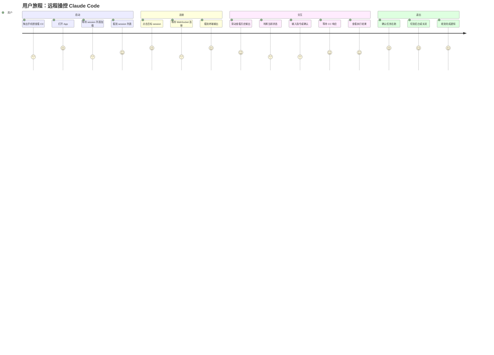
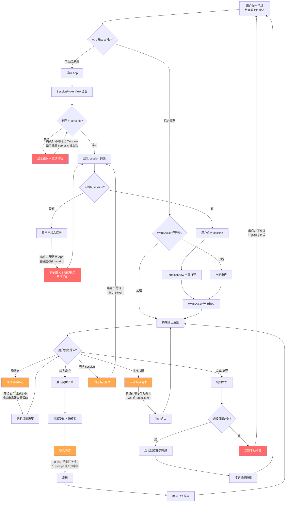
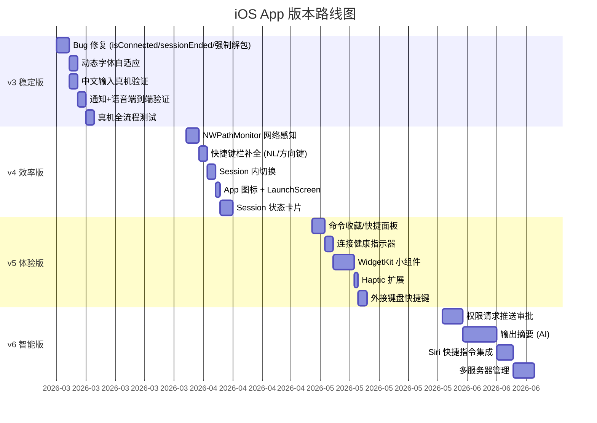
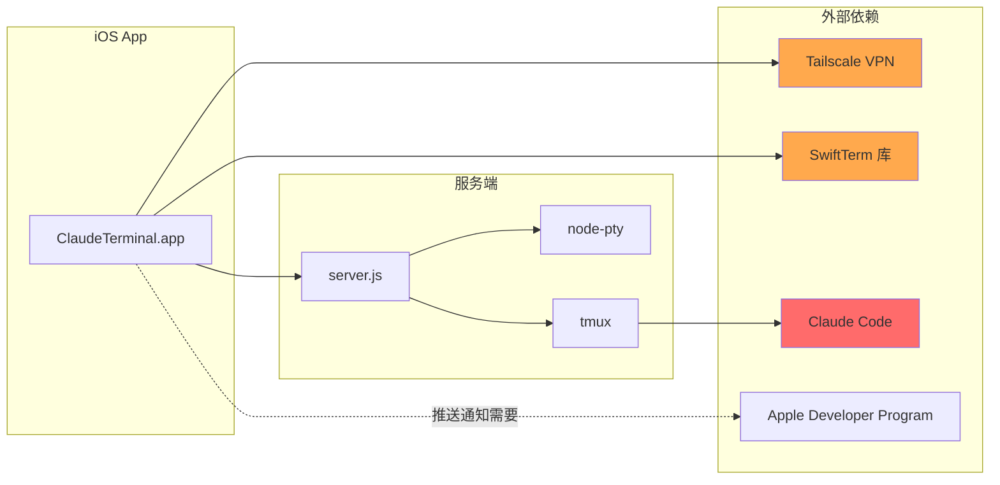

# iOS 原生 App 产品评估报告

> Claude Remote Terminal — 从 Web 终端到原生 App 的产品进化
>
> 评估日期：2026-03-07 | 当前版本：v2（ios-native-app-phase1 分支）

---

## A. 产品定位分析

### 目标用户画像

| 维度 | 描述 |
|------|------|
| **核心用户** | 使用 Claude Code 的独立开发者/技术负责人，Mac 作为开发主力机 |
| **日常场景** | 通勤/外出/沙发/床上时，用手机远程查看 Claude Code 任务进度、审批权限请求、发送补充指令 |
| **技术特征** | 已搭建 Tailscale VPN + tmux 环境，对终端操作有肌肉记忆 |
| **核心痛点** | 不在电脑前时，无法有效监控和干预 Claude Code 正在执行的长任务 |
| **使用频率** | 每天 3-10 次短交互（查看状态/批准操作），偶尔 1-2 次长交互（发起新任务） |
| **设备** | iPhone 为主（90%），iPad 为辅（10%）|

### 用户细分

```
主要用户（80%）：个人开发者自用
  - 一台 Mac + 一部 iPhone
  - Tailscale 组网
  - 对延迟敏感，对 UI 美观度要求中等

次要用户（15%）：小团队技术负责人
  - 需要监控多个 Claude Code session
  - 可能有多台 Mac
  - 需要通知能力以掌握任务完成状态

潜在用户（5%）：Claude Code 重度使用者
  - 全天候运行 Claude Code
  - 需要语音交互能力
  - 对推送通知有强需求
```

### 核心价值主张

**"离开电脑也能掌控 Claude Code"** — 不是复制桌面体验，而是提供最适合移动端的远程控制体验。

与 Web 终端对比：

| 维度 | Web 终端 (index.html) | iOS 原生 App | 优势来源 |
|------|----------------------|-------------|---------|
| 输入可靠性 | 40% 代码是 IME/键盘 workaround | 原生 UIKit 输入，零 workaround | 问题不存在 vs 修补问题 |
| 推送通知 | 仅前台 Browser Notification | UNUserNotificationCenter 后台推送 | 系统级通知能力 |
| 语音播放 | 需 silence.wav 解锁 autoplay | AVAudioPlayer 无限制 | 原生音频权限 |
| 键盘工具栏 | visualViewport hack 定位不稳 | inputAccessoryView 系统贴合 | UIKit 原生支持 |
| 触觉反馈 | 不可用 | UIImpactFeedbackGenerator | 原生独占能力 |
| 后台保活 | 标签页切走即断 | BGTask + 重连机制 | 应用生命周期管理 |
| 启动速度 | 加载 xterm.js CDN (~300ms) | 原生启动 (<100ms) | 本地代码无网络依赖 |
| 离线体验 | 白屏 | 可显示缓存状态/历史 | 本地存储能力 |

**关键洞察**：App 的价值不是"更好的终端"，而是"更好的移动端远程控制体验"。终端只是载体，核心是让用户在移动场景下高效与 Claude Code 交互。

### 竞品对比

| 特性 | Claude Terminal (本项目) | Termius | Blink Shell | a-Shell | WebSSH |
|------|-------------------------|---------|-------------|---------|--------|
| **定价** | 免费/自用 | $10/月 | $16/年 | 免费 | $5 |
| **核心定位** | Claude Code 远程控制 | 通用 SSH 客户端 | 专业终端模拟器 | 本地 Shell | 轻量 SSH |
| **Claude Code 适配** | 专属优化 | 通用 SSH | 通用 mosh/SSH | 不适用 | 通用 SSH |
| **语音交互** | TTS 播报 + 语音输入 | 无 | 无 | 无 | 无 |
| **任务通知** | Hook 驱动推送 | 无 | 无 | 无 | 无 |
| **Mac 剪贴板桥接** | API 直通 | Snippets | 无 | 无 | 无 |
| **tmux 滚动集成** | copy-mode 协议 | 通用 | 通用 | 不适用 | 通用 |
| **Session 管理** | tmux API 直连 | SSH 连接管理 | SSH 配置 | 不适用 | SSH |
| **连接方式** | WebSocket over Tailscale | SSH 直连 | SSH/mosh | 本地 | SSH |
| **上手门槛** | 需搭建 server.js | 配置 SSH | 配置 SSH | 无需配置 | 配置 SSH |

**竞争优势总结**：

1. **唯一为 Claude Code 设计的远程工具** — 竞品都是通用终端，不理解 CC 的语义（任务完成、权限请求、输出摘要）
2. **零 SSH 依赖** — WebSocket 直连 server.js，避免了 SSH 在 iOS 上的键盘映射问题
3. **语音 + 通知集成** — 没有竞品能做到"任务完成自动语音播报 + 推送通知"
4. **明确的劣势** — 用户基数极小（个人/小圈子工具），功能覆盖面窄（只服务 CC 远程场景）

---

## B. 功能优先级矩阵（RICE 框架）

> Reach = 影响用户比例 (1-10)
> Impact = 对用户体验影响 (0.25/0.5/1/2/3)
> Confidence = 实现确定性 (0.5/0.8/1.0)
> Effort = 人天 (越大越难)
> RICE = Reach x Impact x Confidence / Effort

### 来源一：v1 Review 的 20 项改进（已在 v2 部分完成）

| # | 功能 | R | I | C | E | RICE | v2 状态 | 排序 |
|---|------|---|---|---|---|------|---------|------|
| 1 | 触摸滚动接入 UI | 10 | 3 | 1.0 | 3 | 10.0 | 已完成 | -- |
| 2 | isConnected 状态修正 | 10 | 2 | 1.0 | 0.5 | 40.0 | 未修 | **1** |
| 3 | [session ended] 检测 | 10 | 2 | 1.0 | 0.5 | 40.0 | 未修 | **2** |
| 4 | 中文输入实测验证 | 8 | 3 | 0.5 | 1 | 12.0 | 待验证 | **5** |
| 5 | 快捷键栏补全 | 9 | 1 | 1.0 | 1 | 9.0 | 部分完成 | 8 |
| 6 | 剪贴板桥接 | 7 | 1 | 1.0 | 1 | 7.0 | 已完成 | -- |
| 7 | 本地通知 | 8 | 2 | 1.0 | 1.5 | 10.7 | 已完成 | -- |
| 8 | 语音播放 | 6 | 1 | 1.0 | 1.5 | 4.0 | 已完成 | -- |
| 9 | 文件上传 | 5 | 1 | 0.8 | 3 | 1.3 | 未做 | 16 |
| 10 | Session 内切换 | 7 | 1 | 1.0 | 1 | 7.0 | 未做 | 9 |
| 11 | 动态字体自适应 | 8 | 1 | 1.0 | 0.5 | 16.0 | 未做 | **4** |
| 12 | Select mode overlay | 6 | 1 | 0.8 | 2 | 2.4 | 已完成 | -- |
| 13 | Debug 日志面板 | 3 | 0.5 | 1.0 | 1 | 1.5 | 未做 | 15 |
| 14 | 网络状态感知 | 8 | 1 | 1.0 | 1 | 8.0 | 未做 | 7 |
| 15 | Background 保活 | 7 | 2 | 0.5 | 3 | 2.3 | 未做 | 14 |
| 16 | fetchSessions 强制解包修复 | 10 | 0.5 | 1.0 | 0.25 | 20.0 | 未修 | **3** |
| 17 | iPad 分屏支持 | 2 | 1 | 0.8 | 3 | 0.5 | 未做 | 20 |
| 18 | App 图标 & Launch Screen | 10 | 0.5 | 1.0 | 1 | 5.0 | 未做 | 11 |
| 19 | Haptic 扩展 | 8 | 0.25 | 1.0 | 0.5 | 4.0 | 未做 | 13 |
| 20 | 外接键盘快捷键 | 3 | 1 | 0.8 | 1.5 | 1.6 | 未做 | 17 |

### 来源二：原规划 Phase 2/3/4 待做项

| # | 功能 | R | I | C | E | RICE | 排序 |
|---|------|---|---|---|---|------|------|
| 21 | 文件上传（相册/文件 -> POST /api/upload） | 5 | 1 | 0.8 | 3 | 1.3 | 16 |
| 22 | Tailscale IP 配置页面 | 10 | 1 | 1.0 | 0.5 | 20.0 | **3** |
| 23 | 深色/浅色/Solarized 主题切换 | 6 | 0.5 | 1.0 | 1 | 3.0 | 14 |

> 注：#22 已在 v2 的 SettingsSheet 中实现，标记为完成。#23 的主题模型已存在但渲染切换需验证。

### 来源三：新发现的需求

| # | 功能 | R | I | C | E | RICE | 来源 | 排序 |
|---|------|---|---|---|---|------|------|------|
| 24 | **权限请求快速审批** — CC 请求文件/命令权限时推送，一键批准/拒绝 | 10 | 3 | 0.5 | 5 | 3.0 | 用户旅程分析 | 12 |
| 25 | **任务状态一览卡片** — Session 列表页显示每个 session 当前状态（运行中/等待输入/空闲） | 9 | 2 | 0.8 | 3 | 4.8 | 竞品差异化 | 10 |
| 26 | **输出摘要（AI 辅助）** — 长输出自动折叠，显示 AI 生成的一行摘要 | 5 | 2 | 0.5 | 8 | 0.6 | 移动端痛点 | 19 |
| 27 | **命令收藏/快捷面板** — 收藏常用 prompt，一键发送 | 7 | 1 | 1.0 | 2 | 3.5 | 移动端输入效率 | 12 |
| 28 | **Siri / iOS 快捷指令集成** — "Hey Siri, 查看 Claude 状态" | 4 | 1 | 0.8 | 4 | 0.8 | iOS 生态整合 | 18 |
| 29 | **Widget（桌面小组件）** — 锁屏/主屏显示 session 状态和最近消息 | 6 | 2 | 0.8 | 4 | 2.4 | iOS 生态整合 | 14 |
| 30 | **连接健康指示器** — 显示 WebSocket 延迟、Tailscale 状态 | 8 | 0.5 | 1.0 | 1 | 4.0 | 可靠性 | 13 |
| 31 | **多服务器支持** — 管理多台 Mac 上的 Claude Code | 3 | 2 | 0.8 | 4 | 1.2 | 扩展性 | 17 |

### 综合优先级排序（Top 15）

| 排名 | # | 功能 | RICE | 类型 | 建议版本 |
|------|---|------|------|------|---------|
| 1 | 2 | isConnected 状态修正 | 40.0 | Bug Fix | v3 |
| 2 | 3 | [session ended] 检测 | 40.0 | Bug Fix | v3 |
| 3 | 16 | fetchSessions 强制解包修复 | 20.0 | Bug Fix | v3 |
| 4 | 11 | 动态字体自适应 | 16.0 | UX 优化 | v3 |
| 5 | 4 | 中文输入实测验证 | 12.0 | 验证 | v3 |
| 6 | 7/8 | 通知+语音完整性验证 | 10.7 | 验证 | v3 |
| 7 | 14 | 网络状态感知 (NWPathMonitor) | 8.0 | 可靠性 | v4 |
| 8 | 5 | 快捷键栏补全 (NL/左右方向键) | 9.0 | 功能 | v4 |
| 9 | 10 | Session 内切换 | 7.0 | 功能 | v4 |
| 10 | 25 | 任务状态一览卡片 | 4.8 | 功能 | v4 |
| 11 | 18 | App 图标 & Launch Screen | 5.0 | 完成度 | v4 |
| 12 | 27 | 命令收藏/快捷面板 | 3.5 | 效率 | v5 |
| 13 | 30 | 连接健康指示器 | 4.0 | 可靠性 | v5 |
| 14 | 29 | Widget 桌面小组件 | 2.4 | 生态 | v5 |
| 15 | 24 | 权限请求快速审批 | 3.0 | 差异化 | v6 |

---

## C. 用户旅程地图

### 核心旅程：查看 Claude Code 状态并执行操作



### 详细用户旅程流程图



### 痛点汇总与优化机会

| 痛点 | 当前体验 | 优化方向 | 对应功能 |
|------|---------|---------|---------|
| 1. 连接失败诊断难 | 只显示 generic error | 区分 Tailscale/server.js/tmux 三层故障 | 连接健康指示器 (#30) |
| 2. 无法从 App 启动 session | 需切换到 iOS 快捷指令 | App 内集成 SSH 命令或 API | 远程启动 (新需求) |
| 3. 长输出阅读困难 | 手指反复滑动 | AI 摘要 / 折叠 / 搜索 | 输出摘要 (#26) |
| 4. 长 prompt 输入低效 | 逐字手打 | 命令收藏 / 模板 / 语音 | 命令收藏 (#27) |
| 5. 权限审批繁琐 | 手动 Tab+Enter | 一键批准推送 | 权限快速审批 (#24) |
| 6. Session 切换断裂 | 退出重进 | 内嵌 session 切换器 | Session 内切换 (#10) |
| 7. 后台无感知 | 定期手动查看 | 推送通知 + Widget | 通知 (#7) + Widget (#29) |

---

## D. 版本路线图建议（v3-v6）

### 版本规划总览



### v3 — "先稳后快"（稳定版）

**主题**：修复已知 Bug，确保基础体验可靠

| 任务 | 说明 | 预估工时 |
|------|------|---------|
| isConnected 状态修正 | 延迟到首次收到消息才设为 true | 0.5 天 |
| [session ended] 检测 | parseTextMessage 中检查并触发回调 | 0.5 天 |
| fetchSessions 强制解包修复 | URL(string:)! 改为 guard let | 0.25 天 |
| 动态字体自适应 | 连接后检查 cols，若 < 70 自动缩小字号 | 1 天 |
| 中文输入真机验证 | 拼音/手写输入 + SwiftTerm 兼容性测试 | 1 天（含修复时间） |
| 通知+语音端到端测试 | 确认 voice 控制帧 -> AVAudioPlayer 播放，notify -> UNNotification 完整链路 | 1 天 |
| 主题渲染验证 | 确认 SettingsSheet 中选择的 theme 是否真正应用到 SwiftTerm | 0.5 天 |

**v3 交付标准**：所有现有功能在真机上可靠运行，零已知 crash，中文输入正常。

### v4 — "日常好用"（效率版）

**主题**：提升日常使用效率，减少操作步骤

| 任务 | 说明 | 预估工时 |
|------|------|---------|
| NWPathMonitor 网络感知 | WiFi/Cellular 切换时主动重连 | 1.5 天 |
| 快捷键栏补全 | 添加 NL（换行发送）、左右方向键、Shift-Tab | 1 天 |
| Session 内切换 | topBar session 名称可点击，弹出 ActionSheet 显示其他 session | 1 天 |
| App 图标 + LaunchScreen | 设计终端风格图标，添加 LaunchScreen | 0.5 天 |
| Session 状态卡片 | Session 列表页显示简要状态（运行中/等待输入/空闲） | 2 天（需 server.js 配合） |

**v4 交付标准**：从启动到操作完成，流程中无断裂点。Session 切换无需退出。

### v5 — "贴心工具"（体验版）

**主题**：添加 iOS 生态深度整合，让 App 有原生 feel

| 任务 | 说明 | 预估工时 |
|------|------|---------|
| 命令收藏/快捷面板 | 保存常用 prompt，一键发送 | 2 天 |
| 连接健康指示器 | 显示 WebSocket 延迟、区分故障层级 | 1.5 天 |
| WidgetKit 小组件 | 锁屏/主屏显示 session 状态 | 3 天 |
| Haptic 扩展 | 连接成功/断线/通知时触觉反馈 | 0.5 天 |
| 外接键盘支持 | Cmd+C / Cmd+V / Cmd+K 等常用组合键 | 1 天 |

**v5 交付标准**：支持 Widget，不打开 App 就能看到 session 状态。外接键盘使用体验接近桌面。

### v6 — "智能助手"（智能版）

**主题**：引入 AI 辅助能力，实现"不看终端也能掌控"的愿景

| 任务 | 说明 | 预估工时 |
|------|------|---------|
| 权限请求推送审批 | 识别 CC 权限请求，推送到手机，支持一键批准/拒绝 | 3 天 |
| 输出摘要 (AI) | 长输出自动生成一行摘要，可展开查看完整内容 | 5 天 |
| Siri 快捷指令集成 | 语音查看 session 状态、发送简单命令 | 2 天 |
| 多服务器管理 | 支持配置多台 Mac，在服务器间切换 | 3 天 |

**v6 交付标准**：权限审批可通过推送完成，无需打开 App。用户可以通过 Siri 查看状态。

### 与原规划的关键差异

| 维度 | 原规划（Phase 1-4） | 本建议（v3-v6） |
|------|-------------------|----------------|
| Phase 1/2/3 | 功能堆叠 → 输入 → 语音 → 体验 | v3 先修 Bug 再功能（v2 已做完 Phase 2+3 的主体） |
| 通知和语音 | Phase 3/4 才做 | v2 已实现框架，v3 做验证而非新开发 |
| 文件上传 | Phase 4 优先做 | 降优先级（RICE 仅 1.3，使用频率低） |
| Session 状态 | 未规划 | v4 加入（差异化价值高） |
| Widget | 未规划 | v5 加入（iOS 生态深度整合） |
| AI 辅助 | 未规划 | v6 探索（长期差异化方向） |
| iPad 分屏 | P2 优先级 | 降至 v6+（RICE 仅 0.5，用户极少） |

---

## E. 关键产品决策建议

### E1. 是否支持多 Session 同时连接（分屏）？

**建议：v5 之前不做，v6 可作为实验性功能。**

理由：
- 手机屏幕尺寸限制，分屏后单个终端仅半屏（约 40 cols），Claude Code 的输出（diff、代码块）几乎无法阅读
- iPad 用户仅占约 10%，且 iPad 用户更可能直接用 Mac
- 实现复杂度高：需管理多个 WebSocket 连接、多个 SwiftTerm 实例、布局自适应
- **替代方案**：Session 内快速切换（v4）可以覆盖 90% 的多 session 需求，成本低 10 倍

### E2. 是否加入 AI 辅助功能？

**建议：分阶段引入，从低成本高价值的开始。**

| AI 功能 | 建议 | 理由 |
|---------|------|------|
| **命令建议** | 不做 | Claude Code 本身就是 AI，在 CC 上面再加一层 AI 建议是多余的 |
| **输出摘要** | v6 探索 | 有价值但实现成本高（需额外 LLM 调用或本地模型），与项目"零额外 LLM 调用"原则冲突 |
| **权限请求识别** | v6 做 | 基于模式匹配（不需要 LLM），价值极高 — 这是移动端最高频的操作 |
| **状态分类** | v4 做 | 基于终端输出的关键字匹配（如检测 spinner、prompt 符号 `$`/`>`），不需要 AI |

**核心原则**：不在 CC 之上叠加 LLM 层，用规则引擎和模式匹配实现"智能"效果。

### E3. 是否支持离线查看历史？

**建议：v5 引入轻量级历史缓存。**

实现方案：
- 连接时将终端输出同步写入本地 SQLite（按 session + 时间戳）
- 离线时可查看最近 N 条 session 的历史输出（只读，不可交互）
- 存储上限：每个 session 最近 1MB 终端数据（约 2-3 小时的输出）
- 不做复杂的离线编辑/命令队列（场景太边缘）

**价值**：用户可以在无网络时回顾之前的 CC 输出，辅助思考下一步操作。

### E4. 推送通知策略

**建议：分三级通知，用户可按级别开关。**

| 级别 | 触发条件 | 通知方式 | 默认 |
|------|---------|---------|------|
| **紧急** | CC 请求权限审批（检测到 `Allow` / `Deny` / `permission` 关键字） | 全量推送 + 声音 + Badge | 开 |
| **重要** | 任务完成（检测到特定 emoji 或关键字） | 推送 + 声音 | 开 |
| **信息** | 连接断开 / session 结束 | 静默推送 | 开 |

**技术实现**：
- 前台：不弹通知（避免干扰当前操作）
- 后台/锁屏：根据级别决定通知方式
- 冷却时间：同级别通知最少间隔 10 秒（已在 NotificationManager 中实现）
- 分组：按 session 名称分组，避免通知堆积

### E5. 付费/分发策略

**建议：个人工具，免费开源，TestFlight 分享。**

| 阶段 | 策略 | 理由 |
|------|------|------|
| 当前（v2-v4） | 免费 Apple ID + Xcode 直装 | 开发阶段，7 天重签可接受 |
| 稳定后（v5+） | 购买 $99 Developer Program | 避免 7 天重签，启用推送通知（UNNotificationCenter 部分功能需要） |
| 分享 | TestFlight 内测 | 给同样搭建了 Tailscale + CC 的开发者朋友使用 |
| 长期 | GitHub 开源 + TestFlight | 扩大用户基数，收集反馈，但不上架 App Store（目标用户太窄，审核成本高） |

**不建议上架 App Store 的理由**：
1. 目标用户极度垂直（需要 Tailscale + Mac + tmux + Claude Code 的开发者）
2. App Store 审核对"远程终端"类应用要求较高
3. 需要处理 App Transport Security、隐私政策等合规要求
4. 用户基数太小，维护 App Store listing 的 ROI 低

---

## F. 风险和依赖

### F1. 技术风险

| 风险 | 概率 | 影响 | 缓解策略 |
|------|------|------|---------|
| **SwiftTerm 维护停滞** | 中 | 高 | SwiftTerm 由 Miguel de Icaza (Mono/.NET 创始人) 维护，最近活跃度一般。备选方案：fork 自维护，或研究 Apple 原生 Terminal.app 使用的私有框架 |
| **iOS 版本兼容性** | 低 | 中 | 当前使用 SwiftUI + URLSessionWebSocketTask，最低支持 iOS 15。建议设定 iOS 16+ 为最低版本（覆盖 95%+ 活跃设备） |
| **SwiftTerm IME 兼容性** | 中 | 高 | SwiftTerm 的 iOS IME 支持未经生产验证，中文输入可能出问题。缓解：v3 必须做真机验证，准备好 UITextView 输入代理方案作为 fallback |
| **WebSocket 后台断开** | 高 | 中 | iOS 严格限制后台网络活动。缓解：快速重连 + BGTask 定期唤醒检查（注意系统调度不可靠，不能保证实时性） |
| **node-pty 在 Apple Silicon 上的兼容性** | 低 | 低 | 已验证，使用绝对路径 `/opt/homebrew/bin/tmux`，server.js 已稳定运行 |

### F2. 产品风险

| 风险 | 概率 | 影响 | 缓解策略 |
|------|------|------|---------|
| **用户基数极小** | 确定 | 中 | 这是个人/小圈子工具，不追求增长。价值在于提升自己的效率，不在于用户量 |
| **使用场景狭窄** | 确定 | 低 | App 定位就是"Claude Code 遥控器"，不尝试做通用终端。狭窄但深入 |
| **Web 终端已够用** | 中 | 高 | v2 的 Web 终端已经很完善。如果 iOS Safari 的 workaround 持续稳定，App 的增量价值减小。缓解：聚焦推送通知、Widget、触觉反馈等 Web 无法提供的能力 |
| **Claude Code 产品方向变化** | 中 | 高 | 如果 Anthropic 提供了官方 iOS App 或改变了远程控制方式，本项目价值归零。缓解：保持轻量，不过度投入 |
| **Tailscale 依赖** | 低 | 高 | 如果 Tailscale 政策变化或服务中断，整个远程工作流失效。缓解：架构上保持网络层可替换 |

### F3. 依赖关系



黄色 = 可控风险，红色 = 不可控风险。

### F4. MVP 验证计划

**假设清单及验证方法**：

| # | 假设 | 验证方法 | 通过标准 | 当前状态 |
|---|------|---------|---------|---------|
| H1 | SwiftTerm 能正确渲染 Claude Code 所有 ANSI 输出 | 连接真实 CC session，执行 diff / 代码编辑 / spinner 场景 | 零渲染异常 | 待验证 |
| H2 | iOS 原生输入比 Web 终端 diff 模型更可靠 | 中/英/日文混合输入 50 条消息，记录错误率 | 错误率 < 1% | 待验证 |
| H3 | 推送通知能让用户在后台感知任务完成 | 启动长任务后切到后台，观察通知延迟 | 通知延迟 < 30 秒 | 待验证 |
| H4 | App 启动速度明显优于 Web 终端 | 计时对比：App 冷启动 vs Safari 加载 index.html | App 快 2 倍以上 | 待验证 |
| H5 | 用户每天实际使用 App 而非退回 Web 终端 | 自己连续使用 2 周，记录切换次数 | 80%+ 场景用 App | 待验证 |

**MVP 测试流程**：

```
Week 1: v3 Bug Fix + 真机验证
  - 修复 3 个已知 Bug
  - 真机安装，验证 H1/H2
  - 记录所有发现的新问题

Week 2: 端到端场景测试
  - 日常使用 App 操控 CC 完成 3-5 个真实开发任务
  - 验证 H3/H4
  - 收集通知延迟数据

Week 3-4: 开始验证 H5
  - 切换到 App 为主力工具
  - 记录"不得不回到 Web 终端"的场景
  - 这些场景 = v4 的优先级输入
```

---

## 附录：v2 已完成功能清单

基于 `ios-native-app-phase1` 分支的代码审查，v2 已实现以下能力：

| 模块 | 已实现 | 文件 |
|------|--------|------|
| Session 选择器 | 列表展示 + 设置页 + 服务器配置持久化 | SessionPickerView.swift, ServerConfig.swift |
| 终端渲染 | SwiftTerm 集成 + 主题模型 | TerminalView.swift |
| WebSocket 通信 | 完整协议（input/resize/scroll/voice/notify） | WebSocketManager.swift |
| 触摸滚动 | 非线性加速 + 惯性动量 + copy-mode 管理 | ScrollGestureHandler.swift |
| 长按选择 | 全屏 overlay + 原生文本选择 + 复制 | TerminalView.swift (TerminalContainerView) |
| 语音播放 | AVAudioPlayer + voice 控制帧解析 + 开关 API | VoiceManager.swift |
| 通知监控 | 终端输出扫描 + notify 控制帧 + UNNotification | NotificationManager.swift |
| 剪贴板桥接 | GET /api/clipboard + Mac/iOS 双源粘贴 | ClipboardBridge.swift |
| 快捷键栏 | 9 键（Tab/^C/Esc/Up/Down/^D/^Z/^L） | InputAccessoryBar.swift |
| 断线重连 | 指数退避 + 抖动 + 30s ping keep-alive | WebSocketManager.swift |
| 触觉反馈 | bell -> UIImpactFeedbackGenerator | TerminalView.swift |
| URL 打开 | requestOpenLink delegate | TerminalView.swift |
