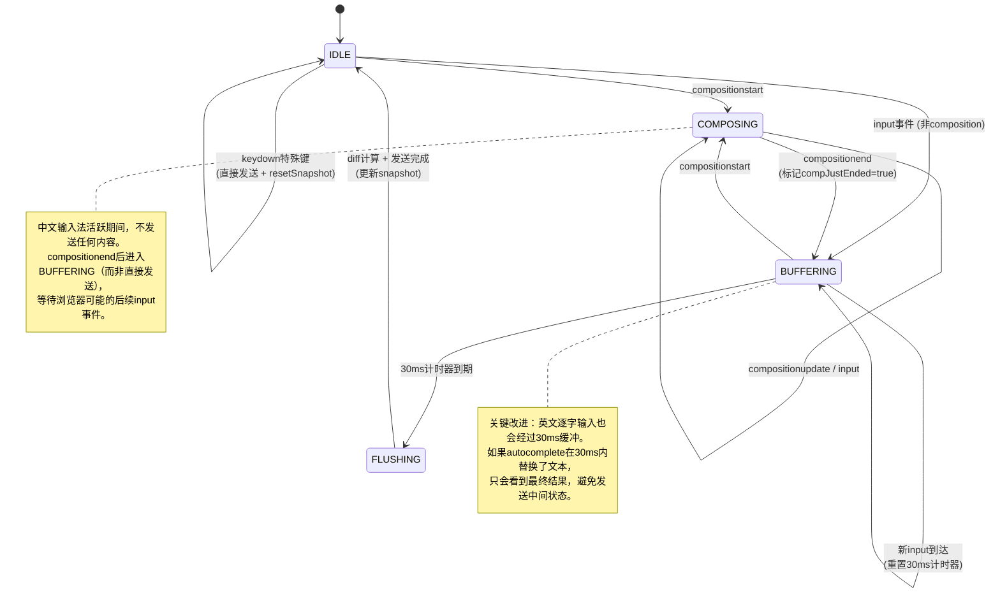
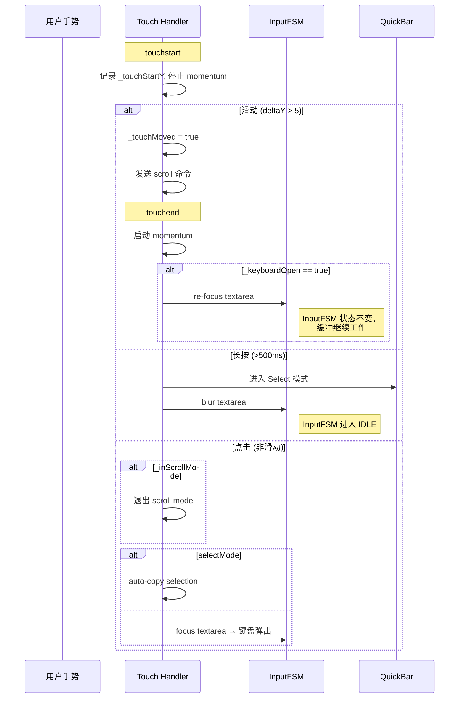

# 移动端输入系统重新设计方案

> 基于 `public/index.html` 现有实现的深度分析，结合 xterm.js、CodeMirror 6、EditContext API 等业界方案的研究成果。
> 目标：提出一套更成熟、统一的移动端终端输入方案，解决已知 edge cases。

---

## 1. 现有架构分析

### 1.1 当前 DOM 结构

```
#terminal-container
  ├── xterm.js canvas (disableStdin: true on mobile)
  ├── #select-overlay (长按/Select模式下覆盖canvas的可选文本层)
  └── #overlay-input <textarea>  ← 真正的输入捕获元素
       autocomplete="off" autocorrect="off" autocapitalize="off"
       spellcheck="false" enterkeyhint="send"

#quick-bar (fixed bottom, above keyboard)
  ├── NL / Tab / ⇧Tab / ← → ↑ ↓ / ^C / Esc / /
  ├── Select / Done / Paste / 📷 / Debug
```

### 1.2 当前事件流

```mermaid
flowchart TD
    subgraph user["用户动作"]
        A1["英文字母按键"]
        A2["中文拼音输入"]
        A3["点击联想词"]
        A4["物理键盘Enter"]
        A5["软键盘Backspace"]
        A6["滑动屏幕"]
    end

    subgraph keydown["keydown 处理"]
        K1{"e.key识别?"}
        K2["KEY_MAP匹配<br/>Enter/Arrow/Tab/Esc"]
        K3{"Backspace?"}
        K4["发送\\x7f"]
        K5["keydownHandled=true"]
        K6["跳过 (keyCode=229<br/>或 Unidentified)"]
    end

    subgraph beforeinput["beforeinput 处理"]
        B1{"isComposing?"}
        B2{"keydownHandled?"}
        B3{"inputType?"}
        B4["deleteContentBackward<br/>→ 发送\\x7f"]
        B5["insertParagraph/<br/>insertLineBreak<br/>→ BLOCKED"]
    end

    subgraph input["input 事件处理"]
        I1{"isComposing?"}
        I2{"justFinishedComposition?"}
        I3{"keydownHandled?"}
        I4["diff: current vs sentBuffer"]
        I5{"current.startsWith<br/>(sentBuffer)?"}
        I6["发送 newChars =<br/>current.slice(sentBuffer.length)"]
        I7["计算公共前缀<br/>发退格 + 发新文本"]
        I8["sentBuffer = current<br/>scheduleReset()"]
    end

    subgraph composition["composition 事件"]
        C1["compositionstart<br/>isComposing=true"]
        C2["compositionend<br/>isComposing=false<br/>发送全部text<br/>resetSentState()"]
    end

    A1 --> K1
    K1 -->|"key可识别"| K2
    K1 -->|"不可识别"| K6
    K2 --> K5
    K1 -->|"Backspace"| K3
    K3 --> K4 --> K5
    K6 --> B1
    K5 --> B2

    B1 -->|"是"| B1x["return"]
    B2 -->|"是"| B2x["return"]
    B1 -->|"否"| B3
    B2 -->|"否"| B3
    B3 -->|"delete"| B4
    B3 -->|"Enter"| B5
    B3 -->|"其他"| I1

    I1 -->|"是"| I1x["return"]
    I2 -->|"是"| I2x["return"]
    I3 -->|"是"| I3x["return, reset flag"]
    I1 -->|"否"| I2
    I2 -->|"否"| I3
    I3 -->|"否"| I4 --> I5
    I5 -->|"是 (追加)"| I6 --> I8
    I5 -->|"否 (替换)"| I7 --> I8

    A2 --> C1
    C1 -.->|"输入过程中"| I1
    C1 -->|"选字/确认"| C2

    A3 --> I4
    A4 --> K2
    A5 --> K6
    A6 -->|"touchmove"| scroll["tmux scroll"]

    style K6 fill:#553,stroke:#aa0
    style B5 fill:#533,stroke:#a00
    style I7 fill:#335,stroke:#06a
    style C2 fill:#353,stroke:#0a0
```



### 1.3 sentBuffer diff 模型工作原理

```
状态追踪：
  sentBuffer: 记录已经通过 wsSend 发送到终端的字符
  overlayInput.value: textarea 的当前值
  resetTimer: 800ms 空闲后清空两者

正常打字 "the"：
  按 t: value="t"  sentBuffer=""  → 发送"t"  → sentBuffer="t"
  按 h: value="th" sentBuffer="t" → 发送"h"  → sentBuffer="th"
  按 e: value="the" sentBuffer="th" → 发送"e" → sentBuffer="the"

联想词替换 "th" → "the "：
  value 从 "th" 变成 "the "
  sentBuffer="th", current="the "
  公共前缀: "th" (commonLen=2)
  charsToDelete = 2-2 = 0 (无需退格)
  newPart = "the ".slice(2) = "e " → 发送 "e "
  sentBuffer = "the "

联想词替换 "th" → "that "：
  sentBuffer="th", current="that "
  公共前缀: "th" (commonLen=2)
  charsToDelete = 2-2 = 0
  newPart = "at " → 发送 "at "

联想词替换 "helo" → "hello "：
  sentBuffer="helo", current="hello "
  公共前缀: "hel" (commonLen=3)
  charsToDelete = 4-3 = 1 → 发送 1个 \x7f
  newPart = "lo " → 发送 "lo "
```

---

## 2. 已知问题完整清单

### 2.1 未修复问题（Critical / High）

| # | 问题 | 严重度 | 复现条件 | 根因分析 |
|---|------|--------|----------|----------|
| **P1** | **英文联想词时序 race condition** | Critical | iOS 英文键盘点击联想词 "the"；当 "th" 已逐字发送 | 逐字即发模型下，autocomplete 替换触发的 `input` 事件中 diff 依赖 `sentBuffer` 精确同步。若 `input` 事件在 `resetTimer` 触发后到达，`sentBuffer=""` 导致全文重发而非 diff |
| **P2** | **800ms resetTimer 误清** | High | 快速输入一个词，暂停 ~800ms，然后点联想词 | `scheduleReset()` 在 800ms 后清空 `sentBuffer`，但 textarea.value 被 iOS 保留。下次 autocomplete 替换时 `sentBuffer=""` 但 `value` 不为空，diff 计算错误 |
| **P3** | **sentBuffer 与 textarea.value 不同步** | High | 连续快速打字后 autocomplete | `beforeinput` 的 `deleteContentBackward` 手动 `sentBuffer.slice(0,-1)` 和 `overlayInput.value.slice(0,-1)` 可能与浏览器实际行为不一致（如 iOS 删除整个联想词而非单字符） |
| **P4** | **compositionend 发送全量 + 后续 input 重复** | Medium | 中文拼音确认后，浏览器额外触发 input 事件 | `compositionend` 中 `wsSend(text)` 发送全部 `overlayInput.value`，然后 `resetSentState()`。但 `requestAnimationFrame` 抑制 `justFinishedComposition` 的时机可能不精确，某些浏览器的 `input` 事件在 rAF 之后才触发 |

### 2.2 已修复但有遗漏风险的问题

| # | 问题 | 状态 | 当前方案 | 遗漏场景 |
|---|------|------|----------|----------|
| **P5** | 滑动后输入失效 | 已修复 | `_keyboardOpen` + touchend re-focus | 极端情况：快速连续滑动后立即打字，`_keyboardOpen` 状态可能在 `adjustQuickBarPosition` 异步更新前被误判 |
| **P6** | iOS Enter 时序：key="" → fake Backspace | 已修复 | `_emptyKeyTs` 100ms 窗口抑制 | 在高延迟设备上 100ms 窗口可能不够；Android 无此问题但有类似的 keyCode=229 Enter 问题 |
| **P7** | 软键盘 Enter 被阻断 | 刻意设计 | beforeinput 阻断 insertParagraph/insertLineBreak，需按 NL 按钮 | 用户认知负担：新用户不知道要按 NL 按钮发送 Enter |
| **P8** | iOS Chinese IME key="\n\r" | 已修复 | `_isWhitespaceKey` 检测 | 仅覆盖了空白字符模式，其他 IME（日文、韩文）可能有不同行为 |

### 2.3 设计缺陷

| # | 问题 | 影响 |
|---|------|------|
| **D1** | **英文逐字即发 vs 中文 composition 缓冲，逻辑不统一** | 两套路径维护复杂；英文 autocomplete 是中间状态，既不是纯逐字也不是 composition |
| **D2** | **sentBuffer 是纯字符串追踪，不感知光标位置** | 如果用户在 textarea 中移动光标（理论上可能），diff 计算完全错误 |
| **D3** | **resetTimer 800ms 是硬编码魔法数字** | 无法适应不同打字速度和不同平台的 autocomplete 延迟 |
| **D4** | **compositionend 发送 overlayInput.value 而非 composition 结果** | 如果 textarea 中有残留文本，会把非本次 composition 的内容一起发送 |
| **D5** | **autocomplete="off" 在 iOS 上无效** | iOS 忽略这些属性，predictive text 仍然会出现并触发替换事件 |

---

## 3. 业界方案研究

### 3.1 xterm.js 原生 CompositionHelper

**核心策略**：

- 使用隐藏 textarea 捕获输入
- `_dataAlreadySent` 追踪已发送文本（类似我们的 sentBuffer）
- keyCode 229 时通过 `_handleAnyTextareaChanges()` 做 diff 检测
- composition 结束后通过 `setTimeout(0)` 等待事件传播再处理

**局限**：xterm.js 自身的 CompositionHelper 在移动端仍然有大量已知问题（#2403, #3600, #675），不算成熟方案。

### 3.2 CodeMirror 6 的 InputState

**核心策略（最成熟的参考）**：

| 特性 | 实现方式 |
|------|----------|
| 平台区分 | 独立的 Android / iOS 处理路径 |
| Android Enter/Backspace | `delayAndroidKey()` 延迟处理，等 composition 事件链结束 |
| iOS 按键 | `pendingIOSKey` + 250ms 超时窗口 |
| Autocorrection | 检测 "correction before Enter" 模式，选择性跳过 |
| 状态追踪 | `composing` / `compositionFirstChange` / `compositionPendingKey` 多层标志 |
| DOM 变更检测 | 通过 MutationObserver 观察 textarea DOM 变化，而非仅依赖事件 |
| 抑制重复 | 比较 DOM mutation 与 beforeinput data，只处理一次 |

**关键洞察**：CodeMirror 6 不信任任何单一事件源，而是交叉验证多个信号来确定用户意图。

### 3.3 EditContext API

**理想但不实际**：

- 仅 Chromium 121+ 支持（Chrome/Edge）
- Safari 和 Firefox 均不支持
- iOS Safari 不支持 = 我们的主要目标平台无法使用
- **结论：排除**

### 3.4 VirtualKeyboard API

- 仅 Chromium 94+ 支持
- iOS Safari 不支持
- 我们已用 `visualViewport` API 实现了等效功能
- **结论：无需迁移**

### 3.5 input type="password" 技巧

- xterm.js #2403 中提出：将 textarea 改为 `<input type="password">`
- 效果：完全禁用 predictive text / autocomplete
- 缺点：屏幕阅读器会报告 "password input"；无法输入多行文本
- **结论：作为可选降级方案保留，不作为默认**

### 3.6 方案对比总结

| 方案 | 优势 | 劣势 | 适合我们？ |
|------|------|------|-----------|
| 现有 sentBuffer diff | 已实现、大部分场景工作 | race condition、同步问题 | 需改进 |
| xterm.js CompositionHelper | 官方方案 | 移动端同样有问题 | 可借鉴 |
| CodeMirror 6 InputState | 最成熟、多信号交叉验证 | 复杂度高、为编辑器设计 | **核心参考** |
| EditContext API | 最理想的底层 API | iOS 不支持 | 排除 |
| type="password" | 彻底解决 predictive text | 无障碍问题 | 可选降级 |
| 统一 debounce 缓冲 | 简单、统一 | 终端打字延迟感 | **推荐结合使用** |

---

## 4. 推荐方案：统一缓冲 + 双模式状态机

### 4.1 设计原则

1. **不信任单一事件**：所有输入决策基于 textarea.value 的变化（diff），而非事件参数
2. **统一缓冲**：英文和中文都经过短时缓冲，消除 autocomplete 时序问题
3. **最小延迟**：缓冲窗口极短（30-50ms），人类不可感知但足以等待 autocomplete 替换完成
4. **状态机驱动**：明确的状态转换，而非分散的布尔标志
5. **保留 textarea**：不换 contenteditable 或 EditContext（兼容性优先）

### 4.2 架构图

```mermaid
flowchart TB
    subgraph input_layer["输入捕获层"]
        TA["textarea#overlay-input<br/>autocomplete=off autocorrect=off"]
        KB["quick-bar 按钮<br/>(直接 wsSend)"]
    end

    subgraph state_machine["输入状态机 InputFSM"]
        direction TB
        IDLE["IDLE<br/>空闲状态"]
        COMPOSING["COMPOSING<br/>IME活跃"]
        BUFFERING["BUFFERING<br/>30ms缓冲中"]
        FLUSHING["FLUSHING<br/>计算diff并发送"]

        IDLE -->|"compositionstart"| COMPOSING
        IDLE -->|"input (非composition)"| BUFFERING
        IDLE -->|"keydown 特殊键"| FLUSHING

        COMPOSING -->|"compositionend"| BUFFERING
        COMPOSING -->|"input"| COMPOSING

        BUFFERING -->|"30ms到期"| FLUSHING
        BUFFERING -->|"新input到达"| BUFFERING
        BUFFERING -->|"compositionstart"| COMPOSING

        FLUSHING -->|"发送完成"| IDLE
    end

    subgraph diff_engine["Diff 引擎"]
        SNAP["快照: snapshot<br/>(上次flush后的textarea.value)"]
        CURR["当前: textarea.value"]
        DIFF["计算: LCS diff<br/>→ 退格数 + 新增文本"]
        SEND["wsSend(退格 + 文本)"]

        SNAP --> DIFF
        CURR --> DIFF
        DIFF --> SEND
        SEND -->|"更新snapshot"| SNAP
    end

    subgraph special_keys["特殊键处理 (keydown)"]
        SK_ENTER["Enter → \\r"]
        SK_BS["Backspace → \\x7f"]
        SK_ARROW["Arrow/Tab/Esc → 转义序列"]
        SK_NOTE["直接发送，不经过缓冲<br/>发送后 resetSnapshot()"]
    end

    TA --> state_machine
    state_machine -->|"FLUSHING"| diff_engine
    KB -->|"直接wsSend"| SEND
    state_machine -->|"特殊键"| special_keys
    special_keys --> SEND

    style BUFFERING fill:#335,stroke:#06a
    style COMPOSING fill:#353,stroke:#0a0
    style FLUSHING fill:#533,stroke:#a00
```



### 4.3 状态机详细定义



### 4.4 核心算法：Snapshot Diff

替代现有的 `sentBuffer` 追加式追踪，改用 **snapshot 对比** 模型：

```javascript
// === 新方案核心 ===

class InputController {
  constructor(textarea, sendFn) {
    this.textarea = textarea;
    this.send = sendFn;

    // Snapshot: textarea.value at last flush time
    this.snapshot = '';

    // State machine
    this.state = 'IDLE'; // IDLE | COMPOSING | BUFFERING | FLUSHING
    this.bufferTimer = null;
    this.BUFFER_MS = 30; // 缓冲窗口 (ms)
  }

  // --- Snapshot Diff ---
  // 对比 snapshot 和当前 textarea.value，
  // 计算最少退格数 + 新增文本
  computeDiff() {
    const prev = this.snapshot;
    const curr = this.textarea.value;

    // 找最长公共前缀
    let commonLen = 0;
    const minLen = Math.min(prev.length, curr.length);
    while (commonLen < minLen && prev[commonLen] === curr[commonLen]) {
      commonLen++;
    }

    const backspaces = prev.length - commonLen;
    const newText = curr.slice(commonLen);

    return { backspaces, newText };
  }

  // --- Flush: 计算diff并发送 ---
  flush() {
    const { backspaces, newText } = this.computeDiff();

    // 发送退格
    for (let i = 0; i < backspaces; i++) {
      this.send('\x7f');
    }

    // 发送新文本
    if (newText) {
      this.send(newText);
    }

    // 更新 snapshot
    this.snapshot = this.textarea.value;
    this.state = 'IDLE';
  }

  // --- 重置 (Enter/特殊键后) ---
  resetSnapshot() {
    this.snapshot = '';
    this.textarea.value = '';
    if (this.bufferTimer) {
      clearTimeout(this.bufferTimer);
      this.bufferTimer = null;
    }
    this.state = 'IDLE';
  }

  // --- 启动/重启缓冲计时器 ---
  startBuffer() {
    if (this.bufferTimer) clearTimeout(this.bufferTimer);
    this.state = 'BUFFERING';
    this.bufferTimer = setTimeout(() => {
      this.bufferTimer = null;
      this.state = 'FLUSHING';
      this.flush();
    }, this.BUFFER_MS);
  }

  // --- 事件处理 ---
  onCompositionStart() {
    if (this.bufferTimer) {
      // 正在缓冲时进入composition：先flush已有内容
      clearTimeout(this.bufferTimer);
      this.bufferTimer = null;
      this.flush();
    }
    this.state = 'COMPOSING';
  }

  onCompositionEnd() {
    // 不直接发送！进入缓冲，等待浏览器可能的后续input事件
    this.startBuffer();
  }

  onInput(e) {
    if (this.state === 'COMPOSING') return; // composition期间忽略

    // Enter/Paragraph 被阻断（在 beforeinput 中）
    if (e.inputType === 'insertParagraph' || e.inputType === 'insertLineBreak') {
      return;
    }

    // 启动或重启缓冲
    this.startBuffer();
  }

  onBeforeInput(e) {
    if (this.state === 'COMPOSING') return;

    if (e.inputType === 'insertParagraph' || e.inputType === 'insertLineBreak') {
      e.preventDefault();
      this.resetSnapshot();
      return;
    }

    // Backspace/Delete 不阻断——让浏览器修改textarea.value，
    // 然后在 input 事件中通过 diff 检测变化。
    // 这比手动 slice 更可靠（浏览器知道实际删除了什么）。
  }

  onKeydown(e) {
    if (this.state === 'COMPOSING') return;

    // keyCode 229 / Unidentified：交给 beforeinput + input
    if (e.key === 'Unidentified' || e.key === 'Process' || e.keyCode === 229) {
      return;
    }

    const KEY_MAP = {
      'Enter': '\r', 'ArrowUp': '\x1b[A', 'ArrowDown': '\x1b[B',
      'ArrowLeft': '\x1b[D', 'ArrowRight': '\x1b[C',
      'Tab': '\t', 'Escape': '\x1b',
    };

    if (KEY_MAP[e.key]) {
      e.preventDefault();
      // 先flush缓冲区中可能的内容
      if (this.state === 'BUFFERING') {
        clearTimeout(this.bufferTimer);
        this.flush();
      }
      this.send(KEY_MAP[e.key]);
      if (e.key === 'Enter') this.resetSnapshot();
      return;
    }

    // Backspace/Delete: 不手动发送，让浏览器修改value后通过diff处理
    // 这解决了 iOS 删除整词 vs 删除单字符的不一致问题
  }
}
```

### 4.5 关键设计决策详解

#### Q1: 是否应该对所有语言统一使用 debounce 缓冲？

**是的，推荐 30ms 统一缓冲。**

| 方面 | 分析 |
|------|------|
| 延迟感知 | 人类感知延迟阈值约 50-100ms，30ms 完全不可感知 |
| autocomplete 窗口 | iOS autocomplete 替换通常在同一事件循环或下一个 microtask 中完成，30ms 足够 |
| 连续打字 | 每个字符仍然在 30ms 内发出，打字流畅度不受影响 |
| 终端交互 | `ls` + Enter：Enter 通过 keydown 直接发送（不经过缓冲），`ls` 两字符各延迟 30ms，总计无感 |
| composition | compositionend 后也进入 30ms 缓冲，避免浏览器后续 input 事件造成重复发送 |

#### Q2: 是否应该废弃 sentBuffer diff 模型？

**应该改进为 snapshot diff 模型，核心思想不变但机制更可靠。**

| 对比 | sentBuffer (现有) | snapshot (推荐) |
|------|-------------------|-----------------|
| 追踪方式 | 逐字符追加 sentBuffer 字符串 | 记录上次 flush 时的 textarea.value 快照 |
| Backspace 处理 | 手动 `sentBuffer.slice(0,-1)`（可能与浏览器不一致） | 不手动处理，flush 时统一 diff |
| autocomplete | 触发时立即 diff（可能与 sentBuffer 不同步） | 缓冲 30ms 后 diff（textarea.value 已稳定） |
| reset 时机 | 800ms 空闲硬清空（可能误清） | 仅在 Enter/特殊键/flush 后更新 |
| 同步风险 | 高（多处手动维护） | 低（单一 flush 点更新） |

#### Q3: composition 事件是否足够可靠作为唯一信号？

**不够。composition 事件有以下不可靠场景：**

- Android GBoard 在普通英文输入时也会触发 composition 事件
- iOS 某些 IME 的 compositionend 缺失（搜狗输入法已知问题）
- autocomplete 建议替换不触发 composition 事件

**因此方案中 composition 仅作为 "进入/退出 COMPOSING 状态" 的信号，实际发送内容始终基于 textarea.value diff。**

#### Q4: 有没有比 textarea 更好的输入捕获方式？

| 方式 | 优势 | 劣势 | 结论 |
|------|------|------|------|
| `<textarea>` | 所有浏览器支持、IME 支持完善、predictive text 可工作 | iOS autocomplete 无法完全禁用 | **继续使用** |
| `<input type="password">` | 禁用 predictive text | 屏幕阅读器报告为密码框、无多行 | 作为可选模式 |
| `<div contenteditable>` | 富文本支持 | 移动端行为更不可预测、IME 问题更多 | 排除 |
| EditContext API | 最底层控制 | iOS Safari 不支持 | 排除 |

#### Q5: 如何处理 autocomplete/autocorrect/predictive text？

**策略：接受它的存在，通过 diff + 缓冲消化它的影响。**

1. 保留 `autocomplete="off" autocorrect="off" autocapitalize="off"`（在部分浏览器仍有效果）
2. 不试图完全禁用（iOS 上不可能通过 HTML 属性禁用）
3. 30ms 缓冲确保 autocomplete 替换在 flush 前完成
4. snapshot diff 只关心最终结果，不关心中间过程
5. 提供 "密码模式" 开关（切换为 `<input type="password">`）作为极端情况的逃生口

### 4.6 Backspace 处理改进

现有方案中 Backspace 的问题：

```
现有: keydown/beforeinput 拦截 → 手动发送 \x7f → 手动 slice sentBuffer 和 value
问题: iOS 可能删除整个联想词、删除到词首、或删除单字符，手动 slice(0,-1) 只处理了单字符情况
```

**推荐方案：不拦截 Backspace，让浏览器修改 textarea.value，在 input 事件中通过 diff 检测实际删除了什么。**

```javascript
// 现有（有问题的）
overlayInput.addEventListener('keydown', (e) => {
  if (e.key === 'Backspace') {
    e.preventDefault();      // 阻止浏览器行为
    wsSend('\x7f');           // 手动发送单字符删除
    sentBuffer = sentBuffer.slice(0, -1); // 假设只删了一个字符
  }
});

// 推荐（让浏览器处理）
// keydown: 不拦截 Backspace
// input 事件触发 → startBuffer() → 30ms后 flush()
// flush() 中 diff 会发现 snapshot="hello" 而 value="hel"
// → backspaces=2, newText="" → 发送 \x7f\x7f
```

**例外**：物理键盘上的 Backspace（`e.key === 'Backspace'` 且 `e.keyCode !== 229`）仍可直接处理，因为物理键盘不会有 autocomplete 删整词的问题。但为统一性，推荐也走 diff 路径。

### 4.7 Enter 键处理策略

当前方案阻断软键盘 Enter（必须按 NL 按钮），这增加了认知负担。推荐方案：

```
方案 A（保守，推荐）：维持现有阻断 + NL 按钮
  - 理由：终端场景中 Enter = 执行命令，误触代价高
  - 改进：NL 按钮改名为 "Enter" 或 "⏎"，更直观

方案 B（激进）：允许软键盘 Enter 发送 \r
  - 需解决：IME 确认 Enter vs 终端 Enter 的区分
  - 可行性低：iOS 中文输入法的 Enter 确认和终端 Enter 使用相同的 key 事件
```

### 4.8 与现有 scroll/select 手势系统的交互



**关键交互点**：

1. **滑动期间正在缓冲**：滑动不影响 InputFSM，30ms 缓冲继续。re-focus 后 textarea.value 不变，flush 结果正确。
2. **Select 模式退出**：blur → IDLE（如有缓冲内容先 flush）→ 用户点击 → focus → 键盘弹出 → 正常输入。
3. **scroll 模式与输入**：scroll 模式下 `adjustQuickBarPosition` 隐藏 input bar，但 InputFSM 状态不受影响。

---

## 5. 缓冲窗口延迟的选择依据

| 延迟 (ms) | 效果 | 适用场景 |
|-----------|------|----------|
| 0 (requestAnimationFrame) | ~16ms，可能不够等 autocomplete | 不推荐 |
| 10-20 | 快速但可能漏掉慢速 autocomplete | 打字体验优先 |
| **30** | **平衡点：不可感知 + 覆盖大部分 autocomplete** | **推荐默认值** |
| 50 | 安全但开始有微弱感知 | 保守选择 |
| 100+ | 明显延迟感 | 不推荐 |

**实测建议**：在 iOS Safari + 英文键盘上测试 30ms 是否足够覆盖 autocomplete 替换。如果仍有 race condition，可以渐进调整到 50ms。

---

## 6. 迁移路径

### Phase 1: 最小改动修复关键 bug（立即可做）

**改动范围：~50 行代码变更**

1. **修复 P2 (resetTimer 误清)**：将 800ms 硬编码改为 "仅在 Enter/特殊键后 reset"，去掉 `scheduleReset()`
2. **修复 P4 (compositionend 后重复)**：compositionend 中不立即 `wsSend(text)`，改为延迟 50ms 后通过 diff 发送
3. **修复 D4**：compositionend 只发送 composition 期间的增量，不发送全部 textarea.value

### Phase 2: 引入统一缓冲层（推荐）

**改动范围：重写输入事件处理部分，~150 行新代码替换 ~120 行旧代码**

1. 实现 `InputController` 类（含状态机 + snapshot diff + 30ms 缓冲）
2. 替换现有的 keydown / beforeinput / input / composition 事件处理
3. 保留 quick-bar 按钮直接 `wsSend()` 的逻辑（不经过缓冲）
4. 保留 touch/scroll/select 系统不变
5. Backspace 改为不拦截，走 diff 路径

### Phase 3: 可选增强（按需）

1. 添加 "密码输入模式" 开关（`<input type="password">`），用于需要禁用 predictive text 的场景
2. 添加 MutationObserver 作为补充信号（参考 CodeMirror 6）
3. 添加 Android 特定处理路径（延迟 Enter/Backspace 按键处理）
4. 考虑将 NL 按钮重命名为更直观的 "Enter" 或 "⏎ Send"

### 迁移检查清单

```
Phase 2 实施步骤：
□ 创建 InputController 类
□ 注册 compositionstart/end 到 InputController
□ 注册 beforeinput 到 InputController（仅阻断 Enter）
□ 注册 input 到 InputController（启动缓冲）
□ 注册 keydown 到 InputController（特殊键直接发送）
□ 移除 sentBuffer / resetTimer / scheduleReset
□ 移除 justFinishedComposition / keydownHandled / _emptyKeyTs / _enterParagraphHandled
□ 保留 debug overlay 日志（适配新事件流）
□ 测试：iOS Safari 英文打字
□ 测试：iOS Safari 英文 autocomplete 点击
□ 测试：iOS Safari 中文拼音输入
□ 测试：iOS Safari 滑动后继续打字
□ 测试：iOS Safari Enter 按钮行为
□ 测试：物理蓝牙键盘
□ 测试：Android Chrome + GBoard（如有设备）
```

---

## 7. 新旧方案对比

| 场景 | 现有方案行为 | 新方案行为 |
|------|-------------|-----------|
| 英文打字 "cat" | 逐字即发：c → a → t（3次 wsSend） | 缓冲发送：c(30ms后) → a(30ms后) → t(30ms后)，快速连打时可能合并 |
| 英文 autocomplete "th"→"the " | diff: sentBuffer="th", 发送 "e " | 缓冲30ms，此时value已是"the "，snapshot="" → 一次发送 "the " |
| 中文拼音 "你好" | compositionend 发送全部 value，然后 resetSentState | compositionend → 30ms缓冲 → flush: diff snapshot vs value → 发送增量 |
| Backspace 删除 | 手动发 \x7f + slice | 浏览器处理 → 30ms后 diff → 发正确数量的 \x7f |
| iOS 删整词 | 只删1个字符（bug） | diff 检测实际删除量，发正确数量的 \x7f |
| Enter | 阻断软键盘，需按 NL 按钮 | 不变（保持阻断策略） |
| 800ms 空闲后 autocomplete | sentBuffer="" 导致错误 | 无 resetTimer，snapshot 仅在 flush 后更新 |

---

## 8. 风险与缓解

| 风险 | 概率 | 影响 | 缓解措施 |
|------|------|------|----------|
| 30ms 缓冲不够覆盖某些 autocomplete | 中 | 偶尔多发退格 | 可调参数，保留 debug overlay 监控 |
| Backspace 不拦截导致 textarea 残留 | 低 | 后续 diff 可能多发字符 | flush 后 snapshot 同步，残留会在下次 flush 被正确处理 |
| 快速连续 Enter（如粘贴多行） | 低 | Enter 直接发送不经缓冲，可能丢失缓冲中的字符 | Enter 发送前先 flush 缓冲区 |
| Android GBoard 行为差异 | 中 | 可能需要更长缓冲窗口 | 检测 Android UA → 调整 BUFFER_MS 为 50ms |

---

## 参考资料

- [xterm.js CompositionHelper.ts](https://github.com/xtermjs/xterm.js/blob/master/src/browser/input/CompositionHelper.ts) — xterm.js 官方 composition 处理
- [xterm.js #2403: Accommodate predictive keyboard on mobile](https://github.com/xtermjs/xterm.js/issues/2403) — type="password" 方案讨论
- [xterm.js #3600: Erratic text on Chrome Android](https://github.com/xtermjs/xterm.js/issues/3600) — Android 文本混乱问题
- [CodeMirror 6 input.ts](https://github.com/codemirror/view/blob/main/src/input.ts) — 业界最成熟的移动端输入处理参考
- [EditContext API (MDN)](https://developer.mozilla.org/en-US/docs/Web/API/EditContext_API) — 下一代输入 API（目前 iOS 不支持）
- [W3C input-events: insertReplacementText](https://github.com/w3c/input-events/issues/85) — autocomplete 替换事件标准讨论
- [VirtualKeyboard API (MDN)](https://developer.mozilla.org/en-US/docs/Web/API/VirtualKeyboard_API) — 虚拟键盘布局控制 API
- [EditContext API (Can I Use)](https://caniuse.com/mdn-api_editcontext) — 浏览器兼容性
