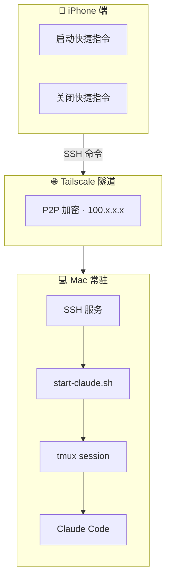
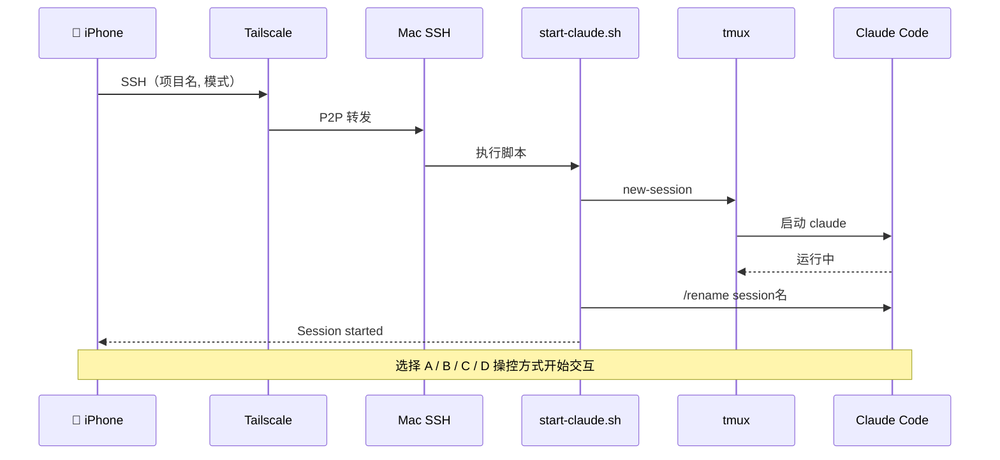
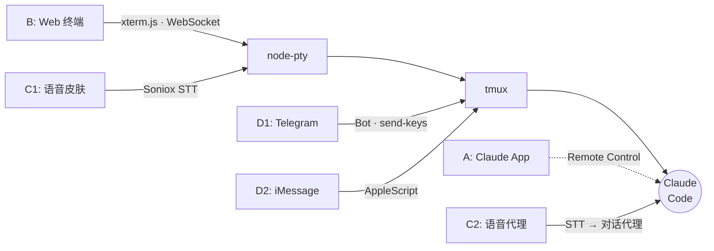
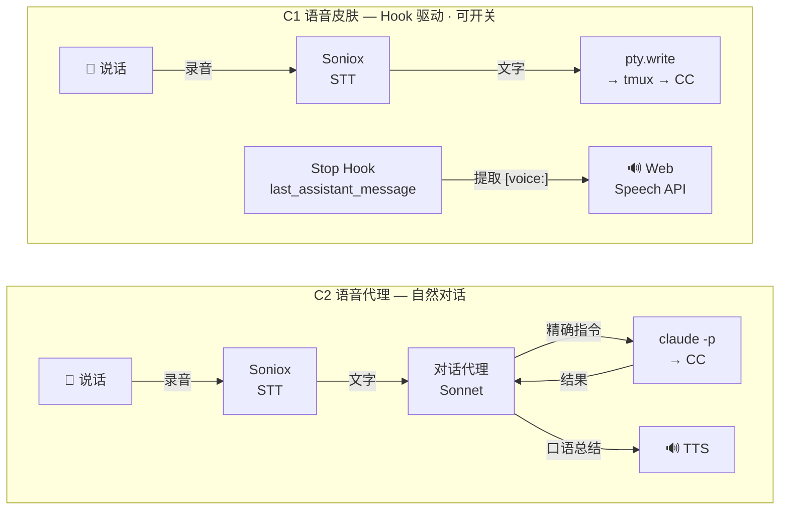

# Claude Code 远程工作流搭建方案

> 目标：随时随地通过手机远程启动并操控 Claude Code，两种操控方式可选

## 架构总览

### iPhone 端

| 组件 | 说明 | 详情 |
|------|------|------|
| [iOS 快捷指令「启动 Claude」](#快捷指令-1启动-claude) | SSH 启动 tmux + CC | 选项目 → 选模式 → 一键启动 |
| [iOS 快捷指令「关闭 Claude」](#快捷指令-2关闭-claude) | SSH 关闭指定 session | 列出 → 多选 → 关闭 |

### 操控 CC 的方式（启动后选一个或多个并存）

| 方式 | 入口 | 优势 | 劣势 |
|------|------|------|------|
| [**A**](#方式-a--remote-control) | Remote Control（Claude App） | 界面美观、体验流畅 | 不支持 slash command、无语音 |
| [**B**](#第五阶段web-终端方式-b) | 自建 Web 终端（xterm.js） | 完整终端、slash 补全 | 需自建 |
| [**B+C1**](#方案-c1语音皮肤帮你读屏--帮你打字) | Web 终端 + 语音皮肤 | 终端 + 语音混合 | 对话感弱 |
| [**B+C2**](#方案-c2语音代理自然对话感) | Web 终端 + 语音代理 | 自然对话、不用看屏幕 | 延迟稍高 |
| [**D1**](#d1telegram-bot推荐支持语音消息) | Telegram Bot | 语音+文字、聊天体验 | 需装 Telegram |
| [**D2**](#d2imessage文字为主mac-原生) | iMessage | 零依赖、自带 | 仅文字、语音难 |

### Mac 端（插电常开）

| 组件 | 说明 | 详情 |
|------|------|------|
| [Tailscale](#第二阶段网络--tailscale) | 外网可达（100.x.x.x） | [↓ 跳转](#第二阶段网络--tailscale) |
| [SSH 服务](#第三阶段ssh-配置) | 接收启动/关闭命令 | [↓ 跳转](#第三阶段ssh-配置) |
| [tmux](#第一阶段基础环境mac) | 保持 session 不断 | [↓ 跳转](#第一阶段基础环境mac) |
| [start-claude.sh](#第四阶段启动脚本) | 统一管理脚本 | [↓ 跳转](#第四阶段启动脚本) |
| Claude Code | 核心工具 | — |
| [防休眠设置](#mac-电池设置参考) | 插电时阻止自动休眠 | [↓ 跳转](#mac-电池设置参考) |

### 日常使用流程

**启动（共用）：**
1. 手机点「启动 Claude」快捷指令 → 选项目 → 选模式（normal/skip）
2. SSH 自动触发 → tmux 启动 claude → 返回 session 名称
3. 手动打开浏览器访问 Web 终端（http://Mac的Tailscale-IP:8022）选 session 连接

#### 方式 A — Remote Control

3. 打开 Claude App → 会话列表出现新 session（绿点）→ 点进去
4. 在原生对话界面操作（不支持 slash command）
5. 需在 CC 设置中开启「Enable Remote Control for all sessions」

**使用方式 B — 自建 Web 终端 + 语音：**
3. 手机浏览器打开 `http://Mac的Tailscale-IP:8022`
4. 完整 CC 终端界面，slash command 补全正常
5. 语音输入（C1）：语音按钮 → 转文字 → 注入终端 + CC 输出摘要播报
6. 语音对话（C2）：纯语音来回对话，代理层理解意图并指挥 CC

**关闭（共用）：**
1. 手机点「关闭 Claude」快捷指令
2. 显示当前所有 session 列表 → 选择要关闭的（支持多选）
3. 先发 /exit 优雅退出 CC → 再关闭 tmux 会话

### 架构与信息流图示

#### 基础设施层次



#### 启动时序



#### 六种操控方式 — 指令如何到达 CC



> **读图**：虚线 = Remote Control 协议（不经 tmux）；实线 = 经 tmux 转发；B 与 C1 共享 node-pty 通道

#### 语音方案信息流对比（C1 vs C2）



> **核心区别**：C1 直接注入文字到终端，CC 不知道你在用语音；C2 有中间代理层理解口语并翻译为精确指令

---

## 第一阶段：基础环境（Mac）

安装 tmux：

```bash
brew install tmux
```

防休眠设置：系统设置 → 电池 → 选项 → 打开「Prevent automatic sleeping on power adapter when the display is off」

Claude Code 安装：

```bash
curl -fsSL https://claude.ai/install.sh | bash
```

长期认证（避免远程时需要浏览器登录）：

```bash
claude setup-token
```

---

## 第二阶段：网络 — Tailscale

Mac 和手机都装 Tailscale，登录同一账号：

- **Mac**：官网下载 https://tailscale.com/download
- **手机**：App Store 搜索 Tailscale

每台设备会分配一个固定 IP（100.x.x.x），在 Tailscale 管理面板查看。

---

## 第三阶段：SSH 配置

### Mac 端

系统设置 → 通用 → 共享 → **远程登录** 打开。

### SSH 密钥（免密登录，快捷指令依赖）

```bash
ssh-keygen -t ed25519
ssh-copy-id 用户名@Mac的Tailscale-IP
```

手机端也导入同一私钥，供 iOS 快捷指令使用。

---

## 第四阶段：启动脚本

### ~/start-claude.sh

```bash
#!/bin/bash
# 用法: ~/start-claude.sh [项目名] [skip]
# 示例: ~/start-claude.sh ABL_work skip

export PATH="/opt/homebrew/bin:$PATH"

PROJECT="${1:-default}"
SKIP_MODE="${2:-normal}"

# Web Terminal 配置
WEB_TERMINAL_DIR=~/Documents/LIG_ALL/实时更新学习Claude/remote-claude-project
WEB_TERMINAL_PORT=8022

# 按需启动 Web Terminal
start_web_terminal() {
  if ! lsof -i :$WEB_TERMINAL_PORT -sTCP:LISTEN &>/dev/null; then
    cd "$WEB_TERMINAL_DIR" && nohup node server.js &>/dev/null &
    echo "Web terminal started on port $WEB_TERMINAL_PORT"
  fi
}

# 按需关闭 Web Terminal（无 CC session 时）
stop_web_terminal_if_idle() {
  local remaining
  remaining=$(tmux list-sessions 2>/dev/null | wc -l | tr -d ' ')
  if [ "$remaining" -eq 0 ]; then
    pkill -f "node.*server.js" 2>/dev/null
    echo "Web terminal stopped (no sessions)"
  fi
}

# 特殊命令：查看会话
if [ "$PROJECT" = "list" ]; then
    tmux list-sessions -F '#{session_name}' 2>/dev/null || echo "No active sessions"
    exit 0
fi

if [ "$PROJECT" = "list-detail" ]; then
    tmux list-sessions -F '#{session_name} | #{pane_current_path}' 2>/dev/null || echo "No active sessions"
    exit 0
fi

# 特殊命令：关闭全部
if [ "$PROJECT" = "kill-all" ] || [ "$PROJECT" = "关闭全部" ]; then
    for sess in $(tmux list-sessions -F '#{session_name}' 2>/dev/null); do
        tmux send-keys -t "$sess" "/exit" Enter
    done
    sleep 2
    tmux kill-server 2>/dev/null
    stop_web_terminal_if_idle
    echo "All sessions closed"
    exit 0
fi

# 特殊命令：关闭最近一个
if [ "$PROJECT" = "kill-latest" ] || [ "$PROJECT" = "关闭最近" ]; then
    LATEST=$(tmux list-sessions -F '#{session_name}' 2>/dev/null | tail -1)
    if [ -n "$LATEST" ]; then
        tmux send-keys -t "$LATEST" "/exit" Enter
        sleep 2
        tmux kill-session -t "$LATEST" 2>/dev/null
        echo "Closed session: $LATEST"
    else
        echo "No sessions to close"
    fi
    stop_web_terminal_if_idle
    exit 0
fi

# 特殊命令：关闭指定会话
if [ "$PROJECT" = "kill" ]; then
    SESSION_TO_KILL="$SKIP_MODE"
    if tmux has-session -t "$SESSION_TO_KILL" 2>/dev/null; then
        tmux send-keys -t "$SESSION_TO_KILL" "/exit" Enter
        sleep 2
        tmux kill-session -t "$SESSION_TO_KILL" 2>/dev/null
        echo "Closed session: $SESSION_TO_KILL"
    else
        echo "Session not found: $SESSION_TO_KILL"
    fi
    stop_web_terminal_if_idle
    exit 0
fi

# 项目名 → 文件夹路径 + 英文 session 别名（避免中文编码问题）
case "$PROJECT" in
    Richard所有信息-ai整理版)   DIR=~/Desktop/Richard所有信息-ai整理版;   ALIAS="richard" ;;
    ABL_work)                   DIR=~/Documents/ABL_work;                  ALIAS="abl" ;;
    实时更新学习Claude)          DIR=~/Documents/LIG_ALL/实时更新学习Claude; ALIAS="claude-learn" ;;
    *)                          echo "Unknown project: $PROJECT"; exit 1 ;;
esac

if [ ! -d "$DIR" ]; then
    echo "Error: $DIR does not exist"
    exit 1
fi

SESSION_NAME="${ALIAS}-$(date +%H%M)"

# 启动 Web Terminal（如果没跑）
start_web_terminal

tmux new-session -d -s "$SESSION_NAME" -c "$DIR"

if [ "$SKIP_MODE" = "skip" ]; then
    tmux send-keys -t "$SESSION_NAME" "claude --dangerously-skip-permissions" Enter
else
    tmux send-keys -t "$SESSION_NAME" "claude" Enter
fi

# 等 CC 启动后自动 rename（方式 A Remote Control 需要，便于在 Claude App 中辨识）
sleep 3
tmux send-keys -t "$SESSION_NAME" "/rename $SESSION_NAME"
sleep 1
tmux send-keys -t "$SESSION_NAME" Enter

echo "Session $SESSION_NAME started in $DIR"
```

### 关键设计说明

- **英文别名**：tmux session 名用英文（richard / abl / claude-learn），避免 SSH 传输中文编码问题
- **自动 rename**：启动后发 `/rename`，方式 A（Remote Control）在 Claude App 里能看到辨识名称
- **Remote Control 设置**：方式 A 需在 CC 设置中开启「Enable Remote Control for all sessions」
- **优雅关闭**：关闭时先发 `/exit` 退出 CC，再关 tmux，不丢失上下文
- **Web Terminal 按需启停**：启动 CC session 时自动拉起 server.js（如果没跑）；关闭最后一个 session 时自动停止 server，零资源浪费

### tmux 配置（~/.tmux.conf）

```bash
set -g mouse on
set -g history-limit 50000
set -g status-left '[#S] '
set -g default-terminal "screen-256color"
```

---

## 第五阶段：Web 终端（方式 B）

自建方案，完整终端体验 + 语音输入，两个输入通道互不干扰。

#### 架构

```
手机浏览器
  ├── xterm.js 终端（主输入）
  │     └── 手指直接打字 → 键盘通道 → slash 补全正常 ✅
  │
  └── 语音悬浮按钮（辅助输入）
        └── 按住说话 → 录音
        └── 松开 → 音频发到后端
        └── 后端 Whisper API 转文字
        └── 后端通过 node-pty.write() 注入终端（不走 IME，不触发重复 bug）

后端（Express + node-pty，跑在 Mac 上）
  ├── WebSocket: xterm.js ↔ node-pty ↔ tmux/shell
  └── POST /voice: 接收音频 → Whisper → 写入 pty
```

#### 为什么语音不会触发 iOS 的 xterm.js 重复输入 bug

xterm.js 在 iOS 上的重复输入 bug 是因为文字通过 IME（输入法）通道进入终端。
语音方案绕开了这条路：录音 → Whisper → 后端 API → 直接写入终端进程（node-pty.write），
文字根本不经过浏览器的键盘/IME 层，所以不会重复。

#### 两个输入通道对比

| | 键盘输入（主） | 语音输入（辅） |
|---|---|---|
| 通道 | 浏览器键盘 → xterm.js → WebSocket → node-pty | 麦克风 → 后端 API → Whisper → node-pty.write() |
| 经过 IME | 是 | 否 |
| slash 补全 | ✅ 完整支持 | ❌ 无补全（直接注入文字） |
| iOS 兼容性 | 打字正常，听写有 bug | 无 bug（不走 IME） |
| 适合场景 | 精确输入、slash command | 大段描述、走路/通勤时 |

#### 语音对话方案（两个层级）

语音交互分两个层级，可独立使用也可组合：

---

##### 方案 C1：语音皮肤（帮你读屏 + 帮你打字）

在 Web 终端基础上，贴一层语音 I/O。通过 **Hook 动态注入语音指令**，CC 只在语音模式下才生成播报摘要，关闭后输出完全干净。

```
语音模式开启时：
  UserPromptSubmit Hook → 检测 voice-mode-{session} 标志
    → 注入 additionalContext："回复末尾附加 <!-- voice: {} --> HTML 注释"

你说话 → Soniox STT（实时转写）→ 文字
  → node-pty.write() 注入终端 → CC 当成普通打字处理

CC 输出（末尾自带 <!-- voice: {"text":"改好了，测试全过"} -->）
  → Stop Hook 触发 → stdin.last_assistant_message
  → regex 找 <!-- voice: --> → json.loads 解析 → strip markdown → 推送 TTS
```

**核心设计 — Hook 驱动，可开关：**

不在 CLAUDE.md 写死语音规则（永远生效、不可关闭），而是用两个 Hook 配合 flag 文件实现动态开关：

| Hook | 触发时机 | 语音模式 ON | 语音模式 OFF |
|------|---------|-----------|------------|
| `UserPromptSubmit` | 每次用户输入前 | 注入 `<!-- voice: {} -->` 格式指令 | 什么都不做 |
| `Stop` | CC 完成回复时 | 提取 HTML 注释 → json.loads → strip markdown → TTS | 只发 ntfy 文字通知 |

**开关机制：** per-session flag 文件 `~/.claude/voice-mode-{tmux_session_name}`
- 开启：`touch ~/.claude/voice-mode-richard-1218`（仅该 session 开启语音）
- 关闭：`rm ~/.claude/voice-mode-richard-1218`
- mid-session 随时切换，不影响其他并行 session
- Web 终端 speaker 按钮自动调用 `/api/voice-toggle` 创建/删除对应 flag 文件

**特点：**
- CC 自己生成摘要，零额外 LLM 调用（干掉了 Haiku 摘要层）
- Hook 驱动，语音功能完全可插拔，不污染正常使用
- 打字和语音可以混用（xterm.js 键盘 + 语音按钮）
- 适合：想保留完整终端体验，语音只是辅助

**组件：**

| 组件 | 技术 | 作用 |
|------|------|------|
| STT | Soniox Web SDK | 实时语音转文字，中英混合 |
| 摘要 | CC 自身（Hook 注入指令） | 回复末尾自带 `<!-- voice: {} -->` HTML 注释，零额外 LLM |
| TTS | Web Speech API（浏览器端，免费）/ Kokoro（本地） | 手机端播报 |
| VAD | Silero VAD / Soniox 内置 | 判断你说完了没 |
| 语音开关 | UserPromptSubmit + Stop Hook | 动态注入/提取语音摘要 |

---

##### 方案 C2：语音代理（自然对话感）⭐

中间加一个**对话代理层**（轻量 Claude），它"听懂"你，像助手一样回应，自己决定怎么指挥 CC。

```
你说话 → Soniox STT → 文字 → 对话代理（Sonnet/Haiku）
                                    │
                                    ├── 理解意图，口语回应："好的，我来找一下"
                                    │
                                    ├── 组织精确指令 → claude -p "..." 或 tmux send-keys
                                    │
                                    ├── CC 执行 → 拿到结果
                                    │
                                    └── 口语总结 → TTS："找到了，合同在 ABL_work 下面，要打开吗？"
```

**对比 C1 的区别：**

| 你说 | C1（语音皮肤） | C2（语音代理） |
|------|---------|---------|
| "那个合同找一下" | 直接打进 CC | "好的，我帮你找" → 指令给 CC → "找到了，在 ABL_work/contracts 下，要打开吗？" |
| "等一下别改" | 发 Ctrl+C | "好，停了。你想先看看再决定？" |
| "刚才改的撤回" | 打"撤回"给 CC | "明白" → git restore → "恢复了，和改之前一样" |

**特点：**
- 对话感强 — 会主动确认、追问、反馈状态
- 代理层翻译你的口语为 CC 能理解的精确指令
- 多一层 LLM 调用，延迟 +1-2 秒
- 适合：走路/通勤时纯语音操控，不看屏幕

**组件：**

| 组件 | 技术 | 作用 |
|------|------|------|
| STT | Soniox（实时流式，sub-200ms） | 语音转文字 |
| 对话代理 | Claude Sonnet/Haiku API | 理解意图 + 组织指令 + 口语回复 |
| CC 交互 | `claude -p "..." --output-format stream-json` 或 tmux send-keys | 执行实际操作 |
| TTS | OpenAI TTS / ElevenLabs | 念回复 |
| VAD + 打断 | Pipecat / Soniox 内置 | 你开口说话时中断当前播报 |
| 编排框架 | [Pipecat](https://github.com/pipecat-ai/pipecat) 或 [FastRTC](https://github.com/gradio-app/fastrtc) | 管理语音管线、轮转、打断 |

**关键技术挑战：**
- CC CLI 非流式输出，延迟 3-10 秒 → 用 `--output-format stream-json` 缓解
- 打断时需 kill 当前 CLI 进程
- 对话代理需维护上下文（你说了什么、CC 做了什么）
- CC 用 `--resume` 或 `--continue` 保持会话连续性

---

##### C1 vs C2 选择指南

| | C1 语音皮肤 | C2 语音代理 |
|---|---|---|
| 对话感 | 弱（读屏+打字） | 强（像跟人说话） |
| 延迟 | **极低**（CC 自带摘要 +0ms） | 高（多两次 LLM roundtrip +3-5s） |
| 额外 LLM 调用 | **零**（Hook 注入，CC 自己摘要） | 2 次（理解意图 + 组织回复） |
| 额外 API 费用 | **零**（Web Speech API 免费） | Sonnet/Haiku 对话（适中） |
| 实现复杂度 | 低（两个 Hook + flag 文件） | 中高 |
| 可开关 | **是**（flag 文件，mid-session 切换） | 是（独立进程） |
| 需要看屏幕 | 是（终端为主） | 否（纯语音可用） |
| 适合场景 | 坐着用，终端+语音混合 | 走路/通勤，纯语音（等模型推理更快再做） |

**推荐路线**：先把 C1 做到极致（Hook 驱动、零额外 LLM、可开关），覆盖 80% 场景。C2 作为远期方向，等 Sonnet/Haiku 推理降到 sub-300ms 再投入。

两者可以共存：坐下来用 B 终端 + C1 语音皮肤，出门切 C2 纯语音模式。

---

##### 语音模式开关机制（C1 核心）

语音功能通过 CC Hook 动态注入，**不写入 CLAUDE.md**，确保非语音场景零污染。

**Per-session flag 文件**：`~/.claude/voice-mode-{tmux_session_name}`

每个 tmux session 独立控制语音开关。Hook 通过 `tmux display-message -p '#S'` 获取当前 session 名称（已验证在 hook 子进程中可用），构造对应 flag 路径。

```
开启：touch ~/.claude/voice-mode-richard-1218    # 仅 richard-1218 session
关闭：rm ~/.claude/voice-mode-richard-1218
查询：[ -f ~/.claude/voice-mode-richard-1218 ] && echo "ON" || echo "OFF"
```

**为什么用 tmux session name 而非 CC session_id：**
- CC hook stdin 提供的 `session_id` 是 UUID，手机端不知道
- tmux session name 两端都知道：手机端通过 WS `?session=X` 连接时传入，hook 端通过 `tmux display-message` 获取
- 无需映射表，天然对齐

**Hook 配置**（添加到项目或用户级 settings.json）：

```json
{
  "hooks": {
    "UserPromptSubmit": [
      {
        "hooks": [
          {
            "type": "command",
            "command": "~/.claude/hooks/voice-inject.sh"
          }
        ]
      }
    ],
    "Stop": [
      {
        "hooks": [
          {
            "type": "command",
            "command": "~/.claude/hooks/voice-push.sh"
          }
        ]
      }
    ]
  }
}
```

**voice-inject.sh**（UserPromptSubmit — 注入语音指令）：

```bash
#!/bin/bash
# Per-session 语音 flag 检查
TMUX_SESSION=$(tmux display-message -p '#S' 2>/dev/null)
if [ -n "$TMUX_SESSION" ]; then
  VOICE_FLAG="$HOME/.claude/voice-mode-${TMUX_SESSION}"
else
  VOICE_FLAG="$HOME/.claude/voice-mode"  # fallback
fi

[ ! -f "$VOICE_FLAG" ] && exit 0

# 注入 HTML 注释格式指令：<!-- voice: {"text":"摘要"} -->
cat <<'EOF'
{
  "hookSpecificOutput": {
    "hookEventName": "UserPromptSubmit",
    "additionalContext": "语音模式已开启。请在回复末尾附加 HTML 注释：<!-- voice: {\"text\":\"语音内容\"} -->..."
  }
}
EOF
```

**voice-push.sh**（Stop — 提取并推送）：

```bash
#!/bin/bash
# Per-session 语音 flag 检查
TMUX_SESSION=$(tmux display-message -p '#S' 2>/dev/null)
if [ -n "$TMUX_SESSION" ]; then
  VOICE_FLAG="$HOME/.claude/voice-mode-${TMUX_SESSION}"
else
  VOICE_FLAG="$HOME/.claude/voice-mode"
fi

[ ! -f "$VOICE_FLAG" ] && exit 0

INPUT=$(cat)

# 单个 python3 调用完成全部处理：
# 1. 解析 hook stdin JSON（stdin 管道，无 ARG_MAX 限制）
# 2. regex 找 <!-- voice: {...} -->（HTML 注释不会与 markdown 冲突）
# 3. json.loads 解析内容（结构化，支持扩展字段）
# 4. strip markdown 格式（去 **、`、# 等再送 TTS）
# 5. json.dumps 输出安全 JSON（处理引号、换行、unicode）
# 兼容旧 [voice:] 格式作为 fallback
PAYLOAD=$(echo "$INPUT" | python3 -c "
import sys, json, re
data = json.loads(sys.stdin.read())
msg = data.get('last_assistant_message', '')
if not msg: sys.exit(1)

# 优先匹配 HTML 注释格式
match = re.search(r'<!--\s*voice:\s*(\{.*?\})\s*-->', msg, re.DOTALL)
if match:
    try:
        text = json.loads(match.group(1)).get('text', '').strip()
    except: text = match.group(1).strip()
else:
    # Fallback: 旧 [voice:] 格式
    old = re.search(r'\[voice:\s*(.*?)\]', msg, re.DOTALL)
    text = old.group(1).strip() if old else msg[:50].strip()

# Strip markdown
for pat, rep in [(r'\*\*(.+?)\*\*', r'\1'), (r'\*(.+?)\*', r'\1'),
                 (r'\x60[^\x60]+\x60', ''), (r'^\#{1,6}\s+', '')]:
    text = re.sub(pat, rep, text, flags=re.MULTILINE)
text = text.strip()[:500]
if not text: sys.exit(1)
print(json.dumps({'text': text}))
" 2>/dev/null)

[ -z "$PAYLOAD" ] && exit 0
curl -s -X POST "http://localhost:8022/voice-event" \
  -H "Content-Type: application/json" -d "$PAYLOAD" > /dev/null 2>&1 &
```

**语音开关方式**：

1. **Web 终端 speaker 按钮**（推荐）：点击 🔊/🔇 按钮，自动调用 `/api/voice-toggle` 创建/删除对应 session 的 flag 文件
2. **SSH 命令行**：`touch ~/.claude/voice-mode-{session_name}` / `rm ~/.claude/voice-mode-{session_name}`
3. **API 直接调用**：`curl -X POST localhost:8022/api/voice-toggle -H 'Content-Type: application/json' -d '{"session":"richard-1218","enabled":true}'`

**Server API**：
- `GET /api/voice-status?session=X` — 查询语音状态
- `POST /api/voice-toggle` — body: `{ "session": "X", "enabled": true/false }` — 切换语音

---

##### 方案 D：消息平台入口（Telegram / iMessage）

除了浏览器，也可以通过消息 App 与 CC 交互。

###### D1：Telegram Bot（推荐，支持语音消息）

```
你发 Telegram 语音/文字消息 → Bot 收到
  → 语音消息：下载音频 → Soniox/Whisper 转文字
  → 文字消息：直接使用
  → tmux send-keys 或 claude -p "..." → CC 执行
  → CC 输出 → Stop Hook 提取 [voice:] 标记（复用 C1 机制，零额外 LLM）
  → Bot 发回语音/文字消息
```

> **与 C1 共享语音基础设施**：语音模式开启时，D1 复用 C1 的 Hook 驱动摘要（Stop Hook 提取 `[voice:]` 标记），不额外调 Haiku。Bot 服务监听 `/voice-event` 端点或直接读 Hook 推送即可拿到摘要文本。

**优势：**
- 官方 Bot API，稳定不封号
- 语音消息是一等公民（直接拿到音频文件）
- `python-telegram-bot` 库成熟
- 也能发图片、文件
- 手机体验就是正常聊天，零学习成本
- 支持 inline keyboard（可做快捷按钮：/exit、/resume 等）

**搭建：**
1. @BotFather 创建 Bot → 拿到 Token
2. Mac 上跑 Bot 服务（Python）
3. Bot 收到消息 → 转发给 CC → 回复结果

###### D2：iMessage（文字为主，Mac 原生）

```
你发 iMessage 文字 → Mac Messages.app 收到
  → AppleScript 读取新消息
  → tmux send-keys → CC 执行
  → CC 输出 → 摘要
  → AppleScript 回复 iMessage
```

**优势：**
- 不需要任何第三方服务或 API key
- Mac 原生，AppleScript 几行就能收发
- iPhone 自带，不用装额外 App

**限制：**
- 语音消息自动化困难（AppleScript 对音频附件支持弱）
- 主要适合文字交互
- 适合简单指令："帮我找那个合同"、"git status 看一下"

###### D1 vs D2

| | Telegram Bot | iMessage |
|---|---|---|
| 语音消息 | ✅ 完整支持 | ❌ 难自动化 |
| 文字消息 | ✅ | ✅ |
| 图片/文件 | ✅ | 有限 |
| 需要额外 App | 是（Telegram） | 否（自带） |
| 第三方依赖 | Bot API（官方，稳定） | 无 |
| 快捷按钮 | ✅ inline keyboard | ❌ |
| 适合场景 | 语音+文字，完整交互 | 简单文字指令 |

#### 技术栈总览

| 组件 | 技术 |
|------|------|
| 前端终端 | xterm.js + xterm-addon-fit |
| 前端语音 | MediaRecorder API / Soniox Web SDK |
| 后端框架 | Express (Node.js) 或 FastAPI (Python) |
| 终端进程 | node-pty（Node）或 pty（Python） |
| WebSocket | ws（Node）或 websockets（Python） |
| STT | Soniox API（推荐）/ Whisper API |
| TTS | OpenAI TTS / ElevenLabs / Kokoro |
| 摘要/对话 | Claude Haiku / Sonnet API |
| 语音编排 | [Pipecat](https://github.com/pipecat-ai/pipecat)（C2 推荐）/ [FastRTC](https://github.com/gradio-app/fastrtc)（C2 快速原型） |

#### 参考项目

- [claude-code-remote](https://github.com/buckle42/claude-code-remote) — FastAPI + ttyd + textarea 语音方案（不支持 slash 补全）
- [Happy Coder](https://github.com/slopus/happy) — 功能丰富的 CC 移动客户端
- [VoiceMode](https://github.com/mbailey/voicemode) — CC 的语音 MCP 插件（桌面端，5 分钟起步）
- [Pipecat](https://github.com/pipecat-ai/pipecat) — 实时语音 AI 管线框架（5000+ stars）
- [FastRTC](https://github.com/gradio-app/fastrtc) — Gradio 团队出品，极简语音框架

---

## 第六阶段：手机快捷指令

### 快捷指令 1：「启动 Claude」

```
List [Richard所有信息-ai整理版, ABL_work, 实时更新学习Claude]
    → Choose from List → 存为「项目名」

List [normal, skip]
    → Choose from List → 存为「模式」

SSH: ~/start-claude.sh 项目名 模式
    → 主机：Tailscale IP
    → 用户：你的用户名
    → 认证：SSH 密钥
    → 脚本会自动启动 Web Terminal（按需，端口 8022）

Show Result（显示 SSH 返回的 session 名称）

手动打开浏览器访问 http://Mac的Tailscale-IP:8022 选 session 连接
```

> **按需启停**：start-claude.sh 启动 CC session 时自动拉起 Web Terminal server；关闭最后一个 session 时自动停止 server，零资源浪费。

### 快捷指令 2：「关闭 Claude」

```
SSH: ~/start-claude.sh list
    → Split Text（按 New Lines）
    → Choose from List（开启 Select Multiple 多选）

Repeat with Each（对选中的每一项）:
    SSH: ~/start-claude.sh kill [Repeat Item]

Show Result
```

### iOS 快捷指令变量技巧

- 两个 Choose from List 的输出变量可重命名（长按变量改名），如「项目名」和「模式」
- SSH 脚本里拼接变量时注意**空格**：`~/start-claude.sh ` + 项目名 + ` ` + 模式
- 添加到主屏幕：长按快捷指令 → 分享 → 添加到主屏幕

---

## 第七阶段：任务完成通知（可选）

手机安装 ntfy App，订阅自定义主题。

Claude Code settings 中配置 Stop hook：

```json
{
  "hooks": {
    "Stop": [
      {
        "matcher": "",
        "command": "curl -s -d 'Claude Code 任务完成' ntfy.sh/你的主题名"
      }
    ]
  }
}
```

---

## 日常使用速查

| 操作 | 方式 |
|------|------|
| 启动新 session | 手机点「启动 Claude」→ 选项目 → 选模式 |
| 使用 session（方式 A） | Claude App → 会话列表 → 点绿点 session |
| 使用 session（方式 B） | 手机浏览器打开自建 Web 终端 |
| 使用 session（B + C1） | Web 终端 + 语音皮肤（帮读屏 + 帮打字） |
| 使用 session（B + C2） | 纯语音对话，不用看屏幕 |
| 使用 session（D1） | Telegram 发语音/文字消息 |
| 使用 session（D2） | iMessage 发文字指令 |
| 关闭 session | 手机点「关闭 Claude」→ 选择要关的 |
| 查看所有 session | SSH 跑 `~/start-claude.sh list` |
| 手动接管 tmux | SSH 进来 → `tmux attach -t session名` |

---

## 搭建顺序

1. **Claude Code + tmux** → 确保本地能跑
2. **Tailscale + SSH** → 确保手机能连
3. **start-claude.sh 脚本** → 一键启动/关闭
4. **自建 Web 终端（B）** → xterm.js + node-pty 跑通
5. **手机快捷指令** → 两个图标放主屏幕
6. **防休眠** → Mac 插电常驻在线
7. **语音 C1**（Hook 驱动）→ voice-inject + voice-push 两个 Hook + flag 开关
8. **语音 C2**（语音代理）→ 远期方向，等推理速度提升再做
9. **Telegram Bot / iMessage**（D）→ 消息平台入口
10. **ntfy 通知** → 锦上添花

---

## 软件清单

| 项目 | 用途 | 费用 |
|------|------|------|
| Claude Max 计划 | Claude Code + Remote Control（方式 A） | 订阅费 |
| Claude App | 远程操作界面（方式 A） | 免费 |
| Tailscale | 外网访问 | 免费 |
| xterm.js + node-pty | 自建 Web 终端（方式 B） | 免费 |
| Soniox API | STT 语音转文字（C1/C2） | $0.12/小时 |
| Web Speech API | C1 语音播报（浏览器内置） | **免费** |
| Claude Haiku/Sonnet API | 对话代理（仅 C2） | 按量付费 |
| TTS（OpenAI/ElevenLabs） | 语音回复（仅 C2） | 按量付费 |
| Pipecat / FastRTC | 语音管线编排（C2） | 免费 |
| python-telegram-bot | Telegram Bot（D1） | 免费 |
| AppleScript | iMessage 自动化（D2） | 免费 |
| ntfy App | 任务通知 | 免费 |
| tmux | 会话保持 | 免费 |

---

## Mac 电池设置参考

| 设置项 | 推荐值 |
|--------|--------|
| Slightly dim display on battery | 开 |
| Prevent automatic sleeping on power adapter | **开（关键）** |
| Put hard disks to sleep when possible | Always（SSD 无影响） |
| Wake for network access | Only on Power Adapter |
