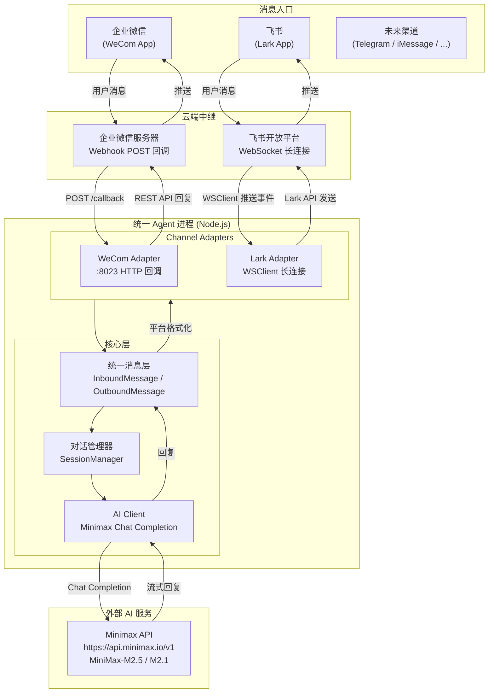
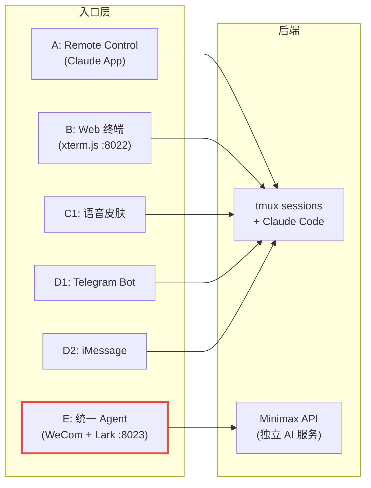
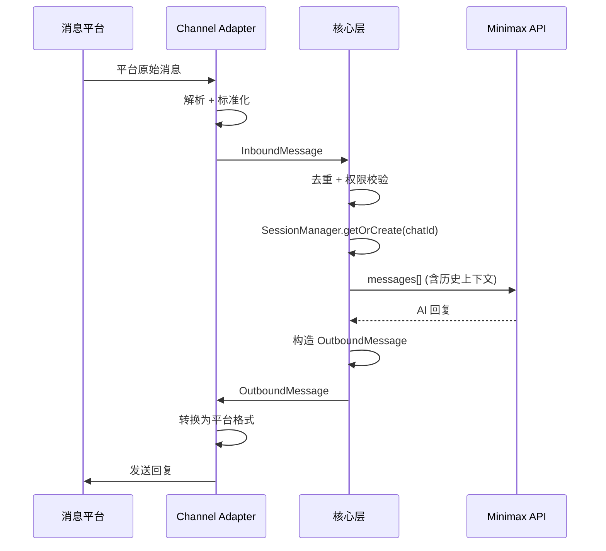
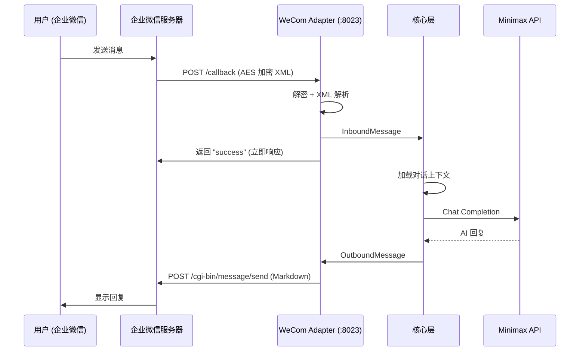
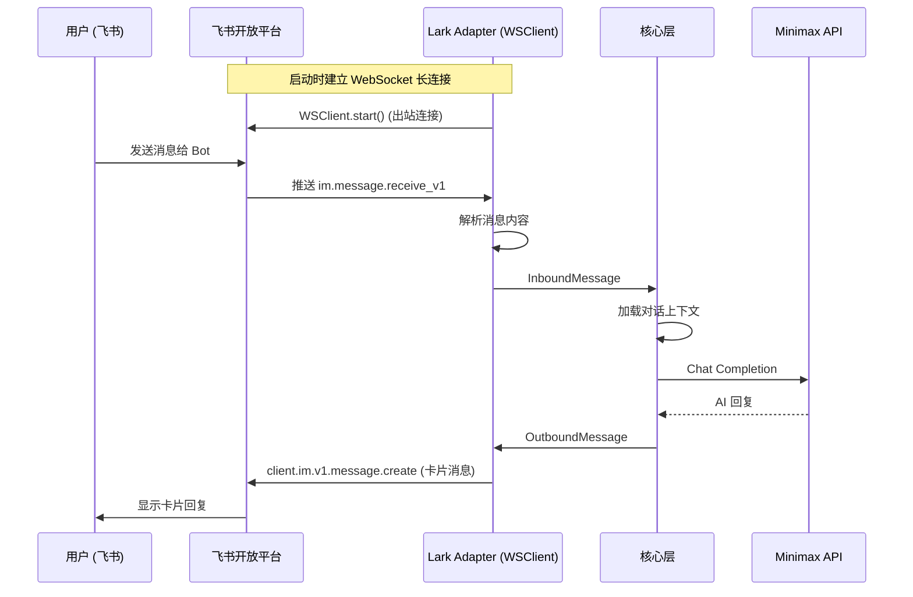
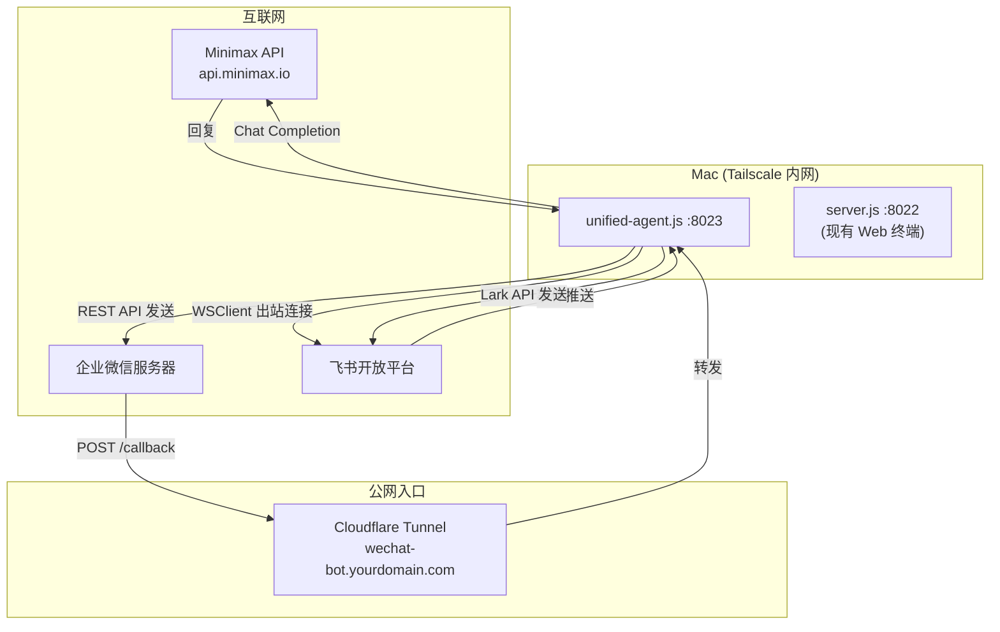

# 统一 Agent 技术框架：企业微信 + 飞书 + Minimax API

> 基于三份多渠道研究文档（WeChat / Lark / iMessage），设计单一 Node.js Agent 同时接入企业微信和飞书，使用 Minimax API 作为 AI 能力层。
>
> 创建日期：2026-03-07

---

## 一、架构总览

### 1.1 系统架构



### 1.2 关键设计原则

| 原则 | 说明 |
|------|------|
| **单进程** | 一个 Node.js 进程同时管理企业微信 HTTP 回调 + 飞书 WSClient 长连接 |
| **AI 后端独立** | 调用 Minimax API 处理消息，不依赖 Claude Code tmux session |
| **消息归一化** | 所有渠道消息转为统一的 `InboundMessage`，回复转为统一的 `OutboundMessage` |
| **Adapter 插件化** | 每个渠道一个 Adapter 模块，新增渠道只需实现 `ChannelAdapter` 接口 |
| **对话隔离** | 每个用户独立对话上下文，支持多轮对话 |

### 1.3 与现有项目架构的关系



统一 Agent（E）与现有方式 A/B/C1/D1/D2 并列，但**后端不同**：现有方式操控 Claude Code CLI（tmux session），而统一 Agent 直接调用 Minimax API。两套后端独立运行，互不干扰。未来可以通过配置切换 AI 后端（Minimax / Claude API / 本地 CC session）。

---

## 二、Minimax API 接入

### 2.1 平台概览

[Minimax](https://www.minimax.io/) 是国产大模型服务商，提供与 OpenAI 兼容的 API 接口，支持直接使用 OpenAI SDK 调用。

| 维度 | 说明 |
|------|------|
| 官网 | https://www.minimax.io/ |
| API 文档 | https://platform.minimax.io/docs/api-reference/text-chat |
| OpenAI 兼容端点 | `https://api.minimax.io/v1` |
| 原生端点 | `https://api.minimax.io/v1/text/chatcompletion_v2` |
| 认证方式 | `Authorization: Bearer <API_KEY>` |
| 获取 API Key | https://platform.minimax.io/ 注册后在控制台创建 |

### 2.2 可用模型

| 模型 | 特点 | 推荐场景 |
|------|------|----------|
| **MiniMax-M2.5** | 最新旗舰，编码能力强 | 代码生成、复杂推理 |
| **MiniMax-M2.5-highspeed** | M2.5 高速版 | 对延迟敏感的场景 |
| **MiniMax-M2.1** | 均衡性能 | 通用对话 |
| **MiniMax-M2.1-highspeed** | M2.1 高速版 | 快速回复 |
| **MiniMax-M2** | 超长上下文 (204,800 tokens) | 长文档分析 |

### 2.3 定价（2026年3月）

| 模型 | 输入 (每百万 tokens) | 输出 (每百万 tokens) |
|------|---------------------|---------------------|
| MiniMax-M2 | ~$0.26 | ~$1.00 |
| MiniMax-M2.5 | ~$0.20 - $0.40 | 按量计费 |

### 2.4 Node.js 接入方式（OpenAI 兼容）

使用 OpenAI SDK，仅需修改 `baseURL` 和 `apiKey`：

```javascript
const OpenAI = require('openai');

const client = new OpenAI({
  baseURL: 'https://api.minimax.io/v1',
  apiKey: process.env.MINIMAX_API_KEY,
});

async function chat(messages) {
  const response = await client.chat.completions.create({
    model: 'MiniMax-M2.5',
    messages,
    max_tokens: 4096,
    temperature: 0.7,
  });
  return response.choices[0].message.content;
}
```

### 2.5 流式响应

```javascript
async function chatStream(messages, onChunk) {
  const stream = await client.chat.completions.create({
    model: 'MiniMax-M2.5',
    messages,
    max_tokens: 4096,
    stream: true,
  });

  let fullContent = '';
  for await (const chunk of stream) {
    const delta = chunk.choices[0]?.delta?.content || '';
    fullContent += delta;
    onChunk(delta, fullContent);
  }
  return fullContent;
}
```

### 2.6 原生 API 调用（备选）

如需使用 Minimax 特有功能（角色扮演、example 对话学习等），可直接调用原生端点：

```javascript
async function chatNative(messages) {
  const resp = await fetch('https://api.minimax.io/v1/text/chatcompletion_v2', {
    method: 'POST',
    headers: {
      'Authorization': `Bearer ${process.env.MINIMAX_API_KEY}`,
      'Content-Type': 'application/json',
    },
    body: JSON.stringify({
      model: 'MiniMax-M2.5',
      messages,
      max_tokens: 4096,
    }),
  });
  const data = await resp.json();
  return data.choices[0].message.content;
}
```

---

## 三、统一消息抽象层设计

### 3.1 设计理念

借鉴 OpenClaw 的 Channel Adapter 模式：每个渠道 Adapter 负责将平台特有的消息格式转换为统一的 `InboundMessage`，Gateway（核心层）完全不感知具体平台。回复时，核心层产出统一的 `OutboundMessage`，由 Adapter 转换回平台特定格式。

### 3.2 核心接口定义

```javascript
// types.js — 统一消息类型定义

/**
 * 入站消息（渠道 → 核心层）
 * @typedef {Object} InboundMessage
 * @property {string} channelType    - 渠道标识：'wecom' | 'lark' | 'telegram' | ...
 * @property {string} channelMsgId   - 平台原始消息 ID（去重用）
 * @property {Sender} sender         - 发送者信息
 * @property {string} text           - 纯文本内容
 * @property {Attachment[]} attachments - 附件列表（图片/文件/语音）
 * @property {string} chatId         - 会话标识（私聊=userId，群聊=groupId）
 * @property {number} timestamp      - 消息时间戳 (ms)
 * @property {Object} rawEvent       - 平台原始事件（调试用，不进入核心逻辑）
 */

/**
 * 出站消息（核心层 → 渠道）
 * @typedef {Object} OutboundMessage
 * @property {string} text           - 回复文本（Markdown 格式）
 * @property {string} [format]       - 格式提示：'text' | 'markdown' | 'card'
 * @property {Attachment[]} [attachments] - 附件
 * @property {Object} [metadata]     - 渠道特定的附加信息（如飞书卡片模板 ID）
 */

/**
 * 发送者
 * @typedef {Object} Sender
 * @property {string} id             - 平台用户 ID
 * @property {string} name           - 显示名称
 * @property {string} platform       - 平台标识
 */

/**
 * 附件
 * @typedef {Object} Attachment
 * @property {string} type           - 'image' | 'file' | 'audio'
 * @property {string} url            - 下载 URL 或本地路径
 * @property {string} [mimeType]     - MIME 类型
 * @property {string} [fileName]     - 文件名
 */
```

### 3.3 Channel Adapter 接口

```javascript
// channel-adapter.js — 渠道适配器基类

class ChannelAdapter {
  /**
   * @param {string} type - 渠道类型标识
   * @param {Object} config - 渠道配置
   * @param {Function} onMessage - 收到消息时的回调 (InboundMessage) => void
   */
  constructor(type, config, onMessage) {
    this.type = type;
    this.config = config;
    this.onMessage = onMessage;
  }

  /** 启动适配器（连接/监听） */
  async start() { throw new Error('start() not implemented'); }

  /** 停止适配器 */
  async stop() { throw new Error('stop() not implemented'); }

  /**
   * 发送回复到渠道
   * @param {string} chatId - 目标会话 ID
   * @param {OutboundMessage} message - 统一回复消息
   */
  async send(chatId, message) { throw new Error('send() not implemented'); }

  /** 健康检查 */
  async healthCheck() { return { ok: true, type: this.type }; }
}

module.exports = ChannelAdapter;
```

### 3.4 消息流转示意



---

## 四、企业微信 Adapter

### 4.1 接入方式

企业微信使用 **Webhook 回调** 模式：企业微信服务器将用户消息 POST 到我们的回调 URL，我们处理后通过 REST API 主动推送回复。

**需要公网入口**：回调 URL 必须公网可达，推荐 Cloudflare Tunnel 或 Tailscale Funnel。

### 4.2 核心流程



### 4.3 实现要点

| 要点 | 说明 |
|------|------|
| **消息解密** | AES-256-CBC 解密，EncodingAESKey 在企业微信后台生成 |
| **URL 验证** | GET /callback 返回解密后的 echostr（企业微信首次验证回调 URL） |
| **Token 管理** | access_token 2h 过期，需定期刷新缓存 |
| **消息发送** | 支持 text / markdown / image 格式 |
| **5 秒响应** | 收到回调后必须 5 秒内返回 "success"，AI 处理异步执行 |
| **公网穿透** | Cloudflare Tunnel 映射 localhost:8023 到公网 HTTPS 域名 |

### 4.4 Adapter 实现骨架

```javascript
// adapters/wecom-adapter.js

const crypto = require('crypto');
const xml2js = require('xml2js');
const ChannelAdapter = require('../channel-adapter');

class WeComAdapter extends ChannelAdapter {
  constructor(config, onMessage) {
    super('wecom', config, onMessage);
    this.accessToken = '';
    this.tokenExpireAt = 0;
  }

  async start(expressApp) {
    // GET /callback — URL 验证
    expressApp.get('/callback', (req, res) => {
      const echostr = this.decryptMsg(req.query.echostr);
      res.send(echostr);
    });

    // POST /callback — 消息接收
    expressApp.post('/callback', async (req, res) => {
      res.send('success'); // 立即响应

      const xmlStr = this.decryptMsg(req.body.xml.Encrypt[0]);
      const parsed = await xml2js.parseStringPromise(xmlStr);
      const content = parsed.xml.Content?.[0] || '';
      const fromUser = parsed.xml.FromUserName[0];

      // 转换为 InboundMessage
      this.onMessage({
        channelType: 'wecom',
        channelMsgId: parsed.xml.MsgId?.[0],
        sender: { id: fromUser, name: fromUser, platform: 'wecom' },
        text: content,
        attachments: [],
        chatId: `wecom:${fromUser}`,
        timestamp: Date.now(),
        rawEvent: parsed,
      });
    });

    // 定时刷新 Token
    await this.refreshToken();
    setInterval(() => this.refreshToken(), 110 * 60 * 1000); // 110 分钟
  }

  async send(chatId, message) {
    const userId = chatId.replace('wecom:', '');
    const token = await this.getToken();
    const text = this.truncate(message.text, 2048);

    await fetch(
      `https://qyapi.weixin.qq.com/cgi-bin/message/send?access_token=${token}`,
      {
        method: 'POST',
        headers: { 'Content-Type': 'application/json' },
        body: JSON.stringify({
          touser: userId,
          msgtype: 'markdown',
          agentid: this.config.agentId,
          markdown: { content: text },
        }),
      }
    );
  }

  // ... decryptMsg(), refreshToken(), getToken(), truncate() 等辅助方法
}
```

### 4.5 企业微信配置清单

1. [work.weixin.qq.com](https://work.weixin.qq.com/) 注册企业微信（免费，可用个人信息）
2. 应用管理 → 自建 → 创建应用 → 记录 **AgentId** + **Secret**
3. 应用详情 → 接收消息 → 设置回调 URL / Token / EncodingAESKey
4. 配置企业可信 IP
5. 可选：开启「微信插件」实现企业微信 ↔ 个人微信互通

---

## 五、飞书 Adapter

### 5.1 接入方式

飞书使用 **WebSocket 长连接** 模式：SDK 主动连接飞书平台保持双向通道，**不需要公网 URL**。这是飞书相比企业微信的最大优势。

### 5.2 核心流程



### 5.3 实现要点

| 要点 | 说明 |
|------|------|
| **无需公网** | WSClient 主动出站连接，只要 Mac 能访问互联网即可 |
| **SDK 原生** | `@larksuiteoapi/node-sdk` v1.24.0+ 内置 WSClient |
| **卡片消息** | 飞书支持富文本卡片（Markdown + 按钮 + 注释），回复体验优于纯文本 |
| **事件订阅** | 订阅 `im.message.receive_v1` 事件接收用户消息 |
| **3 秒响应** | 事件处理需 3 秒内确认，实际 AI 处理异步执行 |
| **连接限制** | 每个应用最多 50 个 WebSocket 连接 |

### 5.4 Adapter 实现骨架

```javascript
// adapters/lark-adapter.js

const Lark = require('@larksuiteoapi/node-sdk');
const ChannelAdapter = require('../channel-adapter');

class LarkAdapter extends ChannelAdapter {
  constructor(config, onMessage) {
    super('lark', config, onMessage);
    this.client = new Lark.Client({
      appId: config.appId,
      appSecret: config.appSecret,
    });
  }

  async start() {
    const wsClient = new Lark.WSClient({
      appId: this.config.appId,
      appSecret: this.config.appSecret,
      loggerLevel: Lark.LoggerLevel.info,
    });

    wsClient.start({
      eventDispatcher: new Lark.EventDispatcher({}).register({
        'im.message.receive_v1': async (data) => {
          const { message, sender } = data;
          const msgType = message.message_type;

          let text = '';
          if (msgType === 'text') {
            text = JSON.parse(message.content).text;
          }

          this.onMessage({
            channelType: 'lark',
            channelMsgId: message.message_id,
            sender: {
              id: sender.sender_id?.open_id || '',
              name: sender.sender_id?.open_id || '',
              platform: 'lark',
            },
            text,
            attachments: [],
            chatId: `lark:${message.chat_id}`,
            timestamp: parseInt(message.create_time) || Date.now(),
            rawEvent: data,
          });
        },
      }),
    });
  }

  async send(chatId, message) {
    const realChatId = chatId.replace('lark:', '');
    const truncated = message.text.length > 4000
      ? message.text.slice(0, 4000) + '\n\n...(输出过长，已截断)'
      : message.text;

    await this.client.im.v1.message.create({
      params: { receive_id_type: 'chat_id' },
      data: {
        receive_id: realChatId,
        msg_type: 'interactive',
        content: JSON.stringify({
          config: { wide_screen_mode: true },
          header: {
            template: 'blue',
            title: { tag: 'plain_text', content: 'AI Assistant' },
          },
          elements: [
            { tag: 'markdown', content: truncated },
            {
              tag: 'note',
              elements: [{
                tag: 'plain_text',
                content: `${new Date().toLocaleTimeString('zh-CN')}`,
              }],
            },
          ],
        }),
      },
    });
  }
}
```

### 5.5 飞书配置清单

1. [open.feishu.cn/app](https://open.feishu.cn/app) 创建企业自建应用
2. 记录 **App ID** (`cli_xxx`) + **App Secret**
3. 添加「机器人」能力
4. 事件与回调 → 选择「长连接接收事件」→ 添加 `im.message.receive_v1`
5. 权限管理 → 开通 `im:message`、`im:message:send_as_bot`、`im:message.p2p_msg`
6. 创建版本 → 提交审核（企业内部应用，管理员审核即可）

---

## 六、对话管理

### 6.1 SessionManager 设计

每个用户独立维护对话上下文，支持多轮对话、上下文窗口控制、历史持久化。

```javascript
// session-manager.js

class SessionManager {
  constructor(options = {}) {
    this.sessions = new Map();          // chatId -> Session
    this.maxHistory = options.maxHistory || 20;       // 最多保留消息轮数
    this.maxTokens = options.maxTokens || 8000;       // 上下文 token 估算上限
    this.systemPrompt = options.systemPrompt || '你是一个有用的 AI 助手。';
    this.storePath = options.storePath || null;        // 持久化路径
  }

  getOrCreate(chatId) {
    if (!this.sessions.has(chatId)) {
      this.sessions.set(chatId, {
        chatId,
        messages: [],       // { role, content, timestamp }
        createdAt: Date.now(),
        lastActiveAt: Date.now(),
      });
    }
    const session = this.sessions.get(chatId);
    session.lastActiveAt = Date.now();
    return session;
  }

  /**
   * 构造发送给 Minimax 的 messages 数组
   */
  buildMessages(chatId, userText) {
    const session = this.getOrCreate(chatId);

    // 添加用户消息
    session.messages.push({
      role: 'user',
      content: userText,
      timestamp: Date.now(),
    });

    // 裁剪：保留最近 N 轮
    if (session.messages.length > this.maxHistory * 2) {
      session.messages = session.messages.slice(-this.maxHistory * 2);
    }

    // 组装完整 messages
    return [
      { role: 'system', content: this.systemPrompt },
      ...session.messages.map(m => ({ role: m.role, content: m.content })),
    ];
  }

  /**
   * 记录 AI 回复
   */
  addAssistantReply(chatId, replyText) {
    const session = this.getOrCreate(chatId);
    session.messages.push({
      role: 'assistant',
      content: replyText,
      timestamp: Date.now(),
    });
  }

  /**
   * 清空指定会话历史
   */
  clear(chatId) {
    if (this.sessions.has(chatId)) {
      this.sessions.get(chatId).messages = [];
    }
  }

  /**
   * 持久化到文件（可选）
   */
  persist() {
    if (!this.storePath) return;
    const data = {};
    for (const [chatId, session] of this.sessions) {
      data[chatId] = session;
    }
    require('fs').writeFileSync(this.storePath, JSON.stringify(data, null, 2));
  }

  /**
   * 从文件恢复（可选）
   */
  restore() {
    if (!this.storePath) return;
    const fs = require('fs');
    if (!fs.existsSync(this.storePath)) return;
    const data = JSON.parse(fs.readFileSync(this.storePath, 'utf-8'));
    for (const [chatId, session] of Object.entries(data)) {
      this.sessions.set(chatId, session);
    }
  }
}

module.exports = SessionManager;
```

### 6.2 对话隔离策略

```
chatId 格式: "{channelType}:{platformUserId}"
示例:
  wecom:zhangsan        → 企业微信用户张三
  lark:ou_abc123        → 飞书用户（Open ID）
  lark:oc_groupxyz      → 飞书群聊
  telegram:12345678     → Telegram 用户
```

同一用户在不同平台有独立的对话上下文（per-channel-peer 模式，与 OpenClaw 一致）。

### 6.3 指令系统

用户通过消息前缀发送控制指令：

| 指令 | 功能 |
|------|------|
| `/clear` | 清空当前对话历史 |
| `/status` | 查看当前会话信息（历史长度、最后活跃时间） |
| `/help` | 显示可用指令列表 |
| `/model <name>` | 切换 AI 模型（如 `MiniMax-M2.5-highspeed`） |

---

## 七、核心调度器

### 7.1 Agent 主流程

```javascript
// agent.js — 统一 Agent 核心调度器

const OpenAI = require('openai');
const SessionManager = require('./session-manager');

class Agent {
  constructor(config) {
    this.config = config;
    this.adapters = new Map();   // channelType -> ChannelAdapter
    this.allowedUsers = new Set(config.allowedUsers || []);

    // Minimax AI Client (OpenAI 兼容)
    this.ai = new OpenAI({
      baseURL: 'https://api.minimax.io/v1',
      apiKey: config.minimaxApiKey,
    });

    // 对话管理器
    this.sessions = new SessionManager({
      maxHistory: config.maxHistory || 20,
      systemPrompt: config.systemPrompt || '你是一个有用的 AI 助手。简洁、准确地回答问题。',
      storePath: config.sessionStorePath || null,
    });
  }

  /** 注册渠道适配器 */
  registerAdapter(adapter) {
    this.adapters.set(adapter.type, adapter);
  }

  /** 启动所有适配器 */
  async start(expressApp) {
    // 恢复历史会话
    this.sessions.restore();

    for (const [type, adapter] of this.adapters) {
      try {
        await adapter.start(expressApp);
        console.log(`[agent] ${type} adapter started`);
      } catch (e) {
        console.error(`[agent] ${type} adapter failed:`, e.message);
      }
    }
  }

  /** 处理入站消息（所有渠道统一入口） */
  async handleInbound(msg) {
    // 1. 权限校验
    if (this.allowedUsers.size > 0 && !this.allowedUsers.has(msg.sender.id)) {
      console.log(`[agent] unauthorized: ${msg.sender.id} (${msg.channelType})`);
      return;
    }

    // 2. 去重（基于 channelMsgId）
    // ... 可选实现

    // 3. 指令处理
    const cmdResult = this.handleCommand(msg);
    if (cmdResult) {
      await this.sendReply(msg, cmdResult);
      return;
    }

    // 4. 构建上下文 + 调用 AI
    const messages = this.sessions.buildMessages(msg.chatId, msg.text);

    try {
      const reply = await this.ai.chat.completions.create({
        model: this.config.model || 'MiniMax-M2.5',
        messages,
        max_tokens: 4096,
        temperature: 0.7,
      });

      const replyText = reply.choices[0]?.message?.content || '(无回复)';
      this.sessions.addAssistantReply(msg.chatId, replyText);

      // 5. 发送回复
      await this.sendReply(msg, replyText);

      // 6. 持久化
      this.sessions.persist();

    } catch (e) {
      console.error(`[agent] AI error:`, e.message);
      await this.sendReply(msg, `AI 处理出错: ${e.message}`);
    }
  }

  /** 通过对应 Adapter 发送回复 */
  async sendReply(inboundMsg, text) {
    const adapter = this.adapters.get(inboundMsg.channelType);
    if (!adapter) return;

    await adapter.send(inboundMsg.chatId, {
      text,
      format: 'markdown',
    });
  }

  /** 处理控制指令 */
  handleCommand(msg) {
    const text = msg.text.trim();
    if (text === '/clear') {
      this.sessions.clear(msg.chatId);
      return '对话历史已清空。';
    }
    if (text === '/status') {
      const session = this.sessions.getOrCreate(msg.chatId);
      return `会话: ${msg.chatId}\n消息数: ${session.messages.length}\n最后活跃: ${new Date(session.lastActiveAt).toLocaleString('zh-CN')}`;
    }
    if (text === '/help') {
      return '可用指令:\n/clear — 清空对话历史\n/status — 查看会话状态\n/model <name> — 切换模型\n/help — 显示帮助';
    }
    if (text.startsWith('/model ')) {
      this.config.model = text.slice(7).trim();
      return `模型已切换为: ${this.config.model}`;
    }
    return null; // 非指令
  }
}

module.exports = Agent;
```

### 7.2 启动入口

```javascript
// unified-agent.js — 启动入口

const express = require('express');
const fs = require('fs');
const path = require('path');
const Agent = require('./agent');
const WeComAdapter = require('./adapters/wecom-adapter');
const LarkAdapter = require('./adapters/lark-adapter');

// 加载配置
const configPath = path.join(__dirname, 'agent-config.json');
const config = JSON.parse(fs.readFileSync(configPath, 'utf-8'));

const app = express();
app.use(express.json());
app.use(express.text({ type: 'text/xml' }));

// 创建 Agent
const agent = new Agent(config);

// 注册渠道适配器
if (config.wecom) {
  const wecomAdapter = new WeComAdapter(config.wecom, (msg) => agent.handleInbound(msg));
  agent.registerAdapter(wecomAdapter);
}

if (config.lark) {
  const larkAdapter = new LarkAdapter(config.lark, (msg) => agent.handleInbound(msg));
  agent.registerAdapter(larkAdapter);
}

// 健康检查端点
app.get('/health', async (req, res) => {
  const statuses = {};
  for (const [type, adapter] of agent.adapters) {
    statuses[type] = await adapter.healthCheck();
  }
  res.json({ ok: true, adapters: statuses, sessions: agent.sessions.sessions.size });
});

// 启动
const PORT = config.port || 8023;
agent.start(app).then(() => {
  app.listen(PORT, () => {
    console.log(`[agent] unified agent running on :${PORT}`);
    console.log(`[agent] adapters: ${[...agent.adapters.keys()].join(', ')}`);
  });
});
```

---

## 八、配置文件

### 8.1 agent-config.json

```json
{
  "port": 8023,
  "minimaxApiKey": "your-minimax-api-key",
  "model": "MiniMax-M2.5",
  "systemPrompt": "你是一个有用的 AI 助手，简洁、准确地回答问题。",
  "maxHistory": 20,
  "sessionStorePath": "./data/sessions.json",
  "allowedUsers": [],

  "wecom": {
    "corpId": "your-corp-id",
    "agentId": 1000002,
    "secret": "your-app-secret",
    "token": "your-callback-token",
    "encodingAESKey": "your-encoding-aes-key"
  },

  "lark": {
    "appId": "cli_xxxxxxxxxxxxxxxx",
    "appSecret": "xxxxxxxxxxxxxxxxxxxxxxxxxxxxxxxx"
  }
}
```

**安全注意**：`agent-config.json` 包含密钥，必须加入 `.gitignore`。也可以改用环境变量：

```bash
export MINIMAX_API_KEY=your-key
export WECOM_CORP_ID=your-corp-id
export WECOM_SECRET=your-secret
# ...
```

---

## 九、部署方案

### 9.1 文件结构

```
remote-claude-project/
├── server.js                  ← 现有 Web 终端（:8022），不修改
├── unified-agent.js           ← 新增：统一 Agent 启动入口
├── agent.js                   ← 新增：核心调度器
├── channel-adapter.js         ← 新增：适配器基类
├── session-manager.js         ← 新增：对话管理
├── types.js                   ← 新增：类型定义
├── agent-config.json          ← 新增：配置文件（不入 git）
├── adapters/
│   ├── wecom-adapter.js       ← 新增：企业微信适配器
│   └── lark-adapter.js        ← 新增：飞书适配器
├── data/
│   └── sessions.json          ← 运行时生成：对话持久化
└── start-claude.sh            ← 现有：增加 Agent 启停
```

### 9.2 依赖安装

```bash
npm install openai @larksuiteoapi/node-sdk xml2js
```

### 9.3 启动方式

```bash
# 独立启动（开发/调试）
node unified-agent.js

# 与现有 server.js 并行运行
node server.js &        # Web 终端 :8022
node unified-agent.js & # 统一 Agent :8023
```

### 9.4 集成到 start-claude.sh

```bash
start_unified_agent() {
  if ! lsof -i :8023 -sTCP:LISTEN -t >/dev/null 2>&1; then
    echo "[agent] Starting unified agent on :8023..."
    (cd "$PROJECT_DIR" && nohup node unified-agent.js </dev/null >/dev/null 2>&1 &) </dev/null >/dev/null 2>&1
    sleep 1
    echo "[agent] Unified agent started"
  fi
}

stop_unified_agent() {
  local pid=$(lsof -i :8023 -sTCP:LISTEN -t 2>/dev/null)
  if [ -n "$pid" ]; then
    kill "$pid"
    echo "[agent] Unified agent stopped"
  fi
}
```

### 9.5 与现有 server.js 的关系

| 组件 | 端口 | 后端 | 职责 |
|------|------|------|------|
| server.js | 8022 | Claude Code (tmux) | Web 终端、语音模式、通知 |
| unified-agent.js | 8023 | Minimax API | 企业微信 + 飞书 AI 对话 |

两者完全独立，不共享进程。server.js 操控 Claude Code CLI，unified-agent.js 调用 Minimax API。端口 8023 兼容 iMessage agent 原有设计（如已部署 iMessage agent 需调整端口）。

---

## 十、从三份研究中借鉴的关键设计决策

### 10.1 来自 integration-wechat.md

| 洞察 | 采纳情况 |
|------|----------|
| **企业微信 > 个人微信**：零封号风险，官方 API 稳定 | 采纳，选择企业微信自建应用 |
| **独立桥接服务**：职责分离，不侵入 server.js | 采纳，unified-agent.js 独立进程 |
| **公网穿透方案**：Cloudflare Tunnel 免费、稳定 | 采纳，用于企业微信回调 |
| **Token 自动刷新**：2h 过期，需定时器 | 采纳，WeComAdapter 内置刷新机制 |
| **消息截断**：企业微信 Markdown 有长度限制 (~2048 字符) | 采纳，truncate 函数 |
| **Stop Hook 复用**：CC 回复通过 Hook 推送 | 不采纳（本框架不连接 CC，直接调 Minimax） |

### 10.2 来自 integration-lark.md

| 洞察 | 采纳情况 |
|------|----------|
| **WebSocket 长连接 > Webhook**：无需公网 URL | 采纳，飞书 Adapter 使用 WSClient |
| **卡片消息**：支持 Markdown + 元信息，体验远优于纯文本 | 采纳，飞书回复使用 interactive 卡片 |
| **条件加载**：配置文件存在才启动对应渠道 | 采纳，按 config 字段动态注册 Adapter |
| **白名单 (allowedUserIds)**：只响应授权用户 | 采纳，Agent 级权限校验 |
| **输入消毒**：防止注入 | 采纳（虽然不注入 tmux，但仍需过滤控制字符） |

### 10.3 来自 integration-imessage.md

| 洞察 | 采纳情况 |
|------|----------|
| **OpenClaw 三层架构 (Gateway-Channel-Agent)**：消息归一化是核心 | 采纳，`InboundMessage` / `OutboundMessage` 统一消息层 |
| **Adapter 归一化模式**：每个渠道一个 Adapter，核心层不感知平台 | 采纳，`ChannelAdapter` 基类 + 具体实现 |
| **Session 隔离 (per-channel-peer)**：同一用户不同平台独立上下文 | 采纳，chatId = `{channelType}:{userId}` |
| **指令前缀系统**：`/list`、`/status` 等控制命令 | 采纳，`/clear`、`/status`、`/help`、`/model` |
| **安全白名单**：只响应已授权 sender | 采纳，`allowedUsers` 配置 |

### 10.4 核心差异：AI 后端

三份研究文档的原始方案均以 **Claude Code tmux session** 作为 AI 后端（通过 `tmux send-keys` 注入命令，通过 `tmux capture-pane` 或 Stop Hook 捕获回复）。本框架改用 **Minimax API** 作为独立 AI 后端，核心变化：

| 维度 | 原方案 (tmux) | 本框架 (Minimax API) |
|------|---------------|---------------------|
| 响应方式 | 异步轮询 / Stop Hook | 同步 API 调用 |
| 延迟 | 不可控（CC 可能运行工具几十秒） | 可控（通常 2-10 秒） |
| 能力 | 完整 Claude Code 能力（文件读写、Shell） | 纯对话（无工具执行） |
| 复杂度 | 高（tmux 交互、ANSI 清理、输出稳定检测） | 低（标准 API 调用） |
| 成本 | Claude Code 订阅费 | Minimax API 按量计费（便宜） |
| 可替换性 | 绑定 Claude Code | 可切换到 OpenAI / Claude API / 其他 |

---

## 十一、实施路线

### Phase 1：MVP — 飞书单渠道 (2-3 天)

优先飞书，因为**不需要公网穿透**，技术复杂度最低。

1. 注册 Minimax API Key（https://platform.minimax.io/）
2. 飞书开放平台创建自建应用 + 配置权限和事件
3. 安装依赖：`npm install openai @larksuiteoapi/node-sdk`
4. 实现核心模块：
   - `channel-adapter.js`（基类）
   - `session-manager.js`（对话管理）
   - `adapters/lark-adapter.js`（飞书适配器）
   - `agent.js`（核心调度器）
   - `unified-agent.js`（启动入口）
5. 测试端到端：飞书发消息 → Minimax 回复 → 飞书显示

### Phase 2：加入企业微信 (2-3 天)

1. 注册企业微信 + 创建自建应用
2. 搭建 Cloudflare Tunnel（公网穿透）
3. 实现 `adapters/wecom-adapter.js`（消息解密、Token 管理、回复推送）
4. 在 `unified-agent.js` 中注册 WeComAdapter
5. 测试企业微信双向通信
6. 验证双渠道并行运行

### Phase 3：体验优化 (2-3 天)

1. 飞书卡片消息优化（代码块渲染、进度更新）
2. 对话持久化（JSON 文件 → 可选 SQLite）
3. 流式回复（飞书卡片更新、企业微信分段发送）
4. 集成到 `start-claude.sh` 生命周期管理
5. `/health` 端点 + 告警通知
6. 错误重试机制

### Phase 4：扩展渠道 (可选)

1. Telegram Adapter（Bot API，与 D1 方案合并）
2. iMessage Adapter（chat.db 轮询，与 D2 方案合并）
3. AI 后端可切换（Minimax / OpenAI / Claude API / 本地 Ollama）
4. 多 Agent 路由（不同用户/渠道路由到不同 system prompt）

---

## 十二、网络拓扑



关键网络特点：
- **飞书**：WSClient 主动出站连接，无需公网入口
- **企业微信**：需要 Cloudflare Tunnel 提供公网回调 URL
- **Minimax API**：标准 HTTPS 出站调用
- **server.js**：保持 Tailscale 内网，不受影响

---

## 参考资料

- [Minimax API 官方文档 - Text Chat](https://platform.minimax.io/docs/api-reference/text-chat)
- [Minimax OpenAI 兼容 API](https://platform.minimax.io/docs/api-reference/text-openai-api)
- [Minimax API 平台](https://platform.minimax.io/docs/guides/quickstart-preparation)
- [MiniMax 2.5 API 指南](https://advenboost.com/en/minimax-2-5-review-setup-guide/)
- [OpenClaw GitHub](https://github.com/openclaw/openclaw) - 多渠道 AI Agent 框架
- [OpenClaw 架构深度解析](https://eastondev.com/blog/en/posts/ai/20260205-openclaw-architecture-guide/)
- [企业微信开发者文档 - 发送消息](https://developer.work.weixin.qq.com/document/path/90236)
- [企业微信开发者文档 - 回调配置](https://developer.work.weixin.qq.com/document/path/90930)
- [飞书开放平台](https://open.feishu.cn/app)
- [@larksuiteoapi/node-sdk (npm)](https://www.npmjs.com/package/@larksuiteoapi/node-sdk)
- [飞书消息卡片构建工具](https://open.feishu.cn/document/tools-and-resources/message-card-builder)
- [Minimax API 定价](https://pricepertoken.com/pricing-page/provider/minimax)
- [liteLLM Minimax Provider](https://docs.litellm.ai/docs/providers/minimax)
